# ViShap.Viper — baseline pre-rework

A frozen record of one released revision. It is never regenerated: a rebuilt baseline agrees with whatever the code became, and so proves nothing.

| Field | Value |
|---|---|
| Kind | Baseline |
| Track | A — Viper alone |
| Tag | pre-rework |
| git describe | `pre-rework-0-g916f805` |
| Revision | `916f80551fd59f9fceeb25176ec9ee4d7806a443` |
| Working tree | clean — the code measured is the code the revision names |
| Job | Publication |
| Filter | none — every suite of the track |
| Started (UTC) | 2026-09-27T04:27:33.8523826Z |
| Finished (UTC) | 2026-09-27T08:21:33.7803386Z |
| Directory | `pre-rework` |


## How this run was produced

```text
dotnet run --project benchmarks/ViShap.Viper.Serialization.Benchmarks -c Release -- --track A
```


## What this record is, and what it is not

- **No second library was measured.** This is Track A of the benchmark plan: Viper against Viper, across its own configurations. The competitor roster, the capability tiers and the exclusions live in §5 and §6 of `internal/Benchmark-Plan.md`, and no cell here compares Viper with anything but Viper.
- **There is no winner.** A configuration that is faster carries less; the point of the table is what each configuration costs, not which one wins.
- **Payload sizes are properties of the format.** They are identical on any machine, under any load, on any day.
- **Every timing and every allocation figure belongs to the machine below.** They are not portable, and they are not comparable with a figure taken anywhere else.
- **Every suite of the track ran.**


## Environment

| Field | Value |
|---|---|
| capturedUtc | 2026-09-27T04:27:33.8669897Z |
| os | Microsoft Windows 10.0.26200 |
| osArchitecture | X64 |
| processArchitecture | X64 |
| cpu | 11th Gen Intel(R) Core(TM) i5-11400H @ 2.70GHz (Intel64 Family 6 Model 141 Stepping 1, GenuineIntel) |
| logicalCores | 12 |
| runtime | .NET 10.0.11 |
| runtimeIdentifier | win-x64 |
| serverGc | False |
| gcLatencyMode | Interactive |
| is64BitProcess | True |
| aesHardwareAcceleration | True |
| vectorHardwareAcceleration | True |
| debuggerAttached | False |
| configuration | Release |
| benchmarkDotNet | 0.15.8.0 |
| revision | 916f80551fd59f9fceeb25176ec9ee4d7806a443 |
| branch | rework/r0-baseline |
| dirty | False |


### Pinned packages

| Package | Version |
|---|---|
| BenchmarkDotNet | 0.15.8 |


## Verification before timing

270 (adapter, dataset) pairs were serialized, read back and compared before any suite was allowed to time them. A timing over an unverified pair is not a measurement.

| State | Pairs |
|---|---|
| Partial | 9 |
| Supported | 252 |
| Unsupported | 9 |


## Payload size and envelope accounting

No timing appears in this table. A size is deterministic, so these rows are valid the moment they are taken and on any machine.

| Profile | Dataset | State | Bytes | Envelope | Reference framing | Compression ratio |
|---|---|---|---|---|---|---|
| B-P0 | DATA-01 | Supported | 120 | 29 | 0 | 1.0000 |
| B-P0 | DATA-02 | Supported | 1,058 | 29 | 0 | 1.0000 |
| B-P0 | DATA-03 | Supported | 21,761 | 29 | 0 | 1.0000 |
| B-P0 | DATA-04 | Supported | 1,739,393 | 29 | 0 | 1.0000 |
| B-P0 | DATA-05 | Supported | 540,107 | 29 | 0 | 1.0000 |
| B-P0 | DATA-06/5 | Supported | 136 | 29 | 0 | 1.0000 |
| B-P0 | DATA-06/10 | Supported | 243 | 29 | 0 | 1.0000 |
| B-P0 | DATA-06/25 | Supported | 584 | 29 | 0 | 1.0000 |
| B-P0 | DATA-06/50 | Supported | 1,110 | 29 | 0 | 1.0000 |
| B-P0 | DATA-06/200 | Supported | 4,490 | 29 | 0 | 1.0000 |
| B-P0 | DATA-06/511 | Supported | 11,299 | 29 | 0 | 1.0000 |
| B-P0 | DATA-07/unicode | Supported | 113,760 | 29 | 0 | 1.0000 |
| B-P0 | DATA-07/ascii | Supported | 84,748 | 29 | 0 | 1.0000 |
| B-P0 | DATA-08 | Supported | 900,066 | 29 | 0 | 1.0000 |
| B-P0 | DATA-09 | Supported | 360,034 | 29 | 0 | 1.0000 |
| B-P0 | DATA-10 | Partial | 28,269 | 29 | 0 | 1.0000 |
| B-P0 | DATA-11 | Unsupported | 0 | 0 | 0 | 1.0000 |
| B-P0 | DATA-12 | Supported | 109,667 | 29 | 0 | 1.0000 |
| B-P0 | DATA-13 | Supported | 18,659 | 29 | 0 | 1.0000 |
| B-P0 | DATA-14/blob | Supported | 900,061 | 29 | 0 | 1.0000 |
| B-P0 | DATA-14/batch | Supported | 3,600,181 | 29 | 0 | 1.0000 |
| B-P0 | DATA-15 | Supported | 2,000,045 | 29 | 0 | 1.0000 |
| B-P0 | DATA-16 | Supported | 700,799 | 29 | 0 | 1.0000 |
| B-P0 | DATA-17 | Supported | 19,915 | 29 | 0 | 1.0000 |
| B-P0 | DATA-18 | Supported | 1,879 | 29 | 0 | 1.0000 |
| B-P0 | DATA-19 | Supported | 18,733 | 29 | 0 | 1.0000 |
| B-P0 | DATA-20 | Supported | 33,657 | 29 | 0 | 1.0000 |
| B-P1 | DATA-01 | Supported | 125 | 0 | 5 | 1.0000 |
| B-P1 | DATA-02 | Supported | 1,123 | 0 | 65 | 1.0000 |
| B-P1 | DATA-03 | Supported | 23,016 | 0 | 1,255 | 1.0000 |
| B-P1 | DATA-04 | Supported | 1,839,398 | 0 | 100,005 | 1.0000 |
| B-P1 | DATA-05 | Supported | 600,112 | 0 | 60,005 | 1.0000 |
| B-P1 | DATA-06/5 | Supported | 161 | 0 | 25 | 1.0000 |
| B-P1 | DATA-06/10 | Supported | 293 | 0 | 50 | 1.0000 |
| B-P1 | DATA-06/25 | Supported | 709 | 0 | 125 | 1.0000 |
| B-P1 | DATA-06/50 | Supported | 1,360 | 0 | 250 | 1.0000 |
| B-P1 | DATA-06/200 | Supported | 5,490 | 0 | 1,000 | 1.0000 |
| B-P1 | DATA-06/511 | Supported | 13,854 | 0 | 2,555 | 1.0000 |
| B-P1 | DATA-07/unicode | Supported | 113,765 | 0 | 5 | 1.0000 |
| B-P1 | DATA-07/ascii | Supported | 84,753 | 0 | 5 | 1.0000 |
| B-P1 | DATA-08 | Supported | 900,076 | 0 | 10 | 1.0000 |
| B-P1 | DATA-09 | Supported | 360,039 | 0 | 5 | 1.0000 |
| B-P1 | DATA-10 | Supported | 7,200 | 0 | -21,069 | 1.0000 |
| B-P1 | DATA-11 | Supported | 7,829 | 0 | 0 | 1.0000 |
| B-P1 | DATA-12 | Supported | 121,247 | 0 | 11,580 | 1.0000 |
| B-P1 | DATA-13 | Supported | 20,184 | 0 | 1,525 | 1.0000 |
| B-P1 | DATA-14/blob | Supported | 900,071 | 0 | 10 | 1.0000 |
| B-P1 | DATA-14/batch | Supported | 3,600,226 | 0 | 45 | 1.0000 |
| B-P1 | DATA-15 | Supported | 2,000,065 | 0 | 20 | 1.0000 |
| B-P1 | DATA-16 | Supported | 700,804 | 0 | 5 | 1.0000 |
| B-P1 | DATA-17 | Supported | 22,420 | 0 | 2,505 | 1.0000 |
| B-P1 | DATA-18 | Supported | 1,884 | 0 | 5 | 1.0000 |
| B-P1 | DATA-19 | Supported | 18,798 | 0 | 65 | 1.0000 |
| B-P1 | DATA-20 | Supported | 34,162 | 0 | 505 | 1.0000 |
| B-P2 | DATA-01 | Supported | 120 | 0 | 0 | 1.0000 |
| B-P2 | DATA-02 | Supported | 1,058 | 0 | 0 | 1.0000 |
| B-P2 | DATA-03 | Supported | 21,761 | 0 | 0 | 1.0000 |
| B-P2 | DATA-04 | Supported | 1,739,393 | 0 | 0 | 1.0000 |
| B-P2 | DATA-05 | Supported | 540,107 | 0 | 0 | 1.0000 |
| B-P2 | DATA-06/5 | Supported | 136 | 0 | 0 | 1.0000 |
| B-P2 | DATA-06/10 | Supported | 243 | 0 | 0 | 1.0000 |
| B-P2 | DATA-06/25 | Supported | 584 | 0 | 0 | 1.0000 |
| B-P2 | DATA-06/50 | Supported | 1,110 | 0 | 0 | 1.0000 |
| B-P2 | DATA-06/200 | Supported | 4,490 | 0 | 0 | 1.0000 |
| B-P2 | DATA-06/511 | Supported | 11,299 | 0 | 0 | 1.0000 |
| B-P2 | DATA-07/unicode | Supported | 113,760 | 0 | 0 | 1.0000 |
| B-P2 | DATA-07/ascii | Supported | 84,748 | 0 | 0 | 1.0000 |
| B-P2 | DATA-08 | Supported | 900,066 | 0 | 0 | 1.0000 |
| B-P2 | DATA-09 | Supported | 360,034 | 0 | 0 | 1.0000 |
| B-P2 | DATA-10 | Partial | 28,269 | 0 | 0 | 1.0000 |
| B-P2 | DATA-11 | Unsupported | 0 | 0 | 0 | 1.0000 |
| B-P2 | DATA-12 | Supported | 109,667 | 0 | 0 | 1.0000 |
| B-P2 | DATA-13 | Supported | 18,659 | 0 | 0 | 1.0000 |
| B-P2 | DATA-14/blob | Supported | 900,061 | 0 | 0 | 1.0000 |
| B-P2 | DATA-14/batch | Supported | 3,600,181 | 0 | 0 | 1.0000 |
| B-P2 | DATA-15 | Supported | 2,000,045 | 0 | 0 | 1.0000 |
| B-P2 | DATA-16 | Supported | 700,799 | 0 | 0 | 1.0000 |
| B-P2 | DATA-17 | Supported | 19,915 | 0 | 0 | 1.0000 |
| B-P2 | DATA-18 | Supported | 1,879 | 0 | 0 | 1.0000 |
| B-P2 | DATA-19 | Supported | 18,733 | 0 | 0 | 1.0000 |
| B-P2 | DATA-20 | Supported | 33,657 | 0 | 0 | 1.0000 |
| B-P3d | DATA-01 | Supported | 114 | 0 | 0 | 0.9500 |
| B-P3d | DATA-02 | Supported | 951 | 0 | 0 | 0.8989 |
| B-P3d | DATA-03 | Supported | 18,078 | 0 | 0 | 0.8308 |
| B-P3d | DATA-04 | Supported | 1,438,464 | 0 | 0 | 0.8270 |
| B-P3d | DATA-05 | Supported | 381,385 | 0 | 0 | 0.7061 |
| B-P3d | DATA-06/5 | Supported | 141 | 0 | 0 | 1.0368 |
| B-P3d | DATA-06/10 | Supported | 243 | 0 | 0 | 1.0000 |
| B-P3d | DATA-06/25 | Supported | 565 | 0 | 0 | 0.9675 |
| B-P3d | DATA-06/50 | Supported | 1,013 | 0 | 0 | 0.9126 |
| B-P3d | DATA-06/200 | Supported | 3,869 | 0 | 0 | 0.8617 |
| B-P3d | DATA-06/511 | Supported | 9,607 | 0 | 0 | 0.8503 |
| B-P3d | DATA-07/unicode | Supported | 10,151 | 0 | 0 | 0.0892 |
| B-P3d | DATA-07/ascii | Supported | 65,753 | 0 | 0 | 0.7759 |
| B-P3d | DATA-08 | Supported | 900,341 | 0 | 0 | 1.0003 |
| B-P3d | DATA-09 | Supported | 2,217 | 0 | 0 | 0.0062 |
| B-P3d | DATA-10 | Partial | 1,818 | 0 | 0 | 0.0643 |
| B-P3d | DATA-11 | Unsupported | 0 | 0 | 0 | 1.0000 |
| B-P3d | DATA-12 | Supported | 89,867 | 0 | 0 | 0.8195 |
| B-P3d | DATA-13 | Supported | 8,293 | 0 | 0 | 0.4445 |
| B-P3d | DATA-14/blob | Supported | 7,096 | 0 | 0 | 0.0079 |
| B-P3d | DATA-14/batch | Supported | 27,287 | 0 | 0 | 0.0076 |
| B-P3d | DATA-15 | Supported | 1,959,540 | 0 | 0 | 0.9797 |
| B-P3d | DATA-16 | Supported | 546,355 | 0 | 0 | 0.7796 |
| B-P3d | DATA-17 | Supported | 9,569 | 0 | 0 | 0.4805 |
| B-P3d | DATA-18 | Supported | 1,645 | 0 | 0 | 0.8755 |
| B-P3d | DATA-19 | Supported | 12,368 | 0 | 0 | 0.6602 |
| B-P3d | DATA-20 | Supported | 24,400 | 0 | 0 | 0.7250 |
| B-P3b | DATA-01 | Supported | 124 | 0 | 0 | 1.0333 |
| B-P3b | DATA-02 | Supported | 932 | 0 | 0 | 0.8809 |
| B-P3b | DATA-03 | Supported | 18,403 | 0 | 0 | 0.8457 |
| B-P3b | DATA-04 | Supported | 1,449,859 | 0 | 0 | 0.8335 |
| B-P3b | DATA-05 | Supported | 372,315 | 0 | 0 | 0.6893 |
| B-P3b | DATA-06/5 | Supported | 140 | 0 | 0 | 1.0294 |
| B-P3b | DATA-06/10 | Supported | 233 | 0 | 0 | 0.9588 |
| B-P3b | DATA-06/25 | Supported | 525 | 0 | 0 | 0.8990 |
| B-P3b | DATA-06/50 | Supported | 972 | 0 | 0 | 0.8757 |
| B-P3b | DATA-06/200 | Supported | 3,826 | 0 | 0 | 0.8521 |
| B-P3b | DATA-06/511 | Supported | 9,588 | 0 | 0 | 0.8486 |
| B-P3b | DATA-07/unicode | Supported | 12,375 | 0 | 0 | 0.1088 |
| B-P3b | DATA-07/ascii | Supported | 65,590 | 0 | 0 | 0.7739 |
| B-P3b | DATA-08 | Supported | 900,071 | 0 | 0 | 1.0000 |
| B-P3b | DATA-09 | Supported | 106 | 0 | 0 | 0.0003 |
| B-P3b | DATA-10 | Partial | 1,497 | 0 | 0 | 0.0530 |
| B-P3b | DATA-11 | Unsupported | 0 | 0 | 0 | 1.0000 |
| B-P3b | DATA-12 | Supported | 91,589 | 0 | 0 | 0.8352 |
| B-P3b | DATA-13 | Supported | 8,324 | 0 | 0 | 0.4461 |
| B-P3b | DATA-14/blob | Supported | 331 | 0 | 0 | 0.0004 |
| B-P3b | DATA-14/batch | Supported | 459 | 0 | 0 | 0.0001 |
| B-P3b | DATA-15 | Supported | 1,959,137 | 0 | 0 | 0.9795 |
| B-P3b | DATA-16 | Supported | 547,034 | 0 | 0 | 0.7806 |
| B-P3b | DATA-17 | Supported | 9,482 | 0 | 0 | 0.4761 |
| B-P3b | DATA-18 | Supported | 1,635 | 0 | 0 | 0.8701 |
| B-P3b | DATA-19 | Supported | 11,681 | 0 | 0 | 0.6236 |
| B-P3b | DATA-20 | Supported | 24,451 | 0 | 0 | 0.7265 |
| B-P4 | DATA-01 | Supported | 124 | 0 | 0 | 1.0000 |
| B-P4 | DATA-02 | Supported | 1,062 | 0 | 0 | 1.0000 |
| B-P4 | DATA-03 | Supported | 21,765 | 0 | 0 | 1.0000 |
| B-P4 | DATA-04 | Supported | 1,739,397 | 0 | 0 | 1.0000 |
| B-P4 | DATA-05 | Supported | 540,111 | 0 | 0 | 1.0000 |
| B-P4 | DATA-06/5 | Supported | 140 | 0 | 0 | 1.0000 |
| B-P4 | DATA-06/10 | Supported | 247 | 0 | 0 | 1.0000 |
| B-P4 | DATA-06/25 | Supported | 588 | 0 | 0 | 1.0000 |
| B-P4 | DATA-06/50 | Supported | 1,114 | 0 | 0 | 1.0000 |
| B-P4 | DATA-06/200 | Supported | 4,494 | 0 | 0 | 1.0000 |
| B-P4 | DATA-06/511 | Supported | 11,303 | 0 | 0 | 1.0000 |
| B-P4 | DATA-07/unicode | Supported | 113,764 | 0 | 0 | 1.0000 |
| B-P4 | DATA-07/ascii | Supported | 84,752 | 0 | 0 | 1.0000 |
| B-P4 | DATA-08 | Supported | 900,070 | 0 | 0 | 1.0000 |
| B-P4 | DATA-09 | Supported | 360,038 | 0 | 0 | 1.0000 |
| B-P4 | DATA-10 | Partial | 28,273 | 0 | 0 | 1.0000 |
| B-P4 | DATA-11 | Unsupported | 0 | 0 | 0 | 1.0000 |
| B-P4 | DATA-12 | Supported | 109,671 | 0 | 0 | 1.0000 |
| B-P4 | DATA-13 | Supported | 18,663 | 0 | 0 | 1.0000 |
| B-P4 | DATA-14/blob | Supported | 900,065 | 0 | 0 | 1.0000 |
| B-P4 | DATA-14/batch | Supported | 3,600,185 | 0 | 0 | 1.0000 |
| B-P4 | DATA-15 | Supported | 2,000,049 | 0 | 0 | 1.0000 |
| B-P4 | DATA-16 | Supported | 700,803 | 0 | 0 | 1.0000 |
| B-P4 | DATA-17 | Supported | 19,919 | 0 | 0 | 1.0000 |
| B-P4 | DATA-18 | Supported | 1,883 | 0 | 0 | 1.0000 |
| B-P4 | DATA-19 | Supported | 18,737 | 0 | 0 | 1.0000 |
| B-P4 | DATA-20 | Supported | 33,661 | 0 | 0 | 1.0000 |
| B-P5 | DATA-01 | Supported | 154 | 0 | 0 | 1.0000 |
| B-P5 | DATA-02 | Supported | 1,092 | 0 | 0 | 1.0000 |
| B-P5 | DATA-03 | Supported | 21,795 | 0 | 0 | 1.0000 |
| B-P5 | DATA-04 | Supported | 1,739,427 | 0 | 0 | 1.0000 |
| B-P5 | DATA-05 | Supported | 540,141 | 0 | 0 | 1.0000 |
| B-P5 | DATA-06/5 | Supported | 170 | 0 | 0 | 1.0000 |
| B-P5 | DATA-06/10 | Supported | 277 | 0 | 0 | 1.0000 |
| B-P5 | DATA-06/25 | Supported | 618 | 0 | 0 | 1.0000 |
| B-P5 | DATA-06/50 | Supported | 1,144 | 0 | 0 | 1.0000 |
| B-P5 | DATA-06/200 | Supported | 4,524 | 0 | 0 | 1.0000 |
| B-P5 | DATA-06/511 | Supported | 11,333 | 0 | 0 | 1.0000 |
| B-P5 | DATA-07/unicode | Supported | 113,794 | 0 | 0 | 1.0000 |
| B-P5 | DATA-07/ascii | Supported | 84,782 | 0 | 0 | 1.0000 |
| B-P5 | DATA-08 | Supported | 900,100 | 0 | 0 | 1.0000 |
| B-P5 | DATA-09 | Supported | 360,068 | 0 | 0 | 1.0000 |
| B-P5 | DATA-10 | Partial | 28,303 | 0 | 0 | 1.0000 |
| B-P5 | DATA-11 | Unsupported | 0 | 0 | 0 | 1.0000 |
| B-P5 | DATA-12 | Supported | 109,701 | 0 | 0 | 1.0000 |
| B-P5 | DATA-13 | Supported | 18,693 | 0 | 0 | 1.0000 |
| B-P5 | DATA-14/blob | Supported | 900,095 | 0 | 0 | 1.0000 |
| B-P5 | DATA-14/batch | Supported | 3,600,215 | 0 | 0 | 1.0000 |
| B-P5 | DATA-15 | Supported | 2,000,079 | 0 | 0 | 1.0000 |
| B-P5 | DATA-16 | Supported | 700,833 | 0 | 0 | 1.0000 |
| B-P5 | DATA-17 | Supported | 19,949 | 0 | 0 | 1.0000 |
| B-P5 | DATA-18 | Supported | 1,913 | 0 | 0 | 1.0000 |
| B-P5 | DATA-19 | Supported | 18,767 | 0 | 0 | 1.0000 |
| B-P5 | DATA-20 | Supported | 33,691 | 0 | 0 | 1.0000 |
| B-P6b | DATA-01 | Supported | 162 | 0 | 0 | 1.3500 |
| B-P6b | DATA-02 | Supported | 970 | 0 | 0 | 0.9168 |
| B-P6b | DATA-03 | Supported | 18,441 | 0 | 0 | 0.8474 |
| B-P6b | DATA-04 | Supported | 1,449,897 | 0 | 0 | 0.8336 |
| B-P6b | DATA-05 | Supported | 372,353 | 0 | 0 | 0.6894 |
| B-P6b | DATA-06/5 | Supported | 178 | 0 | 0 | 1.3088 |
| B-P6b | DATA-06/10 | Supported | 271 | 0 | 0 | 1.1152 |
| B-P6b | DATA-06/25 | Supported | 563 | 0 | 0 | 0.9640 |
| B-P6b | DATA-06/50 | Supported | 1,010 | 0 | 0 | 0.9099 |
| B-P6b | DATA-06/200 | Supported | 3,864 | 0 | 0 | 0.8606 |
| B-P6b | DATA-06/511 | Supported | 9,626 | 0 | 0 | 0.8519 |
| B-P6b | DATA-07/unicode | Supported | 12,413 | 0 | 0 | 0.1091 |
| B-P6b | DATA-07/ascii | Supported | 65,628 | 0 | 0 | 0.7744 |
| B-P6b | DATA-08 | Supported | 900,109 | 0 | 0 | 1.0000 |
| B-P6b | DATA-09 | Supported | 144 | 0 | 0 | 0.0004 |
| B-P6b | DATA-10 | Partial | 1,535 | 0 | 0 | 0.0543 |
| B-P6b | DATA-11 | Unsupported | 0 | 0 | 0 | 1.0000 |
| B-P6b | DATA-12 | Supported | 91,627 | 0 | 0 | 0.8355 |
| B-P6b | DATA-13 | Supported | 8,362 | 0 | 0 | 0.4481 |
| B-P6b | DATA-14/blob | Supported | 369 | 0 | 0 | 0.0004 |
| B-P6b | DATA-14/batch | Supported | 497 | 0 | 0 | 0.0001 |
| B-P6b | DATA-15 | Supported | 1,959,175 | 0 | 0 | 0.9796 |
| B-P6b | DATA-16 | Supported | 547,072 | 0 | 0 | 0.7806 |
| B-P6b | DATA-17 | Supported | 9,520 | 0 | 0 | 0.4780 |
| B-P6b | DATA-18 | Supported | 1,673 | 0 | 0 | 0.8904 |
| B-P6b | DATA-19 | Supported | 11,719 | 0 | 0 | 0.6256 |
| B-P6b | DATA-20 | Supported | 24,489 | 0 | 0 | 0.7276 |
| B-P6d | DATA-01 | Supported | 152 | 0 | 0 | 1.2667 |
| B-P6d | DATA-02 | Supported | 989 | 0 | 0 | 0.9348 |
| B-P6d | DATA-03 | Supported | 18,116 | 0 | 0 | 0.8325 |
| B-P6d | DATA-04 | Supported | 1,438,502 | 0 | 0 | 0.8270 |
| B-P6d | DATA-05 | Supported | 381,423 | 0 | 0 | 0.7062 |
| B-P6d | DATA-06/5 | Supported | 179 | 0 | 0 | 1.3162 |
| B-P6d | DATA-06/10 | Supported | 281 | 0 | 0 | 1.1564 |
| B-P6d | DATA-06/25 | Supported | 603 | 0 | 0 | 1.0325 |
| B-P6d | DATA-06/50 | Supported | 1,051 | 0 | 0 | 0.9468 |
| B-P6d | DATA-06/200 | Supported | 3,907 | 0 | 0 | 0.8702 |
| B-P6d | DATA-06/511 | Supported | 9,645 | 0 | 0 | 0.8536 |
| B-P6d | DATA-07/unicode | Supported | 10,189 | 0 | 0 | 0.0896 |
| B-P6d | DATA-07/ascii | Supported | 65,791 | 0 | 0 | 0.7763 |
| B-P6d | DATA-08 | Supported | 900,379 | 0 | 0 | 1.0003 |
| B-P6d | DATA-09 | Supported | 2,255 | 0 | 0 | 0.0063 |
| B-P6d | DATA-10 | Partial | 1,856 | 0 | 0 | 0.0657 |
| B-P6d | DATA-11 | Unsupported | 0 | 0 | 0 | 1.0000 |
| B-P6d | DATA-12 | Supported | 89,905 | 0 | 0 | 0.8198 |
| B-P6d | DATA-13 | Supported | 8,331 | 0 | 0 | 0.4465 |
| B-P6d | DATA-14/blob | Supported | 7,134 | 0 | 0 | 0.0079 |
| B-P6d | DATA-14/batch | Supported | 27,325 | 0 | 0 | 0.0076 |
| B-P6d | DATA-15 | Supported | 1,959,578 | 0 | 0 | 0.9798 |
| B-P6d | DATA-16 | Supported | 546,393 | 0 | 0 | 0.7797 |
| B-P6d | DATA-17 | Supported | 9,607 | 0 | 0 | 0.4824 |
| B-P6d | DATA-18 | Supported | 1,683 | 0 | 0 | 0.8957 |
| B-P6d | DATA-19 | Supported | 12,406 | 0 | 0 | 0.6623 |
| B-P6d | DATA-20 | Supported | 24,438 | 0 | 0 | 0.7261 |
| B-P7 | DATA-01 | Supported | 91 | 0 | 0 | 1.0000 |
| B-P7 | DATA-02 | Supported | 1,029 | 0 | 0 | 1.0000 |
| B-P7 | DATA-03 | Supported | 21,732 | 0 | 0 | 1.0000 |
| B-P7 | DATA-04 | Supported | 1,739,364 | 0 | 0 | 1.0000 |
| B-P7 | DATA-05 | Supported | 540,078 | 0 | 0 | 1.0000 |
| B-P7 | DATA-06/5 | Supported | 107 | 0 | 0 | 1.0000 |
| B-P7 | DATA-06/10 | Supported | 214 | 0 | 0 | 1.0000 |
| B-P7 | DATA-06/25 | Supported | 555 | 0 | 0 | 1.0000 |
| B-P7 | DATA-06/50 | Supported | 1,081 | 0 | 0 | 1.0000 |
| B-P7 | DATA-06/200 | Supported | 4,461 | 0 | 0 | 1.0000 |
| B-P7 | DATA-06/511 | Supported | 11,270 | 0 | 0 | 1.0000 |
| B-P7 | DATA-07/unicode | Supported | 113,731 | 0 | 0 | 1.0000 |
| B-P7 | DATA-07/ascii | Supported | 84,719 | 0 | 0 | 1.0000 |
| B-P7 | DATA-08 | Supported | 900,037 | 0 | 0 | 1.0000 |
| B-P7 | DATA-09 | Supported | 360,005 | 0 | 0 | 1.0000 |
| B-P7 | DATA-10 | Partial | 28,240 | 0 | 0 | 1.0000 |
| B-P7 | DATA-11 | Unsupported | 0 | 0 | 0 | 1.0000 |
| B-P7 | DATA-12 | Supported | 109,638 | 0 | 0 | 1.0000 |
| B-P7 | DATA-13 | Supported | 18,630 | 0 | 0 | 1.0000 |
| B-P7 | DATA-14/blob | Supported | 900,032 | 0 | 0 | 1.0000 |
| B-P7 | DATA-14/batch | Supported | 3,600,152 | 0 | 0 | 1.0000 |
| B-P7 | DATA-15 | Supported | 2,000,016 | 0 | 0 | 1.0000 |
| B-P7 | DATA-16 | Supported | 700,770 | 0 | 0 | 1.0000 |
| B-P7 | DATA-17 | Supported | 19,886 | 0 | 0 | 1.0000 |
| B-P7 | DATA-18 | Supported | 1,850 | 0 | 0 | 1.0000 |
| B-P7 | DATA-19 | Supported | 18,704 | 0 | 0 | 1.0000 |
| B-P7 | DATA-20 | Supported | 33,628 | 0 | 0 | 1.0000 |


## The profile matrix

Every configuration of §8 over the core corpus, through the buffered and the stream entry points. The floor row is an adapter that does none of a serializer's work: a cell near it is a harness artifact rather than a fast serializer.


### ProfileMatrixBenchmarks

| Method | Parameters | State | Mean | Margin | Median | P95 | Ops/s | Allocated | Gen0/1k |
|---|---|---|---|---|---|---|---|---|---|
| 'WL-01 serialize → byte[]' | Profile=Default; Data=DATA-01 TinyFlat | Supported | 1.06 µs | ±0.9% | 1.05 µs | 1.12 µs | 944,491 | 2.16 KB | 0.351 |
| 'WL-04 deserialize ← byte[]' | Profile=Default; Data=DATA-01 TinyFlat | Supported | 1.12 µs | ±0.8% | 1.12 µs | 1.17 µs | 890,092 | 1.45 KB | 0.237 |
| 'WL-06 round trip' | Profile=Default; Data=DATA-01 TinyFlat | Supported | 2.27 µs | ±0.4% | 2.27 µs | 2.32 µs | 440,182 | 3.61 KB | 0.587 |
| 'WL-01 serialize → byte[]' | Profile=Default; Data=DATA-02 MediumObject | Supported | 9.00 µs | ±0.5% | 8.95 µs | 9.22 µs | 111,084 | 12.74 KB | 2.075 |
| 'WL-04 deserialize ← byte[]' | Profile=Default; Data=DATA-02 MediumObject | Supported | 11.57 µs | ±0.8% | 11.45 µs | 12.13 µs | 86,422 | 15.36 KB | 2.502 |
| 'WL-06 round trip' | Profile=Default; Data=DATA-02 MediumObject | Supported | 31.19 µs | ±7.1% | 28.96 µs | 44.02 µs | 32,065 | 28.10 KB | 4.578 |
| 'WL-01 serialize → byte[]' | Profile=Default; Data=DATA-03 RecordBatchSmall | Supported | 154.61 µs | ±2.3% | 150.49 µs | 181.46 µs | 6,468 | 218.75 KB | 35.645 |
| 'WL-04 deserialize ← byte[]' | Profile=Default; Data=DATA-03 RecordBatchSmall | Supported | 136.26 µs | ±1.0% | 133.72 µs | 144.63 µs | 7,339 | 164.88 KB | 26.855 |
| 'WL-06 round trip' | Profile=Default; Data=DATA-03 RecordBatchSmall | Supported | 264.94 µs | ±0.6% | 263.39 µs | 272.97 µs | 3,774 | 383.66 KB | 62.500 |
| 'WL-01 serialize → byte[]' | Profile=Default; Data=DATA-04 RecordBatchLarge | Supported | 14.47 ms | ±4.4% | 13.86 ms | 18.27 ms | 69 | 15.99 MB | 2109.375 |
| 'WL-04 deserialize ← byte[]' | Profile=Default; Data=DATA-04 RecordBatchLarge | Supported | 22.00 ms | ±1.4% | 21.65 ms | 23.92 ms | 45 | 13.15 MB | 2312.500 |
| 'WL-06 round trip' | Profile=Default; Data=DATA-04 RecordBatchLarge | Supported | 32.98 ms | ±0.8% | 32.92 ms | 34.39 ms | 30 | 29.14 MB | 4000.000 |
| 'WL-01 serialize → byte[]' | Profile=Default; Data=DATA-05 DictionaryHeavy | Supported | 4.66 ms | ±0.5% | 4.67 ms | 4.75 ms | 215 | 5.86 MB | 1390.625 |
| 'WL-04 deserialize ← byte[]' | Profile=Default; Data=DATA-05 DictionaryHeavy | Supported | 12.38 ms | ±1.7% | 12.21 ms | 13.52 ms | 81 | 7.38 MB | 1343.750 |
| 'WL-06 round trip' | Profile=Default; Data=DATA-05 DictionaryHeavy | Supported | 18.11 ms | ±1.7% | 17.81 ms | 19.99 ms | 55 | 13.24 MB | 2437.500 |
| 'WL-01 serialize → byte[]' | Profile=Default; Data=DATA-07/unicode UnicodeHeavy | Supported | 429.11 µs | ±0.6% | 429.58 µs | 442.97 µs | 2,330 | 751.39 KB | 147.949 |
| 'WL-04 deserialize ← byte[]' | Profile=Default; Data=DATA-07/unicode UnicodeHeavy | Supported | 490.69 µs | ±1.0% | 484.95 µs | 519.46 µs | 2,038 | 631.34 KB | 106.934 |
| 'WL-06 round trip' | Profile=Default; Data=DATA-07/unicode UnicodeHeavy | Supported | 877.96 µs | ±0.7% | 874.69 µs | 912.59 µs | 1,139 | 1.35 MB | 183.594 |
| 'WL-01 serialize → byte[]' | Profile=PreserveReferences; Data=DATA-01 TinyFlat | Supported | 1.08 µs | ±0.7% | 1.08 µs | 1.12 µs | 928,466 | 2.30 KB | 0.374 |
| 'WL-04 deserialize ← byte[]' | Profile=PreserveReferences; Data=DATA-01 TinyFlat | Supported | 1.21 µs | ±0.7% | 1.20 µs | 1.26 µs | 827,380 | 1.75 KB | 0.284 |
| 'WL-06 round trip' | Profile=PreserveReferences; Data=DATA-01 TinyFlat | Supported | 2.57 µs | ±0.6% | 2.59 µs | 2.63 µs | 389,538 | 4.05 KB | 0.660 |
| 'WL-01 serialize → byte[]' | Profile=PreserveReferences; Data=DATA-02 MediumObject | Supported | 9.75 µs | ±0.9% | 9.69 µs | 10.24 µs | 102,582 | 13.82 KB | 2.243 |
| 'WL-04 deserialize ← byte[]' | Profile=PreserveReferences; Data=DATA-02 MediumObject | Supported | 12.84 µs | ±0.9% | 12.75 µs | 13.40 µs | 77,904 | 16.47 KB | 2.686 |
| 'WL-06 round trip' | Profile=PreserveReferences; Data=DATA-02 MediumObject | Supported | 22.30 µs | ±1.0% | 22.41 µs | 23.48 µs | 44,849 | 30.29 KB | 4.883 |
| 'WL-01 serialize → byte[]' | Profile=PreserveReferences; Data=DATA-03 RecordBatchSmall | Supported | 155.74 µs | ±1.3% | 153.72 µs | 168.97 µs | 6,421 | 244.12 KB | 39.795 |
| 'WL-04 deserialize ← byte[]' | Profile=PreserveReferences; Data=DATA-03 RecordBatchSmall | Supported | 144.74 µs | ±0.5% | 143.84 µs | 149.40 µs | 6,909 | 187.98 KB | 30.518 |
| 'WL-06 round trip' | Profile=PreserveReferences; Data=DATA-03 RecordBatchSmall | Supported | 281.91 µs | ±1.1% | 284.05 µs | 297.81 µs | 3,547 | 432.15 KB | 70.312 |
| 'WL-01 serialize → byte[]' | Profile=PreserveReferences; Data=DATA-04 RecordBatchLarge | Supported | 14.12 ms | ±1.9% | 14.18 ms | 15.67 ms | 71 | 18.14 MB | 2234.375 |
| 'WL-04 deserialize ← byte[]' | Profile=PreserveReferences; Data=DATA-04 RecordBatchLarge | Supported | 29.75 ms | ±0.4% | 29.76 ms | 30.34 ms | 34 | 15.12 MB | 2843.750 |
| 'WL-06 round trip' | Profile=PreserveReferences; Data=DATA-04 RecordBatchLarge | Supported | 35.98 ms | ±0.4% | 35.96 ms | 36.77 ms | 28 | 33.26 MB | 4428.571 |
| 'WL-01 serialize → byte[]' | Profile=PreserveReferences; Data=DATA-05 DictionaryHeavy | Supported | 5.20 ms | ±0.3% | 5.19 ms | 5.30 ms | 192 | 6.93 MB | 1437.500 |
| 'WL-04 deserialize ← byte[]' | Profile=PreserveReferences; Data=DATA-05 DictionaryHeavy | Supported | 15.68 ms | ±0.3% | 15.67 ms | 15.94 ms | 64 | 8.34 MB | 1578.125 |
| 'WL-06 round trip' | Profile=PreserveReferences; Data=DATA-05 DictionaryHeavy | Supported | 18.37 ms | ±1.4% | 18.00 ms | 19.74 ms | 54 | 15.27 MB | 2531.250 |
| 'WL-01 serialize → byte[]' | Profile=PreserveReferences; Data=DATA-07/unicode UnicodeHeavy | Supported | 419.14 µs | ±0.4% | 416.61 µs | 430.81 µs | 2,386 | 751.53 KB | 147.949 |
| 'WL-04 deserialize ← byte[]' | Profile=PreserveReferences; Data=DATA-07/unicode UnicodeHeavy | Supported | 455.82 µs | ±0.2% | 458.03 µs | 460.73 µs | 2,194 | 631.64 KB | 106.934 |
| 'WL-06 round trip' | Profile=PreserveReferences; Data=DATA-07/unicode UnicodeHeavy | Supported | 882.63 µs | ±0.4% | 885.57 µs | 901.65 µs | 1,133 | 1.35 MB | 183.594 |
| 'WL-01 serialize → byte[]' | Profile=TightLimits; Data=DATA-01 TinyFlat | Supported | 994.96 ns | ±0.4% | 996.15 ns | 1.02 µs | 1,005,062 | 2.16 KB | 0.351 |
| 'WL-04 deserialize ← byte[]' | Profile=TightLimits; Data=DATA-01 TinyFlat | Supported | 1.19 µs | ±1.6% | 1.20 µs | 1.31 µs | 837,834 | 1.45 KB | 0.237 |
| 'WL-06 round trip' | Profile=TightLimits; Data=DATA-01 TinyFlat | Supported | 2.38 µs | ±0.6% | 2.38 µs | 2.47 µs | 419,380 | 3.61 KB | 0.587 |
| 'WL-01 serialize → byte[]' | Profile=TightLimits; Data=DATA-02 MediumObject | Supported | 9.28 µs | ±0.8% | 9.24 µs | 9.72 µs | 107,816 | 12.74 KB | 2.075 |
| 'WL-04 deserialize ← byte[]' | Profile=TightLimits; Data=DATA-02 MediumObject | Supported | 11.47 µs | ±0.3% | 11.44 µs | 11.68 µs | 87,221 | 15.36 KB | 2.502 |
| 'WL-06 round trip' | Profile=TightLimits; Data=DATA-02 MediumObject | Supported | 22.12 µs | ±0.3% | 22.11 µs | 22.49 µs | 45,211 | 28.10 KB | 4.578 |
| 'WL-01 serialize → byte[]' | Profile=TightLimits; Data=DATA-03 RecordBatchSmall | Supported | 150.73 µs | ±0.5% | 150.30 µs | 154.97 µs | 6,634 | 218.75 KB | 35.645 |
| 'WL-04 deserialize ← byte[]' | Profile=TightLimits; Data=DATA-03 RecordBatchSmall | Supported | 135.50 µs | ±0.3% | 135.56 µs | 137.76 µs | 7,380 | 164.88 KB | 26.855 |
| 'WL-06 round trip' | Profile=TightLimits; Data=DATA-03 RecordBatchSmall | Supported | 274.93 µs | ±0.3% | 274.80 µs | 280.70 µs | 3,637 | 383.66 KB | 62.500 |
| 'WL-01 serialize → byte[]' | Profile=TightLimits; Data=DATA-04 RecordBatchLarge | Supported | 12.00 ms | ±0.7% | 11.96 ms | 12.44 ms | 83 | 15.99 MB | 1968.750 |
| 'WL-04 deserialize ← byte[]' | Profile=TightLimits; Data=DATA-04 RecordBatchLarge | Supported | 20.64 ms | ±0.5% | 20.62 ms | 21.08 ms | 48 | 13.15 MB | 2312.500 |
| 'WL-06 round trip' | Profile=TightLimits; Data=DATA-04 RecordBatchLarge | Supported | 31.22 ms | ±0.4% | 31.22 ms | 31.88 ms | 32 | 29.14 MB | 4093.750 |
| 'WL-01 serialize → byte[]' | Profile=TightLimits; Data=DATA-05 DictionaryHeavy | Supported | 4.31 ms | ±0.2% | 4.32 ms | 4.34 ms | 232 | 5.86 MB | 1398.438 |
| 'WL-04 deserialize ← byte[]' | Profile=TightLimits; Data=DATA-05 DictionaryHeavy | Supported | 11.49 ms | ±0.7% | 11.49 ms | 11.88 ms | 87 | 7.38 MB | 1343.750 |
| 'WL-06 round trip' | Profile=TightLimits; Data=DATA-05 DictionaryHeavy | Supported | 16.77 ms | ±1.0% | 16.85 ms | 17.64 ms | 60 | 13.24 MB | 2437.500 |
| 'WL-01 serialize → byte[]' | Profile=TightLimits; Data=DATA-07/unicode UnicodeHeavy | Supported | 399.37 µs | ±0.6% | 399.57 µs | 416.25 µs | 2,504 | 751.39 KB | 147.949 |
| 'WL-04 deserialize ← byte[]' | Profile=TightLimits; Data=DATA-07/unicode UnicodeHeavy | Supported | 433.92 µs | ±0.4% | 431.31 µs | 445.00 µs | 2,305 | 631.34 KB | 106.934 |
| 'WL-06 round trip' | Profile=TightLimits; Data=DATA-07/unicode UnicodeHeavy | Supported | 879.67 µs | ±0.3% | 878.01 µs | 895.15 µs | 1,137 | 1.35 MB | 183.594 |
| 'WL-01 serialize → byte[]' | Profile=Deflate; Data=DATA-01 TinyFlat | Supported | 8.20 µs | ±0.3% | 8.21 µs | 8.34 µs | 122,004 | 2.80 KB | 0.443 |
| 'WL-04 deserialize ← byte[]' | Profile=Deflate; Data=DATA-01 TinyFlat | Supported | 2.57 µs | ±0.3% | 2.56 µs | 2.62 µs | 388,870 | 2.02 KB | 0.328 |
| 'WL-06 round trip' | Profile=Deflate; Data=DATA-01 TinyFlat | Supported | 11.64 µs | ±1.0% | 11.55 µs | 12.39 µs | 85,901 | 4.81 KB | 0.778 |
| 'WL-01 serialize → byte[]' | Profile=Deflate; Data=DATA-02 MediumObject | Supported | 36.68 µs | ±0.4% | 36.71 µs | 37.38 µs | 27,263 | 14.64 KB | 2.380 |
| 'WL-04 deserialize ← byte[]' | Profile=Deflate; Data=DATA-02 MediumObject | Supported | 20.27 µs | ±0.8% | 20.23 µs | 21.10 µs | 49,324 | 17.56 KB | 2.808 |
| 'WL-06 round trip' | Profile=Deflate; Data=DATA-02 MediumObject | Supported | 58.54 µs | ±0.9% | 58.41 µs | 61.43 µs | 17,081 | 32.20 KB | 5.127 |
| 'WL-01 serialize → byte[]' | Profile=Deflate; Data=DATA-03 RecordBatchSmall | Supported | 560.02 µs | ±0.8% | 554.99 µs | 592.71 µs | 1,786 | 285.53 KB | 45.898 |
| 'WL-04 deserialize ← byte[]' | Profile=Deflate; Data=DATA-03 RecordBatchSmall | Supported | 211.57 µs | ±1.6% | 211.18 µs | 230.42 µs | 4,727 | 200.54 KB | 32.471 |
| 'WL-06 round trip' | Profile=Deflate; Data=DATA-03 RecordBatchSmall | Supported | 827.12 µs | ±1.1% | 821.48 µs | 889.55 µs | 1,209 | 486.12 KB | 79.102 |
| 'WL-01 serialize → byte[]' | Profile=Deflate; Data=DATA-04 RecordBatchLarge | Supported | 57.26 ms | ±0.9% | 57.40 ms | 59.62 ms | 17 | 20.78 MB | 2222.222 |
| 'WL-04 deserialize ← byte[]' | Profile=Deflate; Data=DATA-04 RecordBatchLarge | Supported | 25.96 ms | ±3.5% | 24.89 ms | 32.82 ms | 39 | 15.90 MB | 2375.000 |
| 'WL-06 round trip' | Profile=Deflate; Data=DATA-04 RecordBatchLarge | Supported | 76.47 ms | ±1.0% | 75.76 ms | 80.59 ms | 13 | 36.67 MB | 4142.857 |
| 'WL-01 serialize → byte[]' | Profile=Deflate; Data=DATA-05 DictionaryHeavy | Supported | 14.42 ms | ±0.6% | 14.39 ms | 14.99 ms | 69 | 6.92 MB | 1375.000 |
| 'WL-04 deserialize ← byte[]' | Profile=Deflate; Data=DATA-05 DictionaryHeavy | Supported | 10.70 ms | ±0.9% | 10.74 ms | 11.14 ms | 93 | 8.11 MB | 1515.625 |
| 'WL-06 round trip' | Profile=Deflate; Data=DATA-05 DictionaryHeavy | Supported | 31.69 ms | ±2.7% | 30.56 ms | 38.08 ms | 32 | 15.03 MB | 3000.000 |
| 'WL-01 serialize → byte[]' | Profile=Deflate; Data=DATA-07/unicode UnicodeHeavy | Supported | 1.58 ms | ±0.9% | 1.56 ms | 1.68 ms | 633 | 583.23 KB | 74.219 |
| 'WL-04 deserialize ← byte[]' | Profile=Deflate; Data=DATA-07/unicode UnicodeHeavy | Supported | 545.09 µs | ±0.4% | 547.16 µs | 555.27 µs | 1,835 | 651.52 KB | 106.445 |
| 'WL-06 round trip' | Profile=Deflate; Data=DATA-07/unicode UnicodeHeavy | Supported | 2.16 ms | ±0.9% | 2.13 ms | 2.29 ms | 463 | 1.21 MB | 218.750 |
| 'WL-01 serialize → byte[]' | Profile=Brotli; Data=DATA-01 TinyFlat | Supported | 13.38 µs | ±0.3% | 13.34 µs | 13.63 µs | 74,734 | 2.28 KB | 0.366 |
| 'WL-04 deserialize ← byte[]' | Profile=Brotli; Data=DATA-01 TinyFlat | Supported | 1.84 µs | ±0.4% | 1.84 µs | 1.88 µs | 543,083 | 1.64 KB | 0.267 |
| 'WL-06 round trip' | Profile=Brotli; Data=DATA-01 TinyFlat | Supported | 20.36 µs | ±1.1% | 20.44 µs | 21.51 µs | 49,128 | 3.92 KB | 0.626 |
| 'WL-01 serialize → byte[]' | Profile=Brotli; Data=DATA-02 MediumObject | Supported | 41.05 µs | ±0.7% | 40.60 µs | 42.38 µs | 24,363 | 13.39 KB | 2.136 |
| 'WL-04 deserialize ← byte[]' | Profile=Brotli; Data=DATA-02 MediumObject | Supported | 19.47 µs | ±0.5% | 19.43 µs | 20.10 µs | 51,369 | 16.33 KB | 2.655 |
| 'WL-06 round trip' | Profile=Brotli; Data=DATA-02 MediumObject | Supported | 63.25 µs | ±0.5% | 63.18 µs | 64.94 µs | 15,810 | 29.73 KB | 4.761 |
| 'WL-01 serialize → byte[]' | Profile=Brotli; Data=DATA-03 RecordBatchSmall | Supported | 536.15 µs | ±0.4% | 536.40 µs | 547.48 µs | 1,865 | 230.15 KB | 37.109 |
| 'WL-04 deserialize ← byte[]' | Profile=Brotli; Data=DATA-03 RecordBatchSmall | Supported | 229.83 µs | ±0.4% | 229.48 µs | 235.20 µs | 4,351 | 182.93 KB | 29.785 |
| 'WL-06 round trip' | Profile=Brotli; Data=DATA-03 RecordBatchSmall | Supported | 794.16 µs | ±0.3% | 795.27 µs | 801.75 µs | 1,259 | 413.13 KB | 67.383 |
| 'WL-01 serialize → byte[]' | Profile=Brotli; Data=DATA-04 RecordBatchLarge | Supported | 39.72 ms | ±0.4% | 39.89 ms | 40.49 ms | 25 | 16.82 MB | 2307.692 |
| 'WL-04 deserialize ← byte[]' | Profile=Brotli; Data=DATA-04 RecordBatchLarge | Supported | 28.14 ms | ±0.7% | 28.20 ms | 29.33 ms | 36 | 14.53 MB | 2375.000 |
| 'WL-06 round trip' | Profile=Brotli; Data=DATA-04 RecordBatchLarge | Supported | 65.34 ms | ±0.4% | 64.89 ms | 66.86 ms | 15 | 31.36 MB | 4250.000 |
| 'WL-01 serialize → byte[]' | Profile=Brotli; Data=DATA-05 DictionaryHeavy | Supported | 12.59 ms | ±0.3% | 12.62 ms | 12.77 ms | 79 | 5.90 MB | 1343.750 |
| 'WL-04 deserialize ← byte[]' | Profile=Brotli; Data=DATA-05 DictionaryHeavy | Supported | 17.84 ms | ±5.4% | 16.80 ms | 25.57 ms | 56 | 7.74 MB | 1468.750 |
| 'WL-06 round trip' | Profile=Brotli; Data=DATA-05 DictionaryHeavy | Supported | 22.72 ms | ±0.3% | 22.72 ms | 23.13 ms | 44 | 13.64 MB | 2500.000 |
| 'WL-01 serialize → byte[]' | Profile=Brotli; Data=DATA-07/unicode UnicodeHeavy | Supported | 1.07 ms | ±0.2% | 1.07 ms | 1.07 ms | 938 | 565.45 KB | 76.172 |
| 'WL-04 deserialize ← byte[]' | Profile=Brotli; Data=DATA-07/unicode UnicodeHeavy | Supported | 555.52 µs | ±0.3% | 556.19 µs | 563.56 µs | 1,800 | 643.53 KB | 106.445 |
| 'WL-06 round trip' | Profile=Brotli; Data=DATA-07/unicode UnicodeHeavy | Supported | 1.71 ms | ±0.3% | 1.71 ms | 1.74 ms | 584 | 1.18 MB | 218.750 |
| 'WL-01 serialize → byte[]' | Profile=Crc32; Data=DATA-01 TinyFlat | Supported | 1.00 µs | ±0.2% | 1.00 µs | 1.01 µs | 999,035 | 2.18 KB | 0.355 |
| 'WL-04 deserialize ← byte[]' | Profile=Crc32; Data=DATA-01 TinyFlat | Supported | 1.17 µs | ±1.1% | 1.14 µs | 1.25 µs | 857,521 | 1.49 KB | 0.242 |
| 'WL-06 round trip' | Profile=Crc32; Data=DATA-01 TinyFlat | Supported | 2.27 µs | ±0.7% | 2.27 µs | 2.35 µs | 440,852 | 3.67 KB | 0.580 |
| 'WL-01 serialize → byte[]' | Profile=Crc32; Data=DATA-02 MediumObject | Supported | 9.01 µs | ±0.3% | 9.01 µs | 9.17 µs | 110,952 | 12.75 KB | 2.075 |
| 'WL-04 deserialize ← byte[]' | Profile=Crc32; Data=DATA-02 MediumObject | Supported | 11.10 µs | ±0.2% | 11.09 µs | 11.27 µs | 90,067 | 15.40 KB | 2.502 |
| 'WL-06 round trip' | Profile=Crc32; Data=DATA-02 MediumObject | Supported | 21.80 µs | ±0.2% | 21.78 µs | 22.02 µs | 45,865 | 28.15 KB | 4.578 |
| 'WL-01 serialize → byte[]' | Profile=Crc32; Data=DATA-03 RecordBatchSmall | Supported | 133.37 µs | ±0.7% | 133.35 µs | 137.58 µs | 7,498 | 218.76 KB | 35.645 |
| 'WL-04 deserialize ← byte[]' | Profile=Crc32; Data=DATA-03 RecordBatchSmall | Supported | 132.68 µs | ±0.4% | 132.57 µs | 135.11 µs | 7,537 | 164.92 KB | 26.855 |
| 'WL-06 round trip' | Profile=Crc32; Data=DATA-03 RecordBatchSmall | Supported | 261.32 µs | ±0.4% | 261.93 µs | 266.42 µs | 3,827 | 383.72 KB | 62.500 |
| 'WL-01 serialize → byte[]' | Profile=Crc32; Data=DATA-04 RecordBatchLarge | Supported | 12.01 ms | ±0.9% | 12.03 ms | 12.61 ms | 83 | 15.99 MB | 1937.500 |
| 'WL-04 deserialize ← byte[]' | Profile=Crc32; Data=DATA-04 RecordBatchLarge | Supported | 20.56 ms | ±0.4% | 20.55 ms | 20.95 ms | 49 | 13.15 MB | 2312.500 |
| 'WL-06 round trip' | Profile=Crc32; Data=DATA-04 RecordBatchLarge | Supported | 31.43 ms | ±0.3% | 31.55 ms | 31.87 ms | 32 | 29.14 MB | 4093.750 |
| 'WL-01 serialize → byte[]' | Profile=Crc32; Data=DATA-05 DictionaryHeavy | Supported | 4.49 ms | ±0.1% | 4.50 ms | 4.52 ms | 223 | 5.86 MB | 1390.625 |
| 'WL-04 deserialize ← byte[]' | Profile=Crc32; Data=DATA-05 DictionaryHeavy | Supported | 11.10 ms | ±0.8% | 11.15 ms | 11.57 ms | 90 | 7.38 MB | 1343.750 |
| 'WL-06 round trip' | Profile=Crc32; Data=DATA-05 DictionaryHeavy | Supported | 16.02 ms | ±0.7% | 15.97 ms | 16.64 ms | 62 | 13.24 MB | 2437.500 |
| 'WL-01 serialize → byte[]' | Profile=Crc32; Data=DATA-07/unicode UnicodeHeavy | Supported | 409.28 µs | ±0.2% | 409.06 µs | 414.84 µs | 2,443 | 751.42 KB | 147.949 |
| 'WL-04 deserialize ← byte[]' | Profile=Crc32; Data=DATA-07/unicode UnicodeHeavy | Supported | 443.37 µs | ±0.2% | 444.40 µs | 448.01 µs | 2,255 | 631.38 KB | 106.934 |
| 'WL-06 round trip' | Profile=Crc32; Data=DATA-07/unicode UnicodeHeavy | Supported | 857.11 µs | ±0.4% | 861.02 µs | 879.17 µs | 1,167 | 1.35 MB | 183.594 |
| 'WL-01 serialize → byte[]' | Profile=Aes256Gcm; Data=DATA-01 TinyFlat | Supported | 2.14 µs | ±0.2% | 2.14 µs | 2.16 µs | 468,212 | 2.50 KB | 0.404 |
| 'WL-04 deserialize ← byte[]' | Profile=Aes256Gcm; Data=DATA-01 TinyFlat | Supported | 2.63 µs | ±1.0% | 2.64 µs | 2.77 µs | 380,373 | 1.93 KB | 0.313 |
| 'WL-06 round trip' | Profile=Aes256Gcm; Data=DATA-01 TinyFlat | Supported | 5.02 µs | ±0.5% | 5.00 µs | 5.17 µs | 199,326 | 4.43 KB | 0.717 |
| 'WL-01 serialize → byte[]' | Profile=Aes256Gcm; Data=DATA-02 MediumObject | Supported | 11.13 µs | ±0.4% | 11.11 µs | 11.41 µs | 89,839 | 14.03 KB | 2.289 |
| 'WL-04 deserialize ← byte[]' | Profile=Aes256Gcm; Data=DATA-02 MediumObject | Supported | 12.86 µs | ±0.3% | 12.90 µs | 12.99 µs | 77,734 | 16.76 KB | 2.731 |
| 'WL-06 round trip' | Profile=Aes256Gcm; Data=DATA-02 MediumObject | Supported | 25.13 µs | ±0.3% | 25.10 µs | 25.46 µs | 39,799 | 30.79 KB | 5.005 |
| 'WL-01 serialize → byte[]' | Profile=Aes256Gcm; Data=DATA-03 RecordBatchSmall | Supported | 135.76 µs | ±0.3% | 136.19 µs | 137.96 µs | 7,366 | 240.26 KB | 39.062 |
| 'WL-04 deserialize ← byte[]' | Profile=Aes256Gcm; Data=DATA-03 RecordBatchSmall | Supported | 141.89 µs | ±0.4% | 142.01 µs | 145.28 µs | 7,048 | 186.50 KB | 30.273 |
| 'WL-06 round trip' | Profile=Aes256Gcm; Data=DATA-03 RecordBatchSmall | Supported | 288.84 µs | ±0.2% | 289.46 µs | 290.66 µs | 3,462 | 426.80 KB | 69.336 |
| 'WL-01 serialize → byte[]' | Profile=Aes256Gcm; Data=DATA-04 RecordBatchLarge | Supported | 12.43 ms | ±0.5% | 12.44 ms | 12.67 ms | 80 | 17.65 MB | 2000.000 |
| 'WL-04 deserialize ← byte[]' | Profile=Aes256Gcm; Data=DATA-04 RecordBatchLarge | Supported | 20.60 ms | ±0.6% | 20.53 ms | 21.18 ms | 49 | 14.81 MB | 2812.500 |
| 'WL-06 round trip' | Profile=Aes256Gcm; Data=DATA-04 RecordBatchLarge | Supported | 32.33 ms | ±0.4% | 32.22 ms | 33.14 ms | 31 | 32.46 MB | 3687.500 |
| 'WL-01 serialize → byte[]' | Profile=Aes256Gcm; Data=DATA-05 DictionaryHeavy | Supported | 4.83 ms | ±0.3% | 4.83 ms | 4.90 ms | 207 | 6.38 MB | 1398.438 |
| 'WL-04 deserialize ← byte[]' | Profile=Aes256Gcm; Data=DATA-05 DictionaryHeavy | Supported | 15.36 ms | ±0.3% | 15.41 ms | 15.53 ms | 65 | 7.90 MB | 1515.625 |
| 'WL-06 round trip' | Profile=Aes256Gcm; Data=DATA-05 DictionaryHeavy | Supported | 16.35 ms | ±0.6% | 16.45 ms | 16.81 ms | 61 | 14.28 MB | 2406.250 |
| 'WL-01 serialize → byte[]' | Profile=Aes256Gcm; Data=DATA-07/unicode UnicodeHeavy | Supported | 475.60 µs | ±0.4% | 477.42 µs | 486.75 µs | 2,103 | 862.86 KB | 184.570 |
| 'WL-04 deserialize ← byte[]' | Profile=Aes256Gcm; Data=DATA-07/unicode UnicodeHeavy | Supported | 522.95 µs | ±0.3% | 520.95 µs | 531.19 µs | 1,912 | 742.90 KB | 142.578 |
| 'WL-06 round trip' | Profile=Aes256Gcm; Data=DATA-07/unicode UnicodeHeavy | Supported | 1.08 ms | ±0.3% | 1.08 ms | 1.09 ms | 925 | 1.57 MB | 246.094 |
| 'WL-01 serialize → byte[]' | Profile=ProtectedBrotli; Data=DATA-01 TinyFlat | Supported | 14.78 µs | ±0.3% | 14.75 µs | 15.00 µs | 67,645 | 2.64 KB | 0.427 |
| 'WL-04 deserialize ← byte[]' | Profile=ProtectedBrotli; Data=DATA-01 TinyFlat | Supported | 3.35 µs | ±0.2% | 3.35 µs | 3.39 µs | 298,590 | 2.16 KB | 0.351 |
| 'WL-06 round trip' | Profile=ProtectedBrotli; Data=DATA-01 TinyFlat | Supported | 20.61 µs | ±0.3% | 20.62 µs | 20.94 µs | 48,509 | 4.80 KB | 0.763 |
| 'WL-01 serialize → byte[]' | Profile=ProtectedBrotli; Data=DATA-02 MediumObject | Supported | 42.15 µs | ±0.2% | 42.15 µs | 42.62 µs | 23,727 | 14.58 KB | 2.319 |
| 'WL-04 deserialize ← byte[]' | Profile=ProtectedBrotli; Data=DATA-02 MediumObject | Supported | 21.39 µs | ±0.2% | 21.36 µs | 21.63 µs | 46,753 | 17.64 KB | 2.869 |
| 'WL-06 round trip' | Profile=ProtectedBrotli; Data=DATA-02 MediumObject | Supported | 69.55 µs | ±0.2% | 69.52 µs | 70.42 µs | 14,378 | 32.22 KB | 5.249 |
| 'WL-01 serialize → byte[]' | Profile=ProtectedBrotli; Data=DATA-03 RecordBatchSmall | Supported | 524.59 µs | ±0.3% | 523.47 µs | 533.86 µs | 1,906 | 248.41 KB | 40.039 |
| 'WL-04 deserialize ← byte[]' | Profile=ProtectedBrotli; Data=DATA-03 RecordBatchSmall | Supported | 229.79 µs | ±0.2% | 230.25 µs | 232.64 µs | 4,352 | 201.31 KB | 32.715 |
| 'WL-06 round trip' | Profile=ProtectedBrotli; Data=DATA-03 RecordBatchSmall | Supported | 810.60 µs | ±0.2% | 812.11 µs | 818.76 µs | 1,234 | 449.77 KB | 73.242 |
| 'WL-01 serialize → byte[]' | Profile=ProtectedBrotli; Data=DATA-04 RecordBatchLarge | Supported | 41.15 ms | ±0.2% | 41.07 ms | 41.73 ms | 24 | 18.20 MB | 2230.769 |
| 'WL-04 deserialize ← byte[]' | Profile=ProtectedBrotli; Data=DATA-04 RecordBatchLarge | Supported | 23.71 ms | ±3.9% | 20.69 ms | 27.96 ms | 42 | 15.92 MB | 2812.500 |
| 'WL-06 round trip' | Profile=ProtectedBrotli; Data=DATA-04 RecordBatchLarge | Supported | 64.86 ms | ±0.5% | 64.68 ms | 66.67 ms | 15 | 34.12 MB | 4125.000 |
| 'WL-01 serialize → byte[]' | Profile=ProtectedBrotli; Data=DATA-05 DictionaryHeavy | Supported | 12.74 ms | ±0.2% | 12.78 ms | 12.85 ms | 79 | 6.25 MB | 1390.625 |
| 'WL-04 deserialize ← byte[]' | Profile=ProtectedBrotli; Data=DATA-05 DictionaryHeavy | Supported | 15.16 ms | ±0.3% | 15.16 ms | 15.43 ms | 66 | 8.09 MB | 1531.250 |
| 'WL-06 round trip' | Profile=ProtectedBrotli; Data=DATA-05 DictionaryHeavy | Supported | 22.84 ms | ±0.3% | 22.69 ms | 23.29 ms | 44 | 14.35 MB | 2906.250 |
| 'WL-01 serialize → byte[]' | Profile=ProtectedBrotli; Data=DATA-07/unicode UnicodeHeavy | Supported | 1.10 ms | ±0.3% | 1.10 ms | 1.12 ms | 910 | 577.82 KB | 76.172 |
| 'WL-04 deserialize ← byte[]' | Profile=ProtectedBrotli; Data=DATA-07/unicode UnicodeHeavy | Supported | 582.10 µs | ±0.3% | 581.79 µs | 592.47 µs | 1,718 | 656.03 KB | 106.445 |
| 'WL-06 round trip' | Profile=ProtectedBrotli; Data=DATA-07/unicode UnicodeHeavy | Supported | 1.74 ms | ±0.3% | 1.74 ms | 1.77 ms | 575 | 1.21 MB | 218.750 |
| 'WL-01 serialize → byte[]' | Profile=ProtectedDeflate; Data=DATA-01 TinyFlat | Supported | 9.57 µs | ±0.3% | 9.57 µs | 9.69 µs | 104,508 | 3.14 KB | 0.504 |
| 'WL-04 deserialize ← byte[]' | Profile=ProtectedDeflate; Data=DATA-01 TinyFlat | Supported | 3.80 µs | ±0.6% | 3.76 µs | 3.96 µs | 263,232 | 2.52 KB | 0.412 |
| 'WL-06 round trip' | Profile=ProtectedDeflate; Data=DATA-01 TinyFlat | Supported | 13.60 µs | ±0.5% | 13.57 µs | 13.93 µs | 73,539 | 5.67 KB | 0.916 |
| 'WL-01 serialize → byte[]' | Profile=ProtectedDeflate; Data=DATA-02 MediumObject | Supported | 37.39 µs | ±0.2% | 37.35 µs | 37.86 µs | 26,745 | 15.84 KB | 2.563 |
| 'WL-04 deserialize ← byte[]' | Profile=ProtectedDeflate; Data=DATA-02 MediumObject | Supported | 20.64 µs | ±0.3% | 20.62 µs | 20.98 µs | 48,452 | 18.88 KB | 3.082 |
| 'WL-06 round trip' | Profile=ProtectedDeflate; Data=DATA-02 MediumObject | Supported | 60.38 µs | ±0.4% | 60.60 µs | 61.92 µs | 16,561 | 34.72 KB | 5.615 |
| 'WL-01 serialize → byte[]' | Profile=ProtectedDeflate; Data=DATA-03 RecordBatchSmall | Supported | 550.08 µs | ±0.3% | 549.06 µs | 557.29 µs | 1,818 | 303.47 KB | 48.828 |
| 'WL-04 deserialize ← byte[]' | Profile=ProtectedDeflate; Data=DATA-03 RecordBatchSmall | Supported | 194.53 µs | ±0.3% | 194.10 µs | 197.47 µs | 5,141 | 218.60 KB | 35.645 |
| 'WL-06 round trip' | Profile=ProtectedDeflate; Data=DATA-03 RecordBatchSmall | Supported | 767.98 µs | ±0.3% | 768.50 µs | 781.59 µs | 1,302 | 522.13 KB | 83.984 |
| 'WL-01 serialize → byte[]' | Profile=ProtectedDeflate; Data=DATA-04 RecordBatchLarge | Supported | 53.56 ms | ±0.5% | 53.65 ms | 54.75 ms | 19 | 22.15 MB | 2400.000 |
| 'WL-04 deserialize ← byte[]' | Profile=ProtectedDeflate; Data=DATA-04 RecordBatchLarge | Supported | 20.94 ms | ±1.1% | 20.29 ms | 22.39 ms | 48 | 17.27 MB | 2437.500 |
| 'WL-06 round trip' | Profile=ProtectedDeflate; Data=DATA-04 RecordBatchLarge | Supported | 73.91 ms | ±0.2% | 73.95 ms | 74.58 ms | 14 | 39.42 MB | 3857.143 |
| 'WL-01 serialize → byte[]' | Profile=ProtectedDeflate; Data=DATA-05 DictionaryHeavy | Supported | 14.45 ms | ±0.1% | 14.47 ms | 14.53 ms | 69 | 7.28 MB | 1406.250 |
| 'WL-04 deserialize ← byte[]' | Profile=ProtectedDeflate; Data=DATA-05 DictionaryHeavy | Supported | 10.13 ms | ±0.3% | 10.10 ms | 10.32 ms | 99 | 8.48 MB | 1531.250 |
| 'WL-06 round trip' | Profile=ProtectedDeflate; Data=DATA-05 DictionaryHeavy | Supported | 24.63 ms | ±0.2% | 24.62 ms | 24.98 ms | 41 | 15.75 MB | 2937.500 |
| 'WL-01 serialize → byte[]' | Profile=ProtectedDeflate; Data=DATA-07/unicode UnicodeHeavy | Supported | 1.50 ms | ±0.2% | 1.49 ms | 1.52 ms | 668 | 593.44 KB | 76.172 |
| 'WL-04 deserialize ← byte[]' | Profile=ProtectedDeflate; Data=DATA-07/unicode UnicodeHeavy | Supported | 510.38 µs | ±0.3% | 511.35 µs | 516.66 µs | 1,959 | 661.85 KB | 106.445 |
| 'WL-06 round trip' | Profile=ProtectedDeflate; Data=DATA-07/unicode UnicodeHeavy | Supported | 2.06 ms | ±0.2% | 2.05 ms | 2.08 ms | 487 | 1.23 MB | 218.750 |
| 'WL-01 serialize → byte[]' | Profile=Headerless; Data=DATA-01 TinyFlat | Supported | 680.77 ns | ±0.4% | 681.26 ns | 696.68 ns | 1,468,933 | 1.31 KB | 0.214 |
| 'WL-04 deserialize ← byte[]' | Profile=Headerless; Data=DATA-01 TinyFlat | Supported | 788.98 ns | ±0.3% | 788.05 ns | 800.84 ns | 1,267,454 | 944 B | 0.150 |
| 'WL-06 round trip' | Profile=Headerless; Data=DATA-01 TinyFlat | Supported | 1.57 µs | ±0.5% | 1.56 µs | 1.61 µs | 636,124 | 2.23 KB | 0.364 |
| 'WL-01 serialize → byte[]' | Profile=Headerless; Data=DATA-02 MediumObject | Supported | 9.76 µs | ±0.4% | 9.76 µs | 9.98 µs | 102,480 | 9.91 KB | 1.602 |
| 'WL-04 deserialize ← byte[]' | Profile=Headerless; Data=DATA-02 MediumObject | Supported | 14.58 µs | ±0.6% | 14.53 µs | 15.15 µs | 68,595 | 13.91 KB | 2.258 |
| 'WL-06 round trip' | Profile=Headerless; Data=DATA-02 MediumObject | Supported | 26.42 µs | ±0.6% | 26.32 µs | 27.47 µs | 37,848 | 23.82 KB | 3.876 |
| 'WL-01 serialize → byte[]' | Profile=Headerless; Data=DATA-03 RecordBatchSmall | Supported | 138.62 µs | ±0.6% | 139.57 µs | 142.49 µs | 7,214 | 175.48 KB | 28.564 |
| 'WL-04 deserialize ← byte[]' | Profile=Headerless; Data=DATA-03 RecordBatchSmall | Supported | 175.12 µs | ±0.4% | 175.32 µs | 178.35 µs | 5,710 | 143.18 KB | 23.193 |
| 'WL-06 round trip' | Profile=Headerless; Data=DATA-03 RecordBatchSmall | Supported | 312.20 µs | ±0.4% | 312.50 µs | 319.51 µs | 3,203 | 318.67 KB | 51.758 |
| 'WL-01 serialize → byte[]' | Profile=Headerless; Data=DATA-04 RecordBatchLarge | Supported | 12.59 ms | ±0.7% | 12.55 ms | 13.08 ms | 79 | 12.67 MB | 2093.750 |
| 'WL-04 deserialize ← byte[]' | Profile=Headerless; Data=DATA-04 RecordBatchLarge | Supported | 21.46 ms | ±0.4% | 21.62 ms | 22.02 ms | 47 | 11.49 MB | 2218.750 |
| 'WL-06 round trip' | Profile=Headerless; Data=DATA-04 RecordBatchLarge | Supported | 32.38 ms | ±0.5% | 32.63 ms | 33.00 ms | 31 | 24.16 MB | 4000.000 |
| 'WL-01 serialize → byte[]' | Profile=Headerless; Data=DATA-05 DictionaryHeavy | Supported | 4.83 ms | ±0.2% | 4.82 ms | 4.86 ms | 207 | 4.83 MB | 992.188 |
| 'WL-04 deserialize ← byte[]' | Profile=Headerless; Data=DATA-05 DictionaryHeavy | Supported | 12.93 ms | ±0.1% | 12.93 ms | 12.99 ms | 77 | 6.86 MB | 1203.125 |
| 'WL-06 round trip' | Profile=Headerless; Data=DATA-05 DictionaryHeavy | Supported | 15.52 ms | ±0.3% | 15.53 ms | 15.71 ms | 64 | 11.69 MB | 1968.750 |
| 'WL-01 serialize → byte[]' | Profile=Headerless; Data=DATA-07/unicode UnicodeHeavy | Supported | 409.21 µs | ±0.2% | 409.07 µs | 413.50 µs | 2,444 | 528.41 KB | 76.660 |
| 'WL-04 deserialize ← byte[]' | Profile=Headerless; Data=DATA-07/unicode UnicodeHeavy | Supported | 493.31 µs | ±0.1% | 493.08 µs | 497.48 µs | 2,027 | 519.71 KB | 84.473 |
| 'WL-06 round trip' | Profile=Headerless; Data=DATA-07/unicode UnicodeHeavy | Supported | 975.20 µs | ±0.2% | 977.27 µs | 983.89 µs | 1,025 | 1.02 MB | 152.344 |


### ProfileStreamBenchmarks

| Method | Parameters | State | Mean | Margin | Median | P95 | Ops/s | Allocated | Gen0/1k |
|---|---|---|---|---|---|---|---|---|---|
| 'WL-02 serialize → Stream' | Profile=Default; Data=DATA-01 TinyFlat | Supported | 954.27 ns | ±0.4% | 958.53 ns | 968.80 ns | 1,047,917 | 1.68 KB | 0.273 |
| 'WL-05 deserialize ← Stream' | Profile=Default; Data=DATA-01 TinyFlat | Supported | 1.07 µs | ±0.4% | 1.07 µs | 1.09 µs | 937,578 | 1.39 KB | 0.227 |
| 'WL-02 serialize → Stream' | Profile=Default; Data=DATA-02 MediumObject | Supported | 8.91 µs | ±0.2% | 8.92 µs | 9.03 µs | 112,250 | 10.28 KB | 1.663 |
| 'WL-05 deserialize ← Stream' | Profile=Default; Data=DATA-02 MediumObject | Supported | 11.02 µs | ±1.2% | 10.91 µs | 11.78 µs | 90,706 | 15.29 KB | 2.441 |
| 'WL-02 serialize → Stream' | Profile=Default; Data=DATA-03 RecordBatchSmall | Supported | 139.85 µs | ±1.3% | 143.44 µs | 146.65 µs | 7,151 | 175.85 KB | 28.564 |
| 'WL-05 deserialize ← Stream' | Profile=Default; Data=DATA-03 RecordBatchSmall | Supported | 130.55 µs | ±0.3% | 131.02 µs | 132.00 µs | 7,660 | 164.81 KB | 26.855 |
| 'WL-02 serialize → Stream' | Profile=Default; Data=DATA-04 RecordBatchLarge | Supported | 11.56 ms | ±0.9% | 11.49 ms | 12.23 ms | 86 | 12.67 MB | 1921.875 |
| 'WL-05 deserialize ← Stream' | Profile=Default; Data=DATA-04 RecordBatchLarge | Supported | 19.41 ms | ±0.3% | 19.48 ms | 19.61 ms | 52 | 13.15 MB | 2218.750 |
| 'WL-02 serialize → Stream' | Profile=Default; Data=DATA-05 DictionaryHeavy | Supported | 4.38 ms | ±0.3% | 4.39 ms | 4.43 ms | 228 | 4.83 MB | 984.375 |
| 'WL-05 deserialize ← Stream' | Profile=Default; Data=DATA-05 DictionaryHeavy | Supported | 10.99 ms | ±0.8% | 10.94 ms | 11.68 ms | 91 | 7.38 MB | 1359.375 |
| 'WL-02 serialize → Stream' | Profile=Default; Data=DATA-07/unicode UnicodeHeavy | Supported | 382.55 µs | ±0.3% | 382.80 µs | 387.43 µs | 2,614 | 528.78 KB | 76.660 |
| 'WL-05 deserialize ← Stream' | Profile=Default; Data=DATA-07/unicode UnicodeHeavy | Supported | 442.54 µs | ±0.3% | 442.31 µs | 449.27 µs | 2,260 | 631.28 KB | 106.934 |
| 'WL-02 serialize → Stream' | Profile=PreserveReferences; Data=DATA-01 TinyFlat | Supported | 999.53 ns | ±0.4% | 998.68 ns | 1.03 µs | 1,000,466 | 1.81 KB | 0.296 |
| 'WL-05 deserialize ← Stream' | Profile=PreserveReferences; Data=DATA-01 TinyFlat | Supported | 1.20 µs | ±0.5% | 1.20 µs | 1.23 µs | 832,831 | 1.69 KB | 0.275 |
| 'WL-02 serialize → Stream' | Profile=PreserveReferences; Data=DATA-02 MediumObject | Supported | 9.41 µs | ±0.7% | 9.34 µs | 9.83 µs | 106,288 | 11.23 KB | 1.831 |
| 'WL-05 deserialize ← Stream' | Profile=PreserveReferences; Data=DATA-02 MediumObject | Supported | 12.00 µs | ±0.4% | 12.00 µs | 12.20 µs | 83,350 | 16.41 KB | 2.670 |
| 'WL-02 serialize → Stream' | Profile=PreserveReferences; Data=DATA-03 RecordBatchSmall | Supported | 136.83 µs | ±0.4% | 136.52 µs | 139.93 µs | 7,309 | 198.79 KB | 32.227 |
| 'WL-05 deserialize ← Stream' | Profile=PreserveReferences; Data=DATA-03 RecordBatchSmall | Supported | 142.69 µs | ±0.4% | 142.99 µs | 145.24 µs | 7,008 | 187.92 KB | 30.518 |
| 'WL-02 serialize → Stream' | Profile=PreserveReferences; Data=DATA-04 RecordBatchLarge | Supported | 13.44 ms | ±1.0% | 13.30 ms | 14.16 ms | 74 | 14.63 MB | 1781.250 |
| 'WL-05 deserialize ← Stream' | Profile=PreserveReferences; Data=DATA-04 RecordBatchLarge | Supported | 25.43 ms | ±1.1% | 25.76 ms | 26.68 ms | 39 | 15.12 MB | 2500.000 |
| 'WL-02 serialize → Stream' | Profile=PreserveReferences; Data=DATA-05 DictionaryHeavy | Supported | 5.12 ms | ±0.8% | 5.20 ms | 5.25 ms | 195 | 5.79 MB | 1210.938 |
| 'WL-05 deserialize ← Stream' | Profile=PreserveReferences; Data=DATA-05 DictionaryHeavy | Supported | 15.29 ms | ±0.5% | 15.19 ms | 15.75 ms | 65 | 8.34 MB | 1562.500 |
| 'WL-02 serialize → Stream' | Profile=PreserveReferences; Data=DATA-07/unicode UnicodeHeavy | Supported | 398.62 µs | ±0.6% | 397.64 µs | 412.30 µs | 2,509 | 528.91 KB | 76.660 |
| 'WL-05 deserialize ← Stream' | Profile=PreserveReferences; Data=DATA-07/unicode UnicodeHeavy | Supported | 444.12 µs | ±0.2% | 445.08 µs | 448.68 µs | 2,252 | 631.58 KB | 106.934 |
| 'WL-02 serialize → Stream' | Profile=TightLimits; Data=DATA-01 TinyFlat | Supported | 951.14 ns | ±0.3% | 949.39 ns | 969.75 ns | 1,051,371 | 1.68 KB | 0.274 |
| 'WL-05 deserialize ← Stream' | Profile=TightLimits; Data=DATA-01 TinyFlat | Supported | 1.07 µs | ±0.4% | 1.07 µs | 1.10 µs | 935,900 | 1.39 KB | 0.227 |
| 'WL-02 serialize → Stream' | Profile=TightLimits; Data=DATA-02 MediumObject | Supported | 8.66 µs | ±0.3% | 8.65 µs | 8.84 µs | 115,505 | 10.28 KB | 1.663 |
| 'WL-05 deserialize ← Stream' | Profile=TightLimits; Data=DATA-02 MediumObject | Supported | 11.24 µs | ±0.2% | 11.25 µs | 11.32 µs | 89,000 | 15.29 KB | 2.487 |
| 'WL-02 serialize → Stream' | Profile=TightLimits; Data=DATA-03 RecordBatchSmall | Supported | 124.85 µs | ±0.4% | 124.81 µs | 128.18 µs | 8,009 | 175.85 KB | 28.564 |
| 'WL-05 deserialize ← Stream' | Profile=TightLimits; Data=DATA-03 RecordBatchSmall | Supported | 134.69 µs | ±0.2% | 134.78 µs | 136.00 µs | 7,424 | 164.81 KB | 26.855 |
| 'WL-02 serialize → Stream' | Profile=TightLimits; Data=DATA-04 RecordBatchLarge | Supported | 11.26 ms | ±0.6% | 11.29 ms | 11.62 ms | 89 | 12.67 MB | 1875.000 |
| 'WL-05 deserialize ← Stream' | Profile=TightLimits; Data=DATA-04 RecordBatchLarge | Supported | 19.33 ms | ±0.4% | 19.49 ms | 19.59 ms | 52 | 13.15 MB | 2218.750 |
| 'WL-02 serialize → Stream' | Profile=TightLimits; Data=DATA-05 DictionaryHeavy | Supported | 4.31 ms | ±0.6% | 4.34 ms | 4.37 ms | 232 | 4.83 MB | 992.188 |
| 'WL-05 deserialize ← Stream' | Profile=TightLimits; Data=DATA-05 DictionaryHeavy | Supported | 10.91 ms | ±0.4% | 10.95 ms | 11.14 ms | 92 | 7.38 MB | 1359.375 |
| 'WL-02 serialize → Stream' | Profile=TightLimits; Data=DATA-07/unicode UnicodeHeavy | Supported | 387.06 µs | ±0.2% | 387.58 µs | 392.71 µs | 2,584 | 528.78 KB | 76.660 |
| 'WL-05 deserialize ← Stream' | Profile=TightLimits; Data=DATA-07/unicode UnicodeHeavy | Supported | 438.49 µs | ±0.1% | 438.08 µs | 441.07 µs | 2,281 | 631.28 KB | 106.934 |
| 'WL-02 serialize → Stream' | Profile=Deflate; Data=DATA-01 TinyFlat | Supported | 8.16 µs | ±0.2% | 8.15 µs | 8.28 µs | 122,556 | 2.32 KB | 0.366 |
| 'WL-05 deserialize ← Stream' | Profile=Deflate; Data=DATA-01 TinyFlat | Supported | 2.53 µs | ±0.3% | 2.52 µs | 2.56 µs | 395,872 | 1.95 KB | 0.317 |
| 'WL-02 serialize → Stream' | Profile=Deflate; Data=DATA-02 MediumObject | Supported | 34.39 µs | ±0.1% | 34.45 µs | 34.61 µs | 29,078 | 12.39 KB | 2.014 |
| 'WL-05 deserialize ← Stream' | Profile=Deflate; Data=DATA-02 MediumObject | Supported | 18.53 µs | ±0.5% | 18.48 µs | 19.03 µs | 53,972 | 17.50 KB | 2.838 |
| 'WL-02 serialize → Stream' | Profile=Deflate; Data=DATA-03 RecordBatchSmall | Supported | 528.71 µs | ±0.2% | 528.09 µs | 534.92 µs | 1,891 | 249.83 KB | 40.039 |
| 'WL-05 deserialize ← Stream' | Profile=Deflate; Data=DATA-03 RecordBatchSmall | Supported | 191.54 µs | ±0.7% | 191.34 µs | 198.34 µs | 5,221 | 200.48 KB | 32.471 |
| 'WL-02 serialize → Stream' | Profile=Deflate; Data=DATA-04 RecordBatchLarge | Supported | 51.86 ms | ±0.3% | 52.01 ms | 52.47 ms | 19 | 18.03 MB | 2000.000 |
| 'WL-05 deserialize ← Stream' | Profile=Deflate; Data=DATA-04 RecordBatchLarge | Supported | 21.76 ms | ±0.5% | 21.67 ms | 22.49 ms | 46 | 15.90 MB | 2375.000 |
| 'WL-02 serialize → Stream' | Profile=Deflate; Data=DATA-05 DictionaryHeavy | Supported | 14.22 ms | ±0.1% | 14.22 ms | 14.32 ms | 70 | 6.19 MB | 1406.250 |
| 'WL-05 deserialize ← Stream' | Profile=Deflate; Data=DATA-05 DictionaryHeavy | Supported | 10.08 ms | ±0.3% | 10.10 ms | 10.20 ms | 99 | 8.11 MB | 1515.625 |
| 'WL-02 serialize → Stream' | Profile=Deflate; Data=DATA-07/unicode UnicodeHeavy | Supported | 1.57 ms | ±0.7% | 1.57 ms | 1.62 ms | 638 | 563.02 KB | 76.172 |
| 'WL-05 deserialize ← Stream' | Profile=Deflate; Data=DATA-07/unicode UnicodeHeavy | Supported | 514.56 µs | ±0.2% | 514.69 µs | 519.01 µs | 1,943 | 651.46 KB | 106.445 |
| 'WL-02 serialize → Stream' | Profile=Brotli; Data=DATA-01 TinyFlat | Supported | 13.38 µs | ±0.3% | 13.37 µs | 13.57 µs | 74,740 | 1.80 KB | 0.290 |
| 'WL-05 deserialize ← Stream' | Profile=Brotli; Data=DATA-01 TinyFlat | Supported | 1.84 µs | ±0.3% | 1.84 µs | 1.87 µs | 542,950 | 1.58 KB | 0.257 |
| 'WL-02 serialize → Stream' | Profile=Brotli; Data=DATA-02 MediumObject | Supported | 39.94 µs | ±0.2% | 39.85 µs | 40.29 µs | 25,036 | 11.18 KB | 1.770 |
| 'WL-05 deserialize ← Stream' | Profile=Brotli; Data=DATA-02 MediumObject | Supported | 19.33 µs | ±0.4% | 19.29 µs | 19.76 µs | 51,727 | 16.27 KB | 2.655 |
| 'WL-02 serialize → Stream' | Profile=Brotli; Data=DATA-03 RecordBatchSmall | Supported | 529.72 µs | ±0.3% | 530.17 µs | 539.05 µs | 1,888 | 193.82 KB | 31.250 |
| 'WL-05 deserialize ← Stream' | Profile=Brotli; Data=DATA-03 RecordBatchSmall | Supported | 227.78 µs | ±0.4% | 228.29 µs | 232.88 µs | 4,390 | 182.86 KB | 29.785 |
| 'WL-02 serialize → Stream' | Profile=Brotli; Data=DATA-04 RecordBatchLarge | Supported | 41.95 ms | ±0.2% | 41.90 ms | 42.31 ms | 24 | 14.05 MB | 1750.000 |
| 'WL-05 deserialize ← Stream' | Profile=Brotli; Data=DATA-04 RecordBatchLarge | Supported | 27.23 ms | ±0.3% | 27.19 ms | 27.66 ms | 37 | 14.53 MB | 2406.250 |
| 'WL-02 serialize → Stream' | Profile=Brotli; Data=DATA-05 DictionaryHeavy | Supported | 12.41 ms | ±0.4% | 12.45 ms | 12.69 ms | 81 | 5.19 MB | 1062.500 |
| 'WL-05 deserialize ← Stream' | Profile=Brotli; Data=DATA-05 DictionaryHeavy | Supported | 14.93 ms | ±0.3% | 14.95 ms | 15.23 ms | 67 | 7.74 MB | 1484.375 |
| 'WL-02 serialize → Stream' | Profile=Brotli; Data=DATA-07/unicode UnicodeHeavy | Supported | 1.10 ms | ±0.3% | 1.11 ms | 1.13 ms | 907 | 540.89 KB | 76.172 |
| 'WL-05 deserialize ← Stream' | Profile=Brotli; Data=DATA-07/unicode UnicodeHeavy | Supported | 560.82 µs | ±0.2% | 562.81 µs | 565.13 µs | 1,783 | 643.47 KB | 105.469 |
| 'WL-02 serialize → Stream' | Profile=Crc32; Data=DATA-01 TinyFlat | Supported | 983.89 ns | ±0.4% | 987.02 ns | 1.00 µs | 1,016,376 | 1.70 KB | 0.277 |
| 'WL-05 deserialize ← Stream' | Profile=Crc32; Data=DATA-01 TinyFlat | Supported | 1.13 µs | ±0.2% | 1.13 µs | 1.14 µs | 884,795 | 1.43 KB | 0.233 |
| 'WL-02 serialize → Stream' | Profile=Crc32; Data=DATA-02 MediumObject | Supported | 8.88 µs | ±0.3% | 8.91 µs | 9.02 µs | 112,565 | 10.29 KB | 1.678 |
| 'WL-05 deserialize ← Stream' | Profile=Crc32; Data=DATA-02 MediumObject | Supported | 11.12 µs | ±0.3% | 11.11 µs | 11.35 µs | 89,943 | 15.33 KB | 2.502 |
| 'WL-02 serialize → Stream' | Profile=Crc32; Data=DATA-03 RecordBatchSmall | Supported | 135.09 µs | ±0.8% | 135.54 µs | 140.04 µs | 7,402 | 175.86 KB | 28.564 |
| 'WL-05 deserialize ← Stream' | Profile=Crc32; Data=DATA-03 RecordBatchSmall | Supported | 132.78 µs | ±0.4% | 133.01 µs | 135.35 µs | 7,531 | 164.85 KB | 26.855 |
| 'WL-02 serialize → Stream' | Profile=Crc32; Data=DATA-04 RecordBatchLarge | Supported | 11.50 ms | ±0.6% | 11.46 ms | 11.91 ms | 87 | 12.67 MB | 1875.000 |
| 'WL-05 deserialize ← Stream' | Profile=Crc32; Data=DATA-04 RecordBatchLarge | Supported | 19.63 ms | ±0.4% | 19.54 ms | 20.10 ms | 51 | 13.15 MB | 2218.750 |
| 'WL-02 serialize → Stream' | Profile=Crc32; Data=DATA-05 DictionaryHeavy | Supported | 4.46 ms | ±0.4% | 4.47 ms | 4.52 ms | 224 | 4.83 MB | 992.188 |
| 'WL-05 deserialize ← Stream' | Profile=Crc32; Data=DATA-05 DictionaryHeavy | Supported | 11.53 ms | ±0.8% | 11.55 ms | 11.96 ms | 87 | 7.38 MB | 1359.375 |
| 'WL-02 serialize → Stream' | Profile=Crc32; Data=DATA-07/unicode UnicodeHeavy | Supported | 403.82 µs | ±0.2% | 402.88 µs | 408.53 µs | 2,476 | 528.80 KB | 76.660 |
| 'WL-05 deserialize ← Stream' | Profile=Crc32; Data=DATA-07/unicode UnicodeHeavy | Supported | 456.73 µs | ±0.1% | 456.71 µs | 459.79 µs | 2,189 | 631.32 KB | 106.934 |
| 'WL-02 serialize → Stream' | Profile=Aes256Gcm; Data=DATA-01 TinyFlat | Supported | 2.17 µs | ±0.4% | 2.16 µs | 2.22 µs | 461,553 | 1.98 KB | 0.320 |
| 'WL-05 deserialize ← Stream' | Profile=Aes256Gcm; Data=DATA-01 TinyFlat | Supported | 2.35 µs | ±0.2% | 2.36 µs | 2.37 µs | 424,847 | 1.87 KB | 0.301 |
| 'WL-02 serialize → Stream' | Profile=Aes256Gcm; Data=DATA-02 MediumObject | Supported | 10.23 µs | ±0.3% | 10.23 µs | 10.41 µs | 97,783 | 11.50 KB | 1.877 |
| 'WL-05 deserialize ← Stream' | Profile=Aes256Gcm; Data=DATA-02 MediumObject | Supported | 12.88 µs | ±0.3% | 12.88 µs | 13.08 µs | 77,621 | 16.69 KB | 2.716 |
| 'WL-02 serialize → Stream' | Profile=Aes256Gcm; Data=DATA-03 RecordBatchSmall | Supported | 132.27 µs | ±0.2% | 132.34 µs | 133.75 µs | 7,560 | 197.29 KB | 31.982 |
| 'WL-05 deserialize ← Stream' | Profile=Aes256Gcm; Data=DATA-03 RecordBatchSmall | Supported | 139.96 µs | ±0.5% | 139.52 µs | 144.01 µs | 7,145 | 186.44 KB | 30.273 |
| 'WL-02 serialize → Stream' | Profile=Aes256Gcm; Data=DATA-04 RecordBatchLarge | Supported | 12.36 ms | ±0.8% | 12.30 ms | 12.89 ms | 81 | 14.33 MB | 1796.875 |
| 'WL-05 deserialize ← Stream' | Profile=Aes256Gcm; Data=DATA-04 RecordBatchLarge | Supported | 19.24 ms | ±0.7% | 19.23 ms | 19.95 ms | 52 | 14.81 MB | 2218.750 |
| 'WL-02 serialize → Stream' | Profile=Aes256Gcm; Data=DATA-05 DictionaryHeavy | Supported | 4.88 ms | ±0.5% | 4.86 ms | 5.03 ms | 205 | 5.35 MB | 1046.875 |
| 'WL-05 deserialize ← Stream' | Profile=Aes256Gcm; Data=DATA-05 DictionaryHeavy | Supported | 15.09 ms | ±0.3% | 15.10 ms | 15.34 ms | 66 | 7.90 MB | 1500.000 |
| 'WL-02 serialize → Stream' | Profile=Aes256Gcm; Data=DATA-07/unicode UnicodeHeavy | Supported | 464.29 µs | ±0.5% | 465.42 µs | 475.21 µs | 2,154 | 640.14 KB | 110.840 |
| 'WL-05 deserialize ← Stream' | Profile=Aes256Gcm; Data=DATA-07/unicode UnicodeHeavy | Supported | 505.34 µs | ±0.3% | 503.63 µs | 513.41 µs | 1,979 | 742.84 KB | 142.578 |
| 'WL-02 serialize → Stream' | Profile=ProtectedBrotli; Data=DATA-01 TinyFlat | Supported | 14.83 µs | ±0.4% | 14.79 µs | 15.18 µs | 67,440 | 2.12 KB | 0.336 |
| 'WL-05 deserialize ← Stream' | Profile=ProtectedBrotli; Data=DATA-01 TinyFlat | Supported | 3.18 µs | ±0.2% | 3.19 µs | 3.21 µs | 313,980 | 2.09 KB | 0.340 |
| 'WL-02 serialize → Stream' | Profile=ProtectedBrotli; Data=DATA-02 MediumObject | Supported | 42.78 µs | ±0.3% | 42.84 µs | 43.33 µs | 23,378 | 12.29 KB | 1.953 |
| 'WL-05 deserialize ← Stream' | Profile=ProtectedBrotli; Data=DATA-02 MediumObject | Supported | 21.03 µs | ±0.2% | 21.03 µs | 21.21 µs | 47,554 | 17.58 KB | 2.869 |
| 'WL-02 serialize → Stream' | Profile=ProtectedBrotli; Data=DATA-03 RecordBatchSmall | Supported | 520.35 µs | ±0.2% | 521.44 µs | 525.03 µs | 1,922 | 212.00 KB | 34.180 |
| 'WL-05 deserialize ← Stream' | Profile=ProtectedBrotli; Data=DATA-03 RecordBatchSmall | Supported | 228.97 µs | ±0.3% | 228.82 µs | 233.11 µs | 4,367 | 201.24 KB | 32.715 |
| 'WL-02 serialize → Stream' | Profile=ProtectedBrotli; Data=DATA-04 RecordBatchLarge | Supported | 41.14 ms | ±0.2% | 41.24 ms | 41.56 ms | 24 | 15.44 MB | 1923.077 |
| 'WL-05 deserialize ← Stream' | Profile=ProtectedBrotli; Data=DATA-04 RecordBatchLarge | Supported | 25.93 ms | ±0.3% | 25.93 ms | 26.42 ms | 39 | 15.92 MB | 2437.500 |
| 'WL-02 serialize → Stream' | Profile=ProtectedBrotli; Data=DATA-05 DictionaryHeavy | Supported | 12.39 ms | ±0.3% | 12.40 ms | 12.56 ms | 81 | 5.54 MB | 1171.875 |
| 'WL-05 deserialize ← Stream' | Profile=ProtectedBrotli; Data=DATA-05 DictionaryHeavy | Supported | 15.21 ms | ±0.6% | 15.11 ms | 15.76 ms | 66 | 8.09 MB | 1531.250 |
| 'WL-02 serialize → Stream' | Profile=ProtectedBrotli; Data=DATA-07/unicode UnicodeHeavy | Supported | 1.09 ms | ±0.4% | 1.09 ms | 1.12 ms | 915 | 553.19 KB | 76.172 |
| 'WL-05 deserialize ← Stream' | Profile=ProtectedBrotli; Data=DATA-07/unicode UnicodeHeavy | Supported | 574.41 µs | ±0.3% | 573.57 µs | 583.53 µs | 1,741 | 655.97 KB | 106.445 |
| 'WL-02 serialize → Stream' | Profile=ProtectedDeflate; Data=DATA-01 TinyFlat | Supported | 9.21 µs | ±0.2% | 9.23 µs | 9.29 µs | 108,555 | 2.63 KB | 0.427 |
| 'WL-05 deserialize ← Stream' | Profile=ProtectedDeflate; Data=DATA-01 TinyFlat | Supported | 4.03 µs | ±0.3% | 4.03 µs | 4.10 µs | 248,172 | 2.46 KB | 0.397 |
| 'WL-02 serialize → Stream' | Profile=ProtectedDeflate; Data=DATA-02 MediumObject | Supported | 36.27 µs | ±0.2% | 36.29 µs | 36.55 µs | 27,568 | 13.52 KB | 2.197 |
| 'WL-05 deserialize ← Stream' | Profile=ProtectedDeflate; Data=DATA-02 MediumObject | Supported | 19.90 µs | ±0.5% | 19.95 µs | 20.35 µs | 50,256 | 18.82 KB | 3.052 |
| 'WL-02 serialize → Stream' | Profile=ProtectedDeflate; Data=DATA-03 RecordBatchSmall | Supported | 541.70 µs | ±0.3% | 542.29 µs | 550.90 µs | 1,846 | 267.70 KB | 42.969 |
| 'WL-05 deserialize ← Stream' | Profile=ProtectedDeflate; Data=DATA-03 RecordBatchSmall | Supported | 189.36 µs | ±0.1% | 189.31 µs | 190.51 µs | 5,281 | 218.54 KB | 35.645 |
| 'WL-02 serialize → Stream' | Profile=ProtectedDeflate; Data=DATA-04 RecordBatchLarge | Supported | 51.62 ms | ±0.4% | 51.73 ms | 52.72 ms | 19 | 19.41 MB | 2000.000 |
| 'WL-05 deserialize ← Stream' | Profile=ProtectedDeflate; Data=DATA-04 RecordBatchLarge | Supported | 22.87 ms | ±0.6% | 22.77 ms | 23.68 ms | 44 | 17.27 MB | 2250.000 |
| 'WL-02 serialize → Stream' | Profile=ProtectedDeflate; Data=DATA-05 DictionaryHeavy | Supported | 13.74 ms | ±0.1% | 13.74 ms | 13.81 ms | 73 | 6.56 MB | 1390.625 |
| 'WL-05 deserialize ← Stream' | Profile=ProtectedDeflate; Data=DATA-05 DictionaryHeavy | Supported | 10.98 ms | ±0.2% | 11.00 ms | 11.11 ms | 91 | 8.48 MB | 1515.625 |
| 'WL-02 serialize → Stream' | Profile=ProtectedDeflate; Data=DATA-07/unicode UnicodeHeavy | Supported | 1.50 ms | ±0.3% | 1.50 ms | 1.53 ms | 667 | 573.15 KB | 76.172 |
| 'WL-05 deserialize ← Stream' | Profile=ProtectedDeflate; Data=DATA-07/unicode UnicodeHeavy | Supported | 497.92 µs | ±0.3% | 496.34 µs | 508.29 µs | 2,008 | 661.79 KB | 106.445 |
| 'WL-02 serialize → Stream' | Profile=Headerless; Data=DATA-01 TinyFlat | Supported | 615.45 ns | ±0.3% | 614.40 ns | 628.27 ns | 1,624,839 | 880 B | 0.140 |
| 'WL-05 deserialize ← Stream' | Profile=Headerless; Data=DATA-01 TinyFlat | Supported | 752.88 ns | ±0.3% | 751.88 ns | 765.25 ns | 1,328,241 | 880 B | 0.140 |
| 'WL-02 serialize → Stream' | Profile=Headerless; Data=DATA-02 MediumObject | Supported | 8.63 µs | ±0.2% | 8.63 µs | 8.71 µs | 115,871 | 4.97 KB | 0.809 |
| 'WL-05 deserialize ← Stream' | Profile=Headerless; Data=DATA-02 MediumObject | Supported | 14.00 µs | ±0.3% | 14.01 µs | 14.27 µs | 71,447 | 13.85 KB | 2.258 |
| 'WL-02 serialize → Stream' | Profile=Headerless; Data=DATA-03 RecordBatchSmall | Supported | 128.27 µs | ±0.4% | 128.59 µs | 130.67 µs | 7,796 | 90.23 KB | 14.648 |
| 'WL-05 deserialize ← Stream' | Profile=Headerless; Data=DATA-03 RecordBatchSmall | Supported | 175.52 µs | ±0.2% | 175.33 µs | 177.93 µs | 5,697 | 143.12 KB | 23.193 |
| 'WL-02 serialize → Stream' | Profile=Headerless; Data=DATA-04 RecordBatchLarge | Supported | 10.39 ms | ±0.5% | 10.36 ms | 10.69 ms | 96 | 7.01 MB | 1156.250 |
| 'WL-05 deserialize ← Stream' | Profile=Headerless; Data=DATA-04 RecordBatchLarge | Supported | 22.40 ms | ±0.7% | 22.37 ms | 23.12 ms | 45 | 11.49 MB | 2218.750 |
| 'WL-02 serialize → Stream' | Profile=Headerless; Data=DATA-05 DictionaryHeavy | Supported | 4.51 ms | ±0.6% | 4.49 ms | 4.64 ms | 222 | 2.32 MB | 382.812 |
| 'WL-05 deserialize ← Stream' | Profile=Headerless; Data=DATA-05 DictionaryHeavy | Supported | 13.08 ms | ±0.2% | 13.05 ms | 13.24 ms | 76 | 6.86 MB | 1234.375 |
| 'WL-02 serialize → Stream' | Profile=Headerless; Data=DATA-07/unicode UnicodeHeavy | Supported | 305.29 µs | ±0.3% | 304.68 µs | 310.39 µs | 3,276 | 161.24 KB | 25.879 |
| 'WL-05 deserialize ← Stream' | Profile=Headerless; Data=DATA-07/unicode UnicodeHeavy | Supported | 506.79 µs | ±0.2% | 507.65 µs | 511.06 µs | 1,973 | 519.65 KB | 83.984 |


### HarnessFloorBenchmarks

| Method | Parameters | State | Mean | Margin | Median | P95 | Ops/s | Allocated | Gen0/1k |
|---|---|---|---|---|---|---|---|---|---|
| 'floor serialize' | Data=DATA-01 TinyFlat | Supported | 4.27 ns | ±0.5% | 4.24 ns | 4.40 ns | 234,451,144 | — | 0.000 |
| 'floor deserialize' | Data=DATA-01 TinyFlat | Supported | 4.32 ns | ±0.4% | 4.31 ns | 4.41 ns | 231,501,644 | — | 0.000 |
| 'floor serialize' | Data=DATA-02 MediumObject | Supported | 4.93 ns | ±0.8% | 4.93 ns | 5.17 ns | 202,900,922 | — | 0.000 |
| 'floor deserialize' | Data=DATA-02 MediumObject | Supported | 4.35 ns | ±0.6% | 4.33 ns | 4.51 ns | 229,977,518 | — | 0.000 |
| 'floor serialize' | Data=DATA-03 RecordBatchSmall | Supported | 3.84 ns | ±0.6% | 3.84 ns | 3.96 ns | 260,153,561 | — | 0.000 |
| 'floor deserialize' | Data=DATA-03 RecordBatchSmall | Supported | 4.20 ns | ±0.5% | 4.19 ns | 4.35 ns | 237,827,508 | — | 0.000 |
| 'floor serialize' | Data=DATA-04 RecordBatchLarge | Supported | 4.31 ns | ±0.6% | 4.29 ns | 4.49 ns | 231,782,355 | — | 0.000 |
| 'floor deserialize' | Data=DATA-04 RecordBatchLarge | Supported | 4.21 ns | ±0.1% | 4.21 ns | 4.23 ns | 237,672,842 | — | 0.000 |
| 'floor serialize' | Data=DATA-05 DictionaryHeavy | Supported | 3.87 ns | ±0.4% | 3.84 ns | 3.96 ns | 258,580,296 | — | 0.000 |
| 'floor deserialize' | Data=DATA-05 DictionaryHeavy | Supported | 4.28 ns | ±0.6% | 4.28 ns | 4.41 ns | 233,737,156 | — | 0.000 |
| 'floor serialize' | Data=DATA-07/unicode UnicodeHeavy | Supported | 4.06 ns | ±0.9% | 4.10 ns | 4.21 ns | 246,193,176 | — | 0.000 |
| 'floor deserialize' | Data=DATA-07/unicode UnicodeHeavy | Supported | 4.45 ns | ±0.3% | 4.44 ns | 4.53 ns | 224,787,693 | — | 0.000 |


## Compression, checksum and encryption

Each phase measured against the same datasets with no algorithm configured, so a phase's cost is a difference rather than an estimate.


### AlgorithmBenchmarks

| Method | Parameters | State | Mean | Margin | Median | P95 | Ops/s | Allocated | Gen0/1k |
|---|---|---|---|---|---|---|---|---|---|
| 'phase write' | Profile=Default; Data=DATA-04 RecordBatchLarge | Supported | 12.51 ms | ±0.7% | 12.41 ms | 13.11 ms | 80 | 15.99 MB | 2093.750 |
| 'phase read' | Profile=Default; Data=DATA-04 RecordBatchLarge | Supported | 20.65 ms | ±0.4% | 20.69 ms | 20.88 ms | 48 | 13.15 MB | 2312.500 |
| 'phase write' | Profile=Default; Data=DATA-08 Incompressible | Supported | 24.14 ms | ±0.4% | 24.14 ms | 24.54 ms | 41 | 25.18 MB | 4437.500 |
| 'phase read' | Profile=Default; Data=DATA-08 Incompressible | Supported | 14.68 ms | ±0.5% | 14.68 ms | 15.09 ms | 68 | 24.32 MB | 4437.500 |
| 'phase write' | Profile=Default; Data=DATA-09 HighlyCompressible | Supported | 562.12 µs | ±2.6% | 537.54 µs | 663.67 µs | 1,779 | 2.49 MB | 592.773 |
| 'phase read' | Profile=Default; Data=DATA-09 HighlyCompressible | Supported | 589.91 µs | ±0.5% | 592.13 µs | 607.16 µs | 1,695 | 2.14 MB | 333.008 |
| 'phase write' | Profile=Default; Data=DATA-14/blob ByteBlob(0.9 MB) | Supported | 23.98 ms | ±0.3% | 23.94 ms | 24.38 ms | 42 | 25.18 MB | 4437.500 |
| 'phase read' | Profile=Default; Data=DATA-14/blob ByteBlob(0.9 MB) | Supported | 13.86 ms | ±0.4% | 13.79 ms | 14.21 ms | 72 | 24.32 MB | 4437.500 |
| 'phase write' | Profile=Default; Data=DATA-16 StringTable | Supported | 3.67 ms | ±0.1% | 3.67 ms | 3.69 ms | 273 | 5.89 MB | 1332.031 |
| 'phase read' | Profile=Default; Data=DATA-16 StringTable | Supported | 14.39 ms | ±0.4% | 14.38 ms | 14.71 ms | 70 | 10.09 MB | 1890.625 |
| 'phase write' | Profile=Deflate; Data=DATA-04 RecordBatchLarge | Supported | 52.98 ms | ±0.9% | 52.87 ms | 55.40 ms | 19 | 20.78 MB | 2363.636 |
| 'phase read' | Profile=Deflate; Data=DATA-04 RecordBatchLarge | Supported | 22.49 ms | ±0.2% | 22.50 ms | 22.70 ms | 44 | 15.90 MB | 2406.250 |
| 'phase write' | Profile=Deflate; Data=DATA-08 Incompressible | Supported | 44.10 ms | ±0.4% | 43.87 ms | 45.08 ms | 23 | 28.03 MB | 4333.333 |
| 'phase read' | Profile=Deflate; Data=DATA-08 Incompressible | Supported | 16.26 ms | ±0.9% | 16.16 ms | 17.04 ms | 62 | 26.04 MB | 4187.500 |
| 'phase write' | Profile=Deflate; Data=DATA-09 HighlyCompressible | Supported | 547.41 µs | ±0.7% | 548.20 µs | 565.75 µs | 1,827 | 1.81 MB | 425.781 |
| 'phase read' | Profile=Deflate; Data=DATA-09 HighlyCompressible | Supported | 610.93 µs | ±0.3% | 610.24 µs | 623.27 µs | 1,637 | 2.14 MB | 333.008 |
| 'phase write' | Profile=Deflate; Data=DATA-14/blob ByteBlob(0.9 MB) | Supported | 23.91 ms | ±0.3% | 24.01 ms | 24.34 ms | 42 | 23.49 MB | 4156.250 |
| 'phase read' | Profile=Deflate; Data=DATA-14/blob ByteBlob(0.9 MB) | Supported | 15.95 ms | ±0.3% | 15.92 ms | 16.24 ms | 63 | 24.33 MB | 4437.500 |
| 'phase write' | Profile=Deflate; Data=DATA-16 StringTable | Supported | 19.91 ms | ±0.3% | 19.98 ms | 20.17 ms | 50 | 8.10 MB | 1125.000 |
| 'phase read' | Profile=Deflate; Data=DATA-16 StringTable | Supported | 12.49 ms | ±0.6% | 12.40 ms | 12.88 ms | 80 | 11.13 MB | 1984.375 |
| 'phase write' | Profile=Brotli; Data=DATA-04 RecordBatchLarge | Supported | 41.99 ms | ±0.4% | 42.06 ms | 42.90 ms | 24 | 16.82 MB | 2333.333 |
| 'phase read' | Profile=Brotli; Data=DATA-04 RecordBatchLarge | Supported | 30.22 ms | ±0.8% | 30.72 ms | 31.23 ms | 33 | 14.53 MB | 2812.500 |
| 'phase write' | Profile=Brotli; Data=DATA-08 Incompressible | Supported | 26.25 ms | ±0.6% | 26.41 ms | 27.07 ms | 38 | 26.03 MB | 4250.000 |
| 'phase read' | Profile=Brotli; Data=DATA-08 Incompressible | Supported | 19.11 ms | ±0.7% | 19.16 ms | 19.88 ms | 52 | 25.18 MB | 4375.000 |
| 'phase write' | Profile=Brotli; Data=DATA-09 HighlyCompressible | Supported | 890.66 µs | ±0.3% | 891.85 µs | 901.88 µs | 1,123 | 1.81 MB | 429.688 |
| 'phase read' | Profile=Brotli; Data=DATA-09 HighlyCompressible | Supported | 939.35 µs | ±0.3% | 939.22 µs | 952.17 µs | 1,065 | 2.14 MB | 332.031 |
| 'phase write' | Profile=Brotli; Data=DATA-14/blob ByteBlob(0.9 MB) | Supported | 26.92 ms | ±0.4% | 26.96 ms | 27.40 ms | 37 | 23.46 MB | 4156.250 |
| 'phase read' | Profile=Brotli; Data=DATA-14/blob ByteBlob(0.9 MB) | Supported | 16.89 ms | ±1.4% | 16.68 ms | 18.31 ms | 59 | 24.32 MB | 4375.000 |
| 'phase write' | Profile=Brotli; Data=DATA-16 StringTable | Supported | 8.10 ms | ±0.3% | 8.06 ms | 8.27 ms | 124 | 6.11 MB | 1296.875 |
| 'phase read' | Profile=Brotli; Data=DATA-16 StringTable | Supported | 15.57 ms | ±0.1% | 15.55 ms | 15.70 ms | 64 | 10.61 MB | 1906.250 |
| 'phase write' | Profile=Crc32; Data=DATA-04 RecordBatchLarge | Supported | 12.06 ms | ±0.5% | 12.00 ms | 12.40 ms | 83 | 15.99 MB | 2078.125 |
| 'phase read' | Profile=Crc32; Data=DATA-04 RecordBatchLarge | Supported | 20.73 ms | ±0.4% | 20.84 ms | 21.14 ms | 48 | 13.15 MB | 2312.500 |
| 'phase write' | Profile=Crc32; Data=DATA-08 Incompressible | Supported | 24.11 ms | ±0.3% | 24.11 ms | 24.55 ms | 41 | 25.18 MB | 4437.500 |
| 'phase read' | Profile=Crc32; Data=DATA-08 Incompressible | Supported | 13.77 ms | ±0.6% | 13.76 ms | 14.20 ms | 73 | 24.32 MB | 4437.500 |
| 'phase write' | Profile=Crc32; Data=DATA-09 HighlyCompressible | Supported | 571.42 µs | ±0.3% | 569.89 µs | 584.02 µs | 1,750 | 2.49 MB | 591.797 |
| 'phase read' | Profile=Crc32; Data=DATA-09 HighlyCompressible | Supported | 614.40 µs | ±0.7% | 620.06 µs | 636.10 µs | 1,628 | 2.14 MB | 333.008 |
| 'phase write' | Profile=Crc32; Data=DATA-14/blob ByteBlob(0.9 MB) | Supported | 24.35 ms | ±0.3% | 24.31 ms | 24.78 ms | 41 | 25.18 MB | 4437.500 |
| 'phase read' | Profile=Crc32; Data=DATA-14/blob ByteBlob(0.9 MB) | Supported | 14.01 ms | ±0.4% | 13.94 ms | 14.38 ms | 71 | 24.32 MB | 4437.500 |
| 'phase write' | Profile=Crc32; Data=DATA-16 StringTable | Supported | 3.80 ms | ±0.4% | 3.81 ms | 3.84 ms | 263 | 5.89 MB | 1328.125 |
| 'phase read' | Profile=Crc32; Data=DATA-16 StringTable | Supported | 14.35 ms | ±0.3% | 14.31 ms | 14.65 ms | 70 | 10.09 MB | 1875.000 |
| 'phase write' | Profile=Aes256Gcm; Data=DATA-04 RecordBatchLarge | Supported | 12.75 ms | ±0.6% | 12.80 ms | 13.17 ms | 78 | 17.65 MB | 1906.250 |
| 'phase read' | Profile=Aes256Gcm; Data=DATA-04 RecordBatchLarge | Supported | 20.34 ms | ±0.4% | 20.29 ms | 20.89 ms | 49 | 14.81 MB | 2406.250 |
| 'phase write' | Profile=Aes256Gcm; Data=DATA-08 Incompressible | Supported | 25.20 ms | ±0.5% | 25.22 ms | 25.97 ms | 40 | 26.04 MB | 4218.750 |
| 'phase read' | Profile=Aes256Gcm; Data=DATA-08 Incompressible | Supported | 16.00 ms | ±0.6% | 16.10 ms | 16.52 ms | 63 | 25.18 MB | 4375.000 |
| 'phase write' | Profile=Aes256Gcm; Data=DATA-09 HighlyCompressible | Supported | 648.50 µs | ±0.3% | 648.52 µs | 663.37 µs | 1,542 | 2.84 MB | 630.859 |
| 'phase read' | Profile=Aes256Gcm; Data=DATA-09 HighlyCompressible | Supported | 2.77 ms | ±1.5% | 2.79 ms | 2.96 ms | 361 | 2.48 MB | 443.359 |
| 'phase write' | Profile=Aes256Gcm; Data=DATA-14/blob ByteBlob(0.9 MB) | Supported | 24.24 ms | ±0.7% | 24.10 ms | 25.12 ms | 41 | 26.04 MB | 4312.500 |
| 'phase read' | Profile=Aes256Gcm; Data=DATA-14/blob ByteBlob(0.9 MB) | Supported | 15.54 ms | ±0.5% | 15.59 ms | 15.93 ms | 64 | 25.18 MB | 4375.000 |
| 'phase write' | Profile=Aes256Gcm; Data=DATA-16 StringTable | Supported | 4.03 ms | ±0.1% | 4.03 ms | 4.05 ms | 248 | 6.55 MB | 1328.125 |
| 'phase read' | Profile=Aes256Gcm; Data=DATA-16 StringTable | Supported | 15.96 ms | ±0.3% | 15.90 ms | 16.32 ms | 63 | 10.76 MB | 1968.750 |
| 'phase write' | Profile=ProtectedBrotli; Data=DATA-04 RecordBatchLarge | Supported | 41.48 ms | ±0.6% | 41.44 ms | 42.52 ms | 24 | 18.20 MB | 2230.769 |
| 'phase read' | Profile=ProtectedBrotli; Data=DATA-04 RecordBatchLarge | Supported | 27.36 ms | ±0.5% | 27.34 ms | 28.27 ms | 37 | 15.92 MB | 2312.500 |
| 'phase write' | Profile=ProtectedBrotli; Data=DATA-08 Incompressible | Supported | 25.34 ms | ±0.4% | 25.36 ms | 25.99 ms | 39 | 26.90 MB | 4406.250 |
| 'phase read' | Profile=ProtectedBrotli; Data=DATA-08 Incompressible | Supported | 17.22 ms | ±1.9% | 16.86 ms | 19.03 ms | 58 | 26.04 MB | 4390.625 |
| 'phase write' | Profile=ProtectedBrotli; Data=DATA-09 HighlyCompressible | Supported | 1.01 ms | ±2.2% | 998.79 µs | 1.15 ms | 986 | 1.81 MB | 429.688 |
| 'phase read' | Profile=ProtectedBrotli; Data=DATA-09 HighlyCompressible | Supported | 988.44 µs | ±2.0% | 957.20 µs | 1.14 ms | 1,012 | 2.14 MB | 333.008 |
| 'phase write' | Profile=ProtectedBrotli; Data=DATA-14/blob ByteBlob(0.9 MB) | Supported | 26.81 ms | ±0.8% | 26.93 ms | 27.89 ms | 37 | 23.46 MB | 4125.000 |
| 'phase read' | Profile=ProtectedBrotli; Data=DATA-14/blob ByteBlob(0.9 MB) | Supported | 19.41 ms | ±1.8% | 19.55 ms | 20.85 ms | 52 | 24.32 MB | 4375.000 |
| 'phase write' | Profile=ProtectedBrotli; Data=DATA-16 StringTable | Supported | 8.55 ms | ±1.1% | 8.53 ms | 9.11 ms | 117 | 6.64 MB | 1312.500 |
| 'phase read' | Profile=ProtectedBrotli; Data=DATA-16 StringTable | Supported | 14.29 ms | ±0.9% | 14.21 ms | 14.98 ms | 70 | 11.13 MB | 1968.750 |
| 'phase write' | Profile=ProtectedDeflate; Data=DATA-04 RecordBatchLarge | Supported | 54.24 ms | ±0.6% | 54.39 ms | 56.05 ms | 18 | 22.15 MB | 2500.000 |
| 'phase read' | Profile=ProtectedDeflate; Data=DATA-04 RecordBatchLarge | Supported | 22.24 ms | ±2.1% | 22.10 ms | 25.02 ms | 45 | 17.27 MB | 2437.500 |
| 'phase write' | Profile=ProtectedDeflate; Data=DATA-08 Incompressible | Supported | 47.09 ms | ±0.8% | 47.15 ms | 49.23 ms | 21 | 28.89 MB | 4090.909 |
| 'phase read' | Profile=ProtectedDeflate; Data=DATA-08 Incompressible | Supported | 16.55 ms | ±0.7% | 16.69 ms | 16.95 ms | 60 | 26.90 MB | 3906.250 |
| 'phase write' | Profile=ProtectedDeflate; Data=DATA-09 HighlyCompressible | Supported | 568.74 µs | ±1.0% | 564.87 µs | 602.47 µs | 1,758 | 1.82 MB | 429.688 |
| 'phase read' | Profile=ProtectedDeflate; Data=DATA-09 HighlyCompressible | Supported | 669.10 µs | ±1.3% | 663.59 µs | 724.65 µs | 1,495 | 2.15 MB | 333.008 |
| 'phase write' | Profile=ProtectedDeflate; Data=DATA-14/blob ByteBlob(0.9 MB) | Supported | 24.46 ms | ±0.3% | 24.52 ms | 24.87 ms | 41 | 23.49 MB | 4156.250 |
| 'phase read' | Profile=ProtectedDeflate; Data=DATA-14/blob ByteBlob(0.9 MB) | Supported | 17.20 ms | ±1.8% | 17.20 ms | 19.18 ms | 58 | 24.34 MB | 4375.000 |
| 'phase write' | Profile=ProtectedDeflate; Data=DATA-16 StringTable | Supported | 20.44 ms | ±0.8% | 20.16 ms | 21.61 ms | 49 | 8.63 MB | 1031.250 |
| 'phase read' | Profile=ProtectedDeflate; Data=DATA-16 StringTable | Supported | 16.44 ms | ±0.6% | 16.52 ms | 17.05 ms | 61 | 11.65 MB | 2187.500 |


### EnvelopeDifferentialBenchmarks

| Method | Parameters | State | Mean | Margin | Median | P95 | Ops/s | Allocated | Gen0/1k |
|---|---|---|---|---|---|---|---|---|---|
| 'DIFF-01 serialize' | Configuration=Headerless | Supported | 9.50 µs | ±0.5% | 9.45 µs | 9.80 µs | 105,256 | 9.91 KB | 1.602 |
| 'DIFF-01 deserialize' | Configuration=Headerless | Supported | 14.06 µs | ±0.3% | 14.05 µs | 14.32 µs | 71,115 | 13.91 KB | 2.258 |
| 'DIFF-01 serialize' | Configuration=MinimalHeader | Supported | 8.96 µs | ±0.3% | 8.97 µs | 9.12 µs | 111,618 | 12.74 KB | 2.075 |
| 'DIFF-01 deserialize' | Configuration=MinimalHeader | Supported | 11.33 µs | ±0.6% | 11.30 µs | 11.66 µs | 88,266 | 15.36 KB | 2.502 |
| 'DIFF-01 serialize' | Configuration=Encrypted | Supported | 11.16 µs | ±1.0% | 11.08 µs | 11.94 µs | 89,595 | 13.97 KB | 2.274 |
| 'DIFF-01 deserialize' | Configuration=Encrypted | Supported | 13.46 µs | ±1.8% | 13.26 µs | 15.05 µs | 74,304 | 16.55 KB | 2.686 |
| 'DIFF-01 serialize' | Configuration=EncryptedWithKeyId | Supported | 10.79 µs | ±0.3% | 10.80 µs | 10.96 µs | 92,680 | 14.09 KB | 2.289 |
| 'DIFF-01 deserialize' | Configuration=EncryptedWithKeyId | Supported | 13.09 µs | ±0.4% | 13.09 µs | 13.43 µs | 76,403 | 16.82 KB | 2.731 |
| 'DIFF-01 serialize' | Configuration=Protected | Supported | 36.69 µs | ±0.3% | 36.67 µs | 37.34 µs | 27,253 | 15.90 KB | 2.563 |
| 'DIFF-01 deserialize' | Configuration=Protected | Supported | 20.39 µs | ±0.3% | 20.37 µs | 20.70 µs | 49,045 | 18.94 KB | 3.082 |
| 'DIFF-01 serialize' | Configuration=ProtectedCustomNames | Supported | 37.74 µs | ±0.2% | 37.80 µs | 38.00 µs | 26,495 | 16.47 KB | 2.686 |
| 'DIFF-01 deserialize' | Configuration=ProtectedCustomNames | Supported | 21.19 µs | ±0.4% | 21.14 µs | 21.67 µs | 47,199 | 20.21 KB | 3.296 |


## Component record

Diagnostic, never a market comparison. These figures exist for two readers: the engineer explaining an end-to-end number, and the next version, which needs a per-mechanism record of this one to know what a change actually improved.


### BudgetBenchmarks

| Method | Parameters | State | Mean | Margin | Median | P95 | Ops/s | Allocated | Gen0/1k |
|---|---|---|---|---|---|---|---|---|---|
| 'MICRO-02 validate collection count' |  | Supported | 1.28 ns | ±0.2% | 1.28 ns | 1.30 ns | 782,065,502 | — | 0.000 |
| 'MICRO-02 validate array count' |  | Supported | 1.27 ns | ±0.1% | 1.26 ns | 1.27 ns | 790,188,914 | — | 0.000 |
| 'MICRO-02 validate dictionary count' |  | Supported | 1.26 ns | ±0.2% | 1.27 ns | 1.27 ns | 792,145,644 | — | 0.000 |
| 'MICRO-02 validate rank-3 shape' |  | Supported | 7.34 ns | ±0.3% | 7.34 ns | 7.44 ns | 136,311,360 | — | 0.000 |
| 'MICRO-02 charge graph node' |  | Supported | 0.92 ns | ±0.3% | 0.92 ns | 0.93 ns | 1,086,688,348 | — | 0.000 |
| 'MICRO-02 charge keyed field' |  | Supported | 0.98 ns | ±0.3% | 0.98 ns | 0.99 ns | 1,024,689,731 | — | 0.000 |


### CompressionPrimitiveBenchmarks

| Method | Parameters | State | Mean | Margin | Median | P95 | Ops/s | Allocated | Gen0/1k |
|---|---|---|---|---|---|---|---|---|---|
| 'MICRO-10 deflate compress' | Bytes=4096; Compressible=False | Supported | 67.67 µs | ±0.2% | 67.62 µs | 68.65 µs | 14,778 | 4.29 KB | 0.610 |
| 'MICRO-10 deflate decompress' | Bytes=4096; Compressible=False | Supported | 1.01 µs | ±0.4% | 1.01 µs | 1.03 µs | 987,390 | 4.34 KB | 0.708 |
| 'MICRO-10 brotli compress' | Bytes=4096; Compressible=False | Supported | 49.74 µs | ±0.3% | 49.50 µs | 50.98 µs | 20,103 | — | 0.000 |
| 'MICRO-10 brotli decompress' | Bytes=4096; Compressible=False | Supported | 448.28 ns | ±0.3% | 447.96 ns | 455.92 ns | 2,230,732 | — | 0.000 |
| 'MICRO-10 deflate compress' | Bytes=4096; Compressible=True | Supported | 6.45 µs | ±0.3% | 6.43 µs | 6.57 µs | 154,945 | 544 B | 0.084 |
| 'MICRO-10 deflate decompress' | Bytes=4096; Compressible=True | Supported | 2.47 µs | ±0.2% | 2.47 µs | 2.49 µs | 405,269 | 424 B | 0.065 |
| 'MICRO-10 brotli compress' | Bytes=4096; Compressible=True | Supported | 14.49 µs | ±0.5% | 14.46 µs | 14.93 µs | 69,005 | — | 0.000 |
| 'MICRO-10 brotli decompress' | Bytes=4096; Compressible=True | Supported | 4.58 µs | ±0.3% | 4.56 µs | 4.66 µs | 218,306 | — | 0.000 |
| 'MICRO-10 deflate compress' | Bytes=65536; Compressible=False | Supported | 1.34 ms | ±0.3% | 1.33 ms | 1.37 ms | 748 | 248.40 KB | 41.016 |
| 'MICRO-10 deflate decompress' | Bytes=65536; Compressible=False | Supported | 8.15 µs | ±0.2% | 8.16 µs | 8.24 µs | 122,761 | 64.35 KB | 10.406 |
| 'MICRO-10 brotli compress' | Bytes=65536; Compressible=False | Supported | 130.18 µs | ±0.2% | 130.27 µs | 131.51 µs | 7,681 | — | 0.000 |
| 'MICRO-10 brotli decompress' | Bytes=65536; Compressible=False | Supported | 2.78 µs | ±0.2% | 2.78 µs | 2.81 µs | 359,446 | — | 0.000 |
| 'MICRO-10 deflate compress' | Bytes=65536; Compressible=True | Supported | 17.08 µs | ±0.2% | 17.08 µs | 17.30 µs | 58,546 | 776 B | 0.122 |
| 'MICRO-10 deflate decompress' | Bytes=65536; Compressible=True | Supported | 5.54 µs | ±0.3% | 5.52 µs | 5.62 µs | 180,614 | 824 B | 0.130 |
| 'MICRO-10 brotli compress' | Bytes=65536; Compressible=True | Supported | 83.65 µs | ±0.2% | 83.61 µs | 84.45 µs | 11,955 | — | 0.000 |
| 'MICRO-10 brotli decompress' | Bytes=65536; Compressible=True | Supported | 51.33 µs | ±0.2% | 51.29 µs | 51.90 µs | 19,480 | — | 0.000 |
| 'MICRO-10 deflate compress' | Bytes=1000000; Compressible=False | Supported | 20.81 ms | ±0.1% | 20.76 ms | 20.98 ms | 48 | 1.99 MB | 281.250 |
| 'MICRO-10 deflate decompress' | Bytes=1000000; Compressible=False | Supported | 195.47 µs | ±1.0% | 198.59 µs | 200.34 µs | 5,116 | 977.57 KB | 165.283 |
| 'MICRO-10 brotli compress' | Bytes=1000000; Compressible=False | Supported | 1.44 ms | ±0.2% | 1.44 ms | 1.46 ms | 693 | — | 0.000 |
| 'MICRO-10 brotli decompress' | Bytes=1000000; Compressible=False | Supported | 245.03 µs | ±0.2% | 244.78 µs | 248.86 µs | 4,081 | — | 0.000 |
| 'MICRO-10 deflate compress' | Bytes=1000000; Compressible=True | Supported | 229.42 µs | ±0.3% | 229.25 µs | 232.45 µs | 4,359 | 6.50 KB | 0.977 |
| 'MICRO-10 deflate decompress' | Bytes=1000000; Compressible=True | Supported | 39.31 µs | ±0.3% | 39.29 µs | 39.79 µs | 25,442 | 6.55 KB | 1.038 |
| 'MICRO-10 brotli compress' | Bytes=1000000; Compressible=True | Supported | 1.05 ms | ±0.4% | 1.05 ms | 1.07 ms | 953 | — | 0.000 |
| 'MICRO-10 brotli decompress' | Bytes=1000000; Compressible=True | Supported | 926.80 µs | ±0.3% | 923.26 µs | 945.61 µs | 1,079 | — | 0.000 |


### ContractLookupBenchmarks

| Method | Parameters | State | Mean | Margin | Median | P95 | Ops/s | Allocated | Gen0/1k |
|---|---|---|---|---|---|---|---|---|---|
| 'MICRO-04 positional lookup' |  | Supported | 4.31 ns | ±0.4% | 4.31 ns | 4.41 ns | 231,886,987 | — | 0.000 |
| 'MICRO-04 keyed lookup' |  | Supported | 4.29 ns | ±0.4% | 4.28 ns | 4.39 ns | 233,216,315 | — | 0.000 |
| 'MICRO-04 union lookup' |  | Supported | 9.94 ns | ±0.3% | 9.94 ns | 10.10 ns | 100,643,560 | — | 0.000 |


### DepthScopeBenchmarks

| Method | Parameters | State | Mean | Margin | Median | P95 | Ops/s | Allocated | Gen0/1k |
|---|---|---|---|---|---|---|---|---|---|
| 'MICRO-03 enter and exit' | Depth=1 | Supported | 2.00 ns | ±0.3% | 2.00 ns | 2.04 ns | 499,055,089 | — | 0.000 |
| 'MICRO-03 descend and return' | Depth=1 | Supported | 6.67 ns | ±0.9% | 6.60 ns | 7.02 ns | 149,901,536 | — | 0.000 |
| 'MICRO-03 descend and unwind' | Depth=1 | Supported | 1.94 µs | ±0.4% | 1.95 µs | 1.99 µs | 514,173 | 320 B | 0.050 |
| 'MICRO-03 enter and exit' | Depth=8 | Supported | 2.00 ns | ±0.3% | 2.00 ns | 2.03 ns | 501,249,932 | — | 0.000 |
| 'MICRO-03 descend and return' | Depth=8 | Supported | 26.13 ns | ±0.4% | 26.15 ns | 26.66 ns | 38,271,049 | — | 0.000 |
| 'MICRO-03 descend and unwind' | Depth=8 | Supported | 3.66 µs | ±0.2% | 3.67 µs | 3.70 µs | 272,975 | 784 B | 0.122 |
| 'MICRO-03 enter and exit' | Depth=64 | Supported | 1.99 ns | ±0.4% | 2.00 ns | 2.04 ns | 501,281,505 | — | 0.000 |
| 'MICRO-03 descend and return' | Depth=64 | Supported | 237.28 ns | ±0.2% | 237.14 ns | 240.26 ns | 4,214,364 | — | 0.000 |
| 'MICRO-03 descend and unwind' | Depth=64 | Supported | 17.55 µs | ±0.2% | 17.56 µs | 17.75 µs | 56,977 | 4.38 KB | 0.702 |
| 'MICRO-03 enter and exit' | Depth=500 | Supported | 2.04 ns | ±0.4% | 2.05 ns | 2.08 ns | 490,835,168 | — | 0.000 |
| 'MICRO-03 descend and return' | Depth=500 | Supported | 1.70 µs | ±0.3% | 1.70 µs | 1.73 µs | 587,207 | — | 0.000 |
| 'MICRO-03 descend and unwind' | Depth=500 | Supported | 126.03 µs | ±0.4% | 126.37 µs | 128.32 µs | 7,935 | 16.46 KB | 2.686 |


### EnvelopeDifferentialBenchmarks

| Method | Parameters | State | Mean | Margin | Median | P95 | Ops/s | Allocated | Gen0/1k |
|---|---|---|---|---|---|---|---|---|---|
| 'DIFF-01 serialize' | Configuration=Headerless | Supported | 9.50 µs | ±0.5% | 9.45 µs | 9.80 µs | 105,256 | 9.91 KB | 1.602 |
| 'DIFF-01 deserialize' | Configuration=Headerless | Supported | 14.06 µs | ±0.3% | 14.05 µs | 14.32 µs | 71,115 | 13.91 KB | 2.258 |
| 'DIFF-01 serialize' | Configuration=MinimalHeader | Supported | 8.96 µs | ±0.3% | 8.97 µs | 9.12 µs | 111,618 | 12.74 KB | 2.075 |
| 'DIFF-01 deserialize' | Configuration=MinimalHeader | Supported | 11.33 µs | ±0.6% | 11.30 µs | 11.66 µs | 88,266 | 15.36 KB | 2.502 |
| 'DIFF-01 serialize' | Configuration=Encrypted | Supported | 11.16 µs | ±1.0% | 11.08 µs | 11.94 µs | 89,595 | 13.97 KB | 2.274 |
| 'DIFF-01 deserialize' | Configuration=Encrypted | Supported | 13.46 µs | ±1.8% | 13.26 µs | 15.05 µs | 74,304 | 16.55 KB | 2.686 |
| 'DIFF-01 serialize' | Configuration=EncryptedWithKeyId | Supported | 10.79 µs | ±0.3% | 10.80 µs | 10.96 µs | 92,680 | 14.09 KB | 2.289 |
| 'DIFF-01 deserialize' | Configuration=EncryptedWithKeyId | Supported | 13.09 µs | ±0.4% | 13.09 µs | 13.43 µs | 76,403 | 16.82 KB | 2.731 |
| 'DIFF-01 serialize' | Configuration=Protected | Supported | 36.69 µs | ±0.3% | 36.67 µs | 37.34 µs | 27,253 | 15.90 KB | 2.563 |
| 'DIFF-01 deserialize' | Configuration=Protected | Supported | 20.39 µs | ±0.3% | 20.37 µs | 20.70 µs | 49,045 | 18.94 KB | 3.082 |
| 'DIFF-01 serialize' | Configuration=ProtectedCustomNames | Supported | 37.74 µs | ±0.2% | 37.80 µs | 38.00 µs | 26,495 | 16.47 KB | 2.686 |
| 'DIFF-01 deserialize' | Configuration=ProtectedCustomNames | Supported | 21.19 µs | ±0.4% | 21.14 µs | 21.67 µs | 47,199 | 20.21 KB | 3.296 |


### FormatterResolutionBenchmarks

| Method | Parameters | State | Mean | Margin | Median | P95 | Ops/s | Allocated | Gen0/1k |
|---|---|---|---|---|---|---|---|---|---|
| 'MICRO-05 resolve claimed sequence' |  | Supported | 4.26 ns | ±0.3% | 4.28 ns | 4.33 ns | 234,743,791 | — | 0.000 |
| 'MICRO-05 resolve claimed map' |  | Supported | 4.24 ns | ±0.4% | 4.24 ns | 4.35 ns | 235,707,135 | — | 0.000 |
| 'MICRO-05 resolve member-encoded' |  | Supported | 4.22 ns | ±0.4% | 4.22 ns | 4.31 ns | 237,220,916 | — | 0.000 |


### FormatterShapeBenchmarks

| Method | Parameters | State | Mean | Margin | Median | P95 | Ops/s | Allocated | Gen0/1k |
|---|---|---|---|---|---|---|---|---|---|
| 'MICRO-06 scalar write' |  | Supported | 9.03 ns | ±0.4% | 9.04 ns | 9.20 ns | 110,753,845 | 32 B | 0.005 |
| 'MICRO-06 scalar read' |  | Supported | 14.81 ns | ±1.4% | 14.52 ns | 16.12 ns | 67,508,778 | 32 B | 0.005 |
| 'MICRO-06 sequence write' |  | Supported | 2.24 µs | ±0.4% | 2.25 µs | 2.30 µs | 445,491 | 2.46 KB | 0.401 |
| 'MICRO-06 sequence read' |  | Supported | 2.80 µs | ±0.3% | 2.80 µs | 2.85 µs | 357,008 | 2.94 KB | 0.477 |
| 'MICRO-06 map write' |  | Supported | 5.85 µs | ±0.3% | 5.85 µs | 5.94 µs | 170,955 | 7.97 KB | 1.297 |
| 'MICRO-06 map read' |  | Supported | 16.62 µs | ±0.5% | 16.68 µs | 17.06 µs | 60,162 | 18.78 KB | 3.052 |
| 'MICRO-06 composite write' |  | Supported | 129.70 ns | ±0.3% | 130.05 ns | 131.04 ns | 7,710,228 | 88 B | 0.014 |
| 'MICRO-06 composite read' |  | Supported | 165.46 ns | ±0.4% | 165.13 ns | 169.73 ns | 6,043,801 | 304 B | 0.048 |


### HeaderBenchmarks

| Method | Parameters | State | Mean | Margin | Median | P95 | Ops/s | Allocated | Gen0/1k |
|---|---|---|---|---|---|---|---|---|---|
| 'MICRO-08 write header' | AllFields=False | Supported | 90.71 ns | ±0.6% | 90.23 ns | 93.76 ns | 11,024,343 | — | 0.000 |
| 'MICRO-08 parse header' | AllFields=False | Supported | 121.65 ns | ±0.3% | 121.67 ns | 123.53 ns | 8,220,529 | 72 B | 0.011 |
| 'MICRO-08 build associated data' | AllFields=False | Supported | 84.19 ns | ±0.6% | 84.72 ns | 86.07 ns | 11,877,269 | 240 B | 0.038 |
| 'MICRO-08 write header' | AllFields=True | Supported | 232.32 ns | ±0.4% | 231.54 ns | 237.45 ns | 4,304,367 | 192 B | 0.031 |
| 'MICRO-08 parse header' | AllFields=True | Supported | 404.70 ns | ±0.3% | 406.36 ns | 411.24 ns | 2,470,973 | 1.28 KB | 0.209 |
| 'MICRO-08 build associated data' | AllFields=True | Supported | 125.01 ns | ±0.3% | 124.88 ns | 127.66 ns | 7,999,293 | 608 B | 0.097 |


### ProtectionPrimitiveBenchmarks

| Method | Parameters | State | Mean | Margin | Median | P95 | Ops/s | Allocated | Gen0/1k |
|---|---|---|---|---|---|---|---|---|---|
| 'MICRO-10 crc32 compute' | Bytes=4096 | Supported | 119.56 ns | ±0.3% | 119.66 ns | 121.99 ns | 8,363,680 | — | 0.000 |
| 'MICRO-10 aes-256-gcm encrypt' | Bytes=4096 | Supported | 1.26 µs | ±0.2% | 1.27 µs | 1.28 µs | 791,837 | 72 B | 0.011 |
| 'MICRO-10 aes-256-gcm decrypt' | Bytes=4096 | Supported | 1.23 µs | ±0.3% | 1.23 µs | 1.25 µs | 811,461 | 40 B | 0.006 |
| 'MICRO-10 crc32 compute' | Bytes=65536 | Supported | 1.88 µs | ±0.1% | 1.88 µs | 1.90 µs | 530,837 | — | 0.000 |
| 'MICRO-10 aes-256-gcm encrypt' | Bytes=65536 | Supported | 8.11 µs | ±0.2% | 8.13 µs | 8.19 µs | 123,268 | 72 B | 0.000 |
| 'MICRO-10 aes-256-gcm decrypt' | Bytes=65536 | Supported | 9.55 µs | ±0.4% | 9.56 µs | 9.76 µs | 104,747 | 40 B | 0.000 |
| 'MICRO-10 crc32 compute' | Bytes=1000000 | Supported | 28.78 µs | ±0.4% | 28.59 µs | 29.35 µs | 34,748 | — | 0.000 |
| 'MICRO-10 aes-256-gcm encrypt' | Bytes=1000000 | Supported | 115.77 µs | ±0.3% | 116.01 µs | 117.60 µs | 8,638 | 40 B | 0.000 |
| 'MICRO-10 aes-256-gcm decrypt' | Bytes=1000000 | Supported | 123.57 µs | ±0.6% | 123.57 µs | 127.34 µs | 8,093 | 40 B | 0.000 |


### ReferenceIdentityBenchmarks

| Method | Parameters | State | Mean | Margin | Median | P95 | Ops/s | Allocated | Gen0/1k |
|---|---|---|---|---|---|---|---|---|---|
| 'MICRO-07 write lookup and register' | SharedPercent=0 | Supported | 21.79 ns | ±0.2% | 21.79 ns | 22.11 ns | 45,886,467 | 102 B | 0.016 |
| 'MICRO-07 read register and resolve' | SharedPercent=0 | Supported | 19.17 ns | ±0.4% | 19.16 ns | 19.54 ns | 52,151,549 | 102 B | 0.016 |
| 'MICRO-07 table construction' | SharedPercent=0 | Supported | 0.01 ns | ±0.3% | 0.01 ns | 0.02 ns | 67,183,038,553 | — | 0.000 |
| 'MICRO-07 write lookup and register' | SharedPercent=10 | Supported | 16.60 ns | ±0.5% | 16.54 ns | 17.11 ns | 60,250,792 | 48 B | 0.008 |
| 'MICRO-07 read register and resolve' | SharedPercent=10 | Supported | 14.17 ns | ±0.4% | 14.17 ns | 14.49 ns | 70,550,535 | 48 B | 0.008 |
| 'MICRO-07 table construction' | SharedPercent=10 | Supported | 0.01 ns | ±0.5% | 0.01 ns | 0.02 ns | 66,986,788,170 | — | 0.000 |
| 'MICRO-07 write lookup and register' | SharedPercent=50 | Supported | 12.14 ns | ±0.2% | 12.15 ns | 12.31 ns | 82,377,566 | 48 B | 0.008 |
| 'MICRO-07 read register and resolve' | SharedPercent=50 | Supported | 10.30 ns | ±0.3% | 10.28 ns | 10.44 ns | 97,099,314 | 48 B | 0.008 |
| 'MICRO-07 table construction' | SharedPercent=50 | Supported | 0.01 ns | ±0.3% | 0.01 ns | 0.02 ns | 66,913,897,932 | — | 0.000 |
| 'MICRO-07 write lookup and register' | SharedPercent=90 | Supported | 7.37 ns | ±0.3% | 7.37 ns | 7.46 ns | 135,770,231 | 10 B | 0.002 |
| 'MICRO-07 read register and resolve' | SharedPercent=90 | Supported | 4.80 ns | ±0.3% | 4.79 ns | 4.88 ns | 208,459,955 | 10 B | 0.002 |
| 'MICRO-07 table construction' | SharedPercent=90 | Supported | 0.02 ns | ±0.5% | 0.02 ns | 0.02 ns | 64,910,063,420 | — | 0.000 |


### ReferenceScopeBenchmarks

| Method | Parameters | State | Mean | Margin | Median | P95 | Ops/s | Allocated | Gen0/1k |
|---|---|---|---|---|---|---|---|---|---|
| 'MICRO-07 write scope enter and exit' |  | Supported | 8.17 ns | ±0.7% | 8.17 ns | 8.50 ns | 122,452,430 | 80 B | 0.013 |
| 'MICRO-07 read scope enter and exit' |  | Supported | 7.52 ns | ±0.5% | 7.52 ns | 7.78 ns | 133,009,687 | 80 B | 0.013 |


### StreamMechanismBenchmarks

| Method | Parameters | State | Mean | Margin | Median | P95 | Ops/s | Allocated | Gen0/1k |
|---|---|---|---|---|---|---|---|---|---|
| 'MICRO-09 bare write' |  | Supported | 5.81 ns | ±0.2% | 5.83 ns | 5.86 ns | 172,003,801 | — | 0.000 |
| 'MICRO-09 metered write' |  | Supported | 9.51 ns | ±0.3% | 9.51 ns | 9.70 ns | 105,196,401 | — | 0.000 |
| 'MICRO-09 bare read' |  | Supported | 4.91 ns | ±0.3% | 4.91 ns | 4.97 ns | 203,710,141 | — | 0.000 |
| 'MICRO-09 metered read' |  | Supported | 7.77 ns | ±0.3% | 7.79 ns | 7.94 ns | 128,782,344 | — | 0.000 |
| 'MICRO-09 window read' |  | Supported | 7.79 ns | ±0.3% | 7.81 ns | 7.89 ns | 128,329,722 | — | 0.000 |
| 'MICRO-09 window construction' |  | Supported | 0.02 ns | ±0.5% | 0.02 ns | 0.02 ns | 49,988,575,527 | — | 0.000 |


### ValuePrimitiveBenchmarks

| Method | Parameters | State | Mean | Margin | Median | P95 | Ops/s | Allocated | Gen0/1k |
|---|---|---|---|---|---|---|---|---|---|
| 'MICRO-01 write' | Primitive=Byte | Supported | 4.45 ns | ±0.4% | 4.45 ns | 4.54 ns | 224,736,259 | — | 0.000 |
| 'MICRO-01 read' | Primitive=Byte | Supported | 2.56 ns | ±0.3% | 2.56 ns | 2.61 ns | 390,814,078 | — | 0.000 |
| 'MICRO-01 write' | Primitive=Int16 | Supported | 5.89 ns | ±0.4% | 5.88 ns | 6.00 ns | 169,903,559 | — | 0.000 |
| 'MICRO-01 read' | Primitive=Int16 | Supported | 11.14 ns | ±0.3% | 11.09 ns | 11.32 ns | 89,775,407 | — | 0.000 |
| 'MICRO-01 write' | Primitive=Int32 | Supported | 5.74 ns | ±0.5% | 5.72 ns | 5.88 ns | 174,234,076 | — | 0.000 |
| 'MICRO-01 read' | Primitive=Int32 | Supported | 11.38 ns | ±0.3% | 11.39 ns | 11.58 ns | 87,908,755 | — | 0.000 |
| 'MICRO-01 write' | Primitive=Int64 | Supported | 5.61 ns | ±0.5% | 5.62 ns | 5.78 ns | 178,281,389 | — | 0.000 |
| 'MICRO-01 read' | Primitive=Int64 | Supported | 11.00 ns | ±0.3% | 11.05 ns | 11.15 ns | 90,905,284 | — | 0.000 |
| 'MICRO-01 write' | Primitive=Double | Supported | 6.47 ns | ±0.4% | 6.47 ns | 6.63 ns | 154,456,063 | — | 0.000 |
| 'MICRO-01 read' | Primitive=Double | Supported | 11.45 ns | ±0.3% | 11.44 ns | 11.61 ns | 87,339,313 | — | 0.000 |
| 'MICRO-01 write' | Primitive=Decimal | Supported | 7.64 ns | ±0.3% | 7.66 ns | 7.74 ns | 130,841,679 | — | 0.000 |
| 'MICRO-01 read' | Primitive=Decimal | Supported | 35.59 ns | ±0.4% | 35.48 ns | 36.45 ns | 28,098,572 | — | 0.000 |
| 'MICRO-01 write' | Primitive=VarIntOneByte | Supported | 4.41 ns | ±0.5% | 4.39 ns | 4.53 ns | 226,695,818 | — | 0.000 |
| 'MICRO-01 read' | Primitive=VarIntOneByte | Supported | 10.66 ns | ±0.6% | 10.67 ns | 11.04 ns | 93,799,998 | 72 B | 0.011 |
| 'MICRO-01 write' | Primitive=VarIntFiveBytes | Supported | 22.61 ns | ±0.4% | 22.72 ns | 23.06 ns | 44,237,193 | — | 0.000 |
| 'MICRO-01 read' | Primitive=VarIntFiveBytes | Supported | 43.82 ns | ±0.4% | 43.84 ns | 44.82 ns | 22,819,683 | 360 B | 0.057 |


### ValueTextBenchmarks

| Method | Parameters | State | Mean | Margin | Median | P95 | Ops/s | Allocated | Gen0/1k |
|---|---|---|---|---|---|---|---|---|---|
| 'MICRO-01 write string' | Bytes=8; MultiByte=False | Supported | 31.80 ns | ±0.9% | 31.71 ns | 33.25 ns | 31,448,365 | 32 B | 0.005 |
| 'MICRO-01 read string' | Bytes=8; MultiByte=False | Supported | 49.86 ns | ±0.6% | 49.54 ns | 51.78 ns | 20,057,865 | 160 B | 0.025 |
| 'MICRO-01 write blob' | Bytes=8; MultiByte=False | Supported | 14.94 ns | ±0.4% | 14.96 ns | 15.27 ns | 66,937,708 | — | 0.000 |
| 'MICRO-01 read blob' | Bytes=8; MultiByte=False | Supported | 48.23 ns | ±1.0% | 47.62 ns | 51.56 ns | 20,733,913 | 192 B | 0.031 |
| 'MICRO-01 write string' | Bytes=8; MultiByte=True | Supported | 34.37 ns | ±0.6% | 34.12 ns | 36.01 ns | 29,091,881 | 32 B | 0.005 |
| 'MICRO-01 read string' | Bytes=8; MultiByte=True | Supported | 60.27 ns | ±0.4% | 60.47 ns | 61.43 ns | 16,591,518 | 152 B | 0.024 |
| 'MICRO-01 write blob' | Bytes=8; MultiByte=True | Supported | 18.24 ns | ±0.4% | 18.25 ns | 18.64 ns | 54,839,006 | — | 0.000 |
| 'MICRO-01 read blob' | Bytes=8; MultiByte=True | Supported | 43.96 ns | ±0.6% | 43.71 ns | 45.91 ns | 22,749,081 | 192 B | 0.031 |
| 'MICRO-01 write string' | Bytes=256; MultiByte=False | Supported | 71.49 ns | ±0.9% | 71.28 ns | 74.89 ns | 13,988,063 | 280 B | 0.045 |
| 'MICRO-01 read string' | Bytes=256; MultiByte=False | Supported | 96.14 ns | ±0.4% | 96.38 ns | 98.03 ns | 10,401,333 | 992 B | 0.158 |
| 'MICRO-01 write blob' | Bytes=256; MultiByte=False | Supported | 22.42 ns | ±0.3% | 22.48 ns | 22.72 ns | 44,594,484 | — | 0.000 |
| 'MICRO-01 read blob' | Bytes=256; MultiByte=False | Supported | 62.10 ns | ±0.3% | 62.14 ns | 63.23 ns | 16,103,975 | 536 B | 0.085 |
| 'MICRO-01 write string' | Bytes=256; MultiByte=True | Supported | 164.60 ns | ±0.2% | 164.63 ns | 166.26 ns | 6,075,388 | 280 B | 0.045 |
| 'MICRO-01 read string' | Bytes=256; MultiByte=True | Supported | 259.18 ns | ±0.3% | 259.10 ns | 262.29 ns | 3,858,278 | 648 B | 0.103 |
| 'MICRO-01 write blob' | Bytes=256; MultiByte=True | Supported | 21.94 ns | ±0.3% | 21.99 ns | 22.22 ns | 45,574,828 | — | 0.000 |
| 'MICRO-01 read blob' | Bytes=256; MultiByte=True | Supported | 63.49 ns | ±0.5% | 63.63 ns | 64.85 ns | 15,750,603 | 536 B | 0.085 |
| 'MICRO-01 write string' | Bytes=4096; MultiByte=False | Supported | 399.76 ns | ±0.5% | 400.74 ns | 410.10 ns | 2,501,499 | 4.02 KB | 0.656 |
| 'MICRO-01 read string' | Bytes=4096; MultiByte=False | Supported | 633.62 ns | ±0.4% | 631.49 ns | 651.01 ns | 1,578,245 | 12.22 KB | 1.995 |
| 'MICRO-01 write blob' | Bytes=4096; MultiByte=False | Supported | 104.70 ns | ±0.3% | 104.70 ns | 106.03 ns | 9,551,340 | — | 0.000 |
| 'MICRO-01 read blob' | Bytes=4096; MultiByte=False | Supported | 214.75 ns | ±0.3% | 215.18 ns | 219.63 ns | 4,656,484 | 4.27 KB | 0.698 |
| 'MICRO-01 write string' | Bytes=4096; MultiByte=True | Supported | 1.87 µs | ±0.2% | 1.87 µs | 1.89 µs | 535,565 | 4.02 KB | 0.656 |
| 'MICRO-01 read string' | Bytes=4096; MultiByte=True | Supported | 2.97 µs | ±0.3% | 2.96 µs | 3.01 µs | 337,043 | 6.88 KB | 1.122 |
| 'MICRO-01 write blob' | Bytes=4096; MultiByte=True | Supported | 91.24 ns | ±0.3% | 91.20 ns | 92.65 ns | 10,959,692 | — | 0.000 |
| 'MICRO-01 read blob' | Bytes=4096; MultiByte=True | Supported | 213.68 ns | ±0.3% | 213.51 ns | 216.83 ns | 4,679,897 | 4.27 KB | 0.698 |
| 'MICRO-01 write string' | Bytes=65536; MultiByte=False | Supported | 7.54 µs | ±0.3% | 7.53 µs | 7.66 µs | 132,681 | 64.02 KB | 10.414 |
| 'MICRO-01 read string' | Bytes=65536; MultiByte=False | Supported | 50.19 µs | ±0.3% | 50.20 µs | 50.81 µs | 19,926 | 192.32 KB | 41.626 |
| 'MICRO-01 write blob' | Bytes=65536; MultiByte=False | Supported | 1.21 µs | ±0.2% | 1.21 µs | 1.23 µs | 827,051 | — | 0.000 |
| 'MICRO-01 read blob' | Bytes=65536; MultiByte=False | Supported | 4.08 µs | ±0.3% | 4.08 µs | 4.14 µs | 245,029 | 64.37 KB | 10.414 |
| 'MICRO-01 write string' | Bytes=65536; MultiByte=True | Supported | 31.60 µs | ±3.3% | 29.88 µs | 39.07 µs | 31,647 | 64.02 KB | 10.406 |
| 'MICRO-01 read string' | Bytes=65536; MultiByte=True | Supported | 51.86 µs | ±1.7% | 50.65 µs | 57.45 µs | 19,281 | 106.97 KB | 17.334 |
| 'MICRO-01 write blob' | Bytes=65536; MultiByte=True | Supported | 1.23 µs | ±0.4% | 1.23 µs | 1.27 µs | 809,858 | — | 0.000 |
| 'MICRO-01 read blob' | Bytes=65536; MultiByte=True | Supported | 4.08 µs | ±0.3% | 4.09 µs | 4.14 µs | 245,183 | 64.37 KB | 10.414 |


## Scaling curves

A single size is a point; a curve is a property. Each sweep multiplies rather than adds, so the charts draw them on a logarithmic axis.


### ElementCountScalingBenchmarks

| Method | Parameters | State | Mean | Margin | Median | P95 | Ops/s | Allocated | Gen0/1k |
|---|---|---|---|---|---|---|---|---|---|
| 'SCALE-01 serialize' | Count=1 | Supported | 1.20 µs | ±0.4% | 1.20 µs | 1.22 µs | 835,751 | 2.25 KB | 0.366 |
| 'SCALE-01 deserialize' | Count=1 | Supported | 1.69 µs | ±0.3% | 1.69 µs | 1.72 µs | 592,085 | 1.69 KB | 0.275 |
| 'SCALE-01 serialize' | Count=10 | Supported | 5.79 µs | ±0.4% | 5.77 µs | 5.92 µs | 172,817 | 9.45 KB | 1.541 |
| 'SCALE-01 deserialize' | Count=10 | Supported | 6.40 µs | ±0.4% | 6.38 µs | 6.53 µs | 156,355 | 7.56 KB | 1.228 |
| 'SCALE-01 serialize' | Count=100 | Supported | 50.51 µs | ±0.4% | 50.65 µs | 51.50 µs | 19,797 | 94.67 KB | 15.442 |
| 'SCALE-01 deserialize' | Count=100 | Supported | 53.03 µs | ±0.3% | 53.17 µs | 53.87 µs | 18,856 | 66.49 KB | 10.803 |
| 'SCALE-01 serialize' | Count=1000 | Supported | 602.02 µs | ±0.4% | 601.22 µs | 615.78 µs | 1,661 | 870.53 KB | 121.094 |
| 'SCALE-01 deserialize' | Count=1000 | Supported | 566.11 µs | ±0.4% | 566.64 µs | 577.55 µs | 1,766 | 656.33 KB | 107.422 |
| 'SCALE-01 serialize' | Count=10000 | Supported | 5.67 ms | ±0.8% | 5.65 ms | 5.96 ms | 176 | 8.00 MB | 1601.562 |
| 'SCALE-01 deserialize' | Count=10000 | Supported | 10.60 ms | ±0.4% | 10.55 ms | 10.79 ms | 94 | 6.57 MB | 1171.875 |
| 'SCALE-01 serialize' | Count=100000 | Supported | 59.05 ms | ±0.3% | 59.27 ms | 59.53 ms | 17 | 91.93 MB | 6333.333 |
| 'SCALE-01 deserialize' | Count=100000 | Supported | 93.51 ms | ±0.5% | 93.87 ms | 96.07 ms | 11 | 65.29 MB | 9833.333 |


### PayloadSizeScalingBenchmarks

| Method | Parameters | State | Mean | Margin | Median | P95 | Ops/s | Allocated | Gen0/1k |
|---|---|---|---|---|---|---|---|---|---|
| 'SCALE-02 serialize' | Bytes=1000 | Supported | 6.24 µs | ±0.4% | 6.23 µs | 6.38 µs | 160,362 | 10.09 KB | 1.640 |
| 'SCALE-02 deserialize' | Bytes=1000 | Supported | 6.93 µs | ±0.3% | 6.93 µs | 7.05 µs | 144,274 | 8.26 KB | 1.343 |
| 'SCALE-02 serialize' | Bytes=64000 | Supported | 374.58 µs | ±0.2% | 374.84 µs | 380.30 µs | 2,670 | 580.89 KB | 94.238 |
| 'SCALE-02 deserialize' | Bytes=64000 | Supported | 401.28 µs | ±0.4% | 401.32 µs | 409.56 µs | 2,492 | 483.57 KB | 78.613 |
| 'SCALE-02 serialize' | Bytes=1000000 | Supported | 6.30 ms | ±0.7% | 6.26 ms | 6.58 ms | 159 | 8.90 MB | 1695.312 |
| 'SCALE-02 deserialize' | Bytes=1000000 | Supported | 11.46 ms | ±0.4% | 11.45 ms | 11.68 ms | 87 | 7.53 MB | 1406.250 |
| 'SCALE-02 serialize' | Bytes=16000000 | Supported | 109.51 ms | ±0.3% | 109.98 ms | 110.61 ms | 9 | 142.31 MB | 12600.000 |
| 'SCALE-02 deserialize' | Bytes=16000000 | Supported | 167.76 ms | ±0.7% | 168.58 ms | 174.31 ms | 6 | 120.49 MB | 17750.000 |
| 'SCALE-02 serialize' | Bytes=64000000 | Supported | 422.32 ms | ±0.7% | 422.27 ms | 437.80 ms | 2 | 569.21 MB | 44000.000 |
| 'SCALE-02 deserialize' | Bytes=64000000 | Supported | 661.83 ms | ±0.3% | 663.81 ms | 669.85 ms | 2 | 481.95 MB | 68000.000 |
| 'SCALE-02 serialize' | Bytes=1000 | Supported | 6.73 µs | ±0.1% | 6.73 µs | 6.79 µs | 148,511 | 10.09 KB | 0.343 |
| 'SCALE-02 deserialize' | Bytes=1000 | Supported | 6.91 µs | ±0.1% | 6.92 µs | 6.97 µs | 144,614 | 8.26 KB | 0.275 |
| 'SCALE-02 serialize' | Bytes=64000 | Supported | 386.42 µs | ±1.6% | 372.90 µs | 426.13 µs | 2,588 | 580.88 KB | 28.320 |
| 'SCALE-02 deserialize' | Bytes=64000 | Supported | 389.37 µs | ±0.5% | 386.95 µs | 403.79 µs | 2,568 | 483.49 KB | 16.113 |
| 'SCALE-02 serialize' | Bytes=1000000 | Supported | 8.13 ms | ±1.0% | 8.02 ms | 8.61 ms | 123 | 8.90 MB | 265.625 |
| 'SCALE-02 deserialize' | Bytes=1000000 | Supported | 8.82 ms | ±1.1% | 8.86 ms | 9.38 ms | 113 | 7.53 MB | 218.750 |
| 'SCALE-02 serialize' | Bytes=16000000 | Supported | 103.36 ms | ±0.6% | 102.76 ms | 107.27 ms | 10 | 142.31 MB | 1200.000 |
| 'SCALE-02 deserialize' | Bytes=16000000 | Supported | 147.49 ms | ±0.7% | 147.54 ms | 153.87 ms | 7 | 120.48 MB | 2000.000 |
| 'SCALE-02 serialize' | Bytes=64000000 | Supported | 410.65 ms | ±0.5% | 412.12 ms | 421.87 ms | 2 | 569.21 MB | 11000.000 |
| 'SCALE-02 deserialize' | Bytes=64000000 | Supported | 595.72 ms | ±0.4% | 593.82 ms | 610.37 ms | 2 | 481.94 MB | 4000.000 |


### DepthScalingBenchmarks

| Method | Parameters | State | Mean | Margin | Median | P95 | Ops/s | Allocated | Gen0/1k |
|---|---|---|---|---|---|---|---|---|---|
| 'SCALE-03 serialize' | Depth=1 | Supported | 674.70 ns | ±0.2% | 674.94 ns | 680.33 ns | 1,482,139 | 1.74 KB | 0.284 |
| 'SCALE-03 deserialize' | Depth=1 | Supported | 742.55 ns | ±0.2% | 743.23 ns | 749.84 ns | 1,346,706 | 1.06 KB | 0.173 |
| 'SCALE-03 serialize' | Depth=5 | Supported | 1.42 µs | ±0.2% | 1.43 µs | 1.44 µs | 702,539 | 2.45 KB | 0.399 |
| 'SCALE-03 deserialize' | Depth=5 | Supported | 1.59 µs | ±0.2% | 1.58 µs | 1.60 µs | 630,861 | 2.20 KB | 0.357 |
| 'SCALE-03 serialize' | Depth=25 | Supported | 5.47 µs | ±0.4% | 5.48 µs | 5.58 µs | 182,764 | 8.20 KB | 1.335 |
| 'SCALE-03 deserialize' | Depth=25 | Supported | 5.61 µs | ±0.4% | 5.63 µs | 5.73 µs | 178,127 | 7.62 KB | 1.244 |
| 'SCALE-03 serialize' | Depth=100 | Supported | 21.64 µs | ±0.2% | 21.64 µs | 21.87 µs | 46,202 | 30.68 KB | 5.005 |
| 'SCALE-03 deserialize' | Depth=100 | Supported | 21.38 µs | ±0.3% | 21.42 µs | 21.66 µs | 46,777 | 27.95 KB | 4.547 |
| 'SCALE-03 serialize' | Depth=500 | Supported | 128.27 µs | ±1.5% | 130.68 µs | 131.60 µs | 7,796 | 139.15 KB | 22.705 |
| 'SCALE-03 deserialize' | Depth=500 | Supported | 116.29 µs | ±0.2% | 116.25 µs | 117.77 µs | 8,600 | 137.09 KB | 22.339 |


### StringScalingBenchmarks

| Method | Parameters | State | Mean | Margin | Median | P95 | Ops/s | Allocated | Gen0/1k |
|---|---|---|---|---|---|---|---|---|---|
| 'SCALE-05 serialize' | Length=8; MultiByte=False | Supported | 495.87 ns | ±0.3% | 496.86 ns | 500.51 ns | 2,016,660 | 1.56 KB | 0.255 |
| 'SCALE-05 deserialize' | Length=8; MultiByte=False | Supported | 541.01 ns | ±0.8% | 544.59 ns | 564.40 ns | 1,848,405 | 984 B | 0.153 |
| 'SCALE-05 serialize' | Length=8; MultiByte=True | Supported | 507.29 ns | ±0.4% | 506.63 ns | 520.05 ns | 1,971,274 | 1.61 KB | 0.262 |
| 'SCALE-05 deserialize' | Length=8; MultiByte=True | Supported | 569.55 ns | ±0.6% | 567.95 ns | 591.45 ns | 1,755,783 | 1016 B | 0.160 |
| 'SCALE-05 serialize' | Length=256; MultiByte=False | Supported | 645.99 ns | ±0.2% | 645.62 ns | 655.11 ns | 1,548,007 | 3.34 KB | 0.544 |
| 'SCALE-05 deserialize' | Length=256; MultiByte=False | Supported | 629.58 ns | ±0.7% | 626.55 ns | 656.22 ns | 1,588,348 | 2.02 KB | 0.328 |
| 'SCALE-05 serialize' | Length=256; MultiByte=True | Supported | 1.06 µs | ±0.3% | 1.06 µs | 1.07 µs | 941,660 | 5.38 KB | 0.877 |
| 'SCALE-05 deserialize' | Length=256; MultiByte=True | Supported | 1.20 µs | ±0.4% | 1.20 µs | 1.22 µs | 835,654 | 3.02 KB | 0.492 |
| 'SCALE-05 serialize' | Length=4000; MultiByte=False | Supported | 1.58 µs | ±0.3% | 1.58 µs | 1.60 µs | 633,673 | 21.16 KB | 3.454 |
| 'SCALE-05 deserialize' | Length=4000; MultiByte=False | Supported | 1.32 µs | ±0.2% | 1.32 µs | 1.34 µs | 758,854 | 16.64 KB | 2.716 |
| 'SCALE-05 serialize' | Length=4000; MultiByte=True | Supported | 7.84 µs | ±0.4% | 7.80 µs | 8.01 µs | 127,566 | 60.22 KB | 9.827 |
| 'SCALE-05 deserialize' | Length=4000; MultiByte=True | Supported | 9.80 µs | ±0.4% | 9.78 µs | 10.05 µs | 102,051 | 32.27 KB | 5.249 |
| 'SCALE-05 serialize' | Length=64000; MultiByte=False | Supported | 18.78 µs | ±0.3% | 18.80 µs | 19.03 µs | 53,235 | 314.14 KB | 50.995 |
| 'SCALE-05 deserialize' | Length=64000; MultiByte=False | Supported | 54.67 µs | ±0.3% | 54.78 µs | 55.41 µs | 18,293 | 251.16 KB | 39.978 |
| 'SCALE-05 serialize' | Length=64000; MultiByte=True | Supported | 190.31 µs | ±0.2% | 190.17 µs | 192.64 µs | 5,255 | 939.24 KB | 293.945 |
| 'SCALE-05 deserialize' | Length=64000; MultiByte=True | Supported | 196.56 µs | ±0.3% | 196.34 µs | 200.77 µs | 5,088 | 501.32 KB | 157.715 |


### DictionaryScalingBenchmarks

| Method | Parameters | State | Mean | Margin | Median | P95 | Ops/s | Allocated | Gen0/1k |
|---|---|---|---|---|---|---|---|---|---|
| 'SCALE-06 serialize' | Entries=10 | Supported | 4.25 µs | ±0.3% | 4.24 µs | 4.30 µs | 235,317 | 5.69 KB | 0.923 |
| 'SCALE-06 deserialize' | Entries=10 | Supported | 6.02 µs | ±0.5% | 6.01 µs | 6.21 µs | 166,166 | 7.52 KB | 1.221 |
| 'SCALE-06 serialize' | Entries=100 | Supported | 35.02 µs | ±0.4% | 35.01 µs | 35.95 µs | 28,556 | 50.36 KB | 8.179 |
| 'SCALE-06 deserialize' | Entries=100 | Supported | 49.79 µs | ±0.3% | 49.81 µs | 50.47 µs | 20,085 | 66.25 KB | 10.803 |
| 'SCALE-06 serialize' | Entries=1000 | Supported | 330.57 µs | ±0.4% | 329.34 µs | 339.13 µs | 3,025 | 458.51 KB | 74.219 |
| 'SCALE-06 deserialize' | Entries=1000 | Supported | 496.85 µs | ±0.2% | 498.84 µs | 500.84 µs | 2,013 | 653.45 KB | 106.445 |
| 'SCALE-06 serialize' | Entries=10000 | Supported | 3.65 ms | ±0.5% | 3.62 ms | 3.77 ms | 274 | 4.22 MB | 839.844 |
| 'SCALE-06 deserialize' | Entries=10000 | Supported | 10.78 ms | ±0.9% | 10.85 ms | 11.32 ms | 93 | 6.30 MB | 1187.500 |
| 'SCALE-06 serialize' | Entries=100000 | Supported | 46.25 ms | ±0.5% | 46.44 ms | 47.50 ms | 22 | 48.17 MB | 4181.818 |
| 'SCALE-06 deserialize' | Entries=100000 | Supported | 98.94 ms | ±0.7% | 99.98 ms | 100.88 ms | 10 | 62.06 MB | 8500.000 |


### SharingDensityBenchmarks

| Method | Parameters | State | Mean | Margin | Median | P95 | Ops/s | Allocated | Gen0/1k |
|---|---|---|---|---|---|---|---|---|---|
| 'SCALE-07 serialize' | SharedPercent=0; Profile=Default | Supported | 774.18 µs | ±0.2% | 775.38 µs | 782.12 µs | 1,292 | 549.10 KB | 88.867 |
| 'SCALE-07 deserialize' | SharedPercent=0; Profile=Default | Supported | 1.26 ms | ±0.2% | 1.26 ms | 1.27 ms | 794 | 1.02 MB | 167.969 |
| 'SCALE-07 serialize' | SharedPercent=0; Profile=PreserveReferences | Supported | 986.30 µs | ±0.3% | 987.47 µs | 1.00 ms | 1,014 | 946.27 KB | 140.625 |
| 'SCALE-07 deserialize' | SharedPercent=0; Profile=PreserveReferences | Supported | 2.07 ms | ±0.3% | 2.06 ms | 2.11 ms | 483 | 1.24 MB | 195.312 |
| 'SCALE-07 serialize' | SharedPercent=10; Profile=Default | Supported | 753.24 µs | ±0.1% | 753.78 µs | 756.73 µs | 1,328 | 544.87 KB | 87.891 |
| 'SCALE-07 deserialize' | SharedPercent=10; Profile=Default | Supported | 1.26 ms | ±0.5% | 1.25 ms | 1.30 ms | 793 | 1.01 MB | 167.969 |
| 'SCALE-07 serialize' | SharedPercent=10; Profile=PreserveReferences | Supported | 944.48 µs | ±0.3% | 943.40 µs | 959.34 µs | 1,059 | 902.60 KB | 142.578 |
| 'SCALE-07 deserialize' | SharedPercent=10; Profile=PreserveReferences | Supported | 1.86 ms | ±0.6% | 1.88 ms | 1.90 ms | 537 | 1.14 MB | 171.875 |
| 'SCALE-07 serialize' | SharedPercent=50; Profile=Default | Supported | 761.77 µs | ±0.5% | 758.90 µs | 784.88 µs | 1,313 | 525.40 KB | 84.961 |
| 'SCALE-07 deserialize' | SharedPercent=50; Profile=Default | Supported | 1.25 ms | ±0.6% | 1.24 ms | 1.28 ms | 803 | 1019.73 KB | 166.016 |
| 'SCALE-07 serialize' | SharedPercent=50; Profile=PreserveReferences | Supported | 560.66 µs | ±0.5% | 561.18 µs | 571.91 µs | 1,784 | 599.43 KB | 90.820 |
| 'SCALE-07 deserialize' | SharedPercent=50; Profile=PreserveReferences | Supported | 1.13 ms | ±0.4% | 1.13 ms | 1.15 ms | 889 | 765.06 KB | 119.141 |
| 'SCALE-07 serialize' | SharedPercent=90; Profile=Default | Supported | 712.12 µs | ±0.3% | 715.75 µs | 721.53 µs | 1,404 | 505.37 KB | 82.031 |
| 'SCALE-07 deserialize' | SharedPercent=90; Profile=Default | Supported | 1.22 ms | ±0.4% | 1.22 ms | 1.25 ms | 818 | 1002.04 KB | 162.109 |
| 'SCALE-07 serialize' | SharedPercent=90; Profile=PreserveReferences | Supported | 177.14 µs | ±0.5% | 176.80 µs | 182.11 µs | 5,645 | 166.38 KB | 26.855 |
| 'SCALE-07 deserialize' | SharedPercent=90; Profile=PreserveReferences | Supported | 227.77 µs | ±0.3% | 226.95 µs | 231.96 µs | 4,390 | 160.39 KB | 26.123 |


### MemberCountScalingBenchmarks

| Method | Parameters | State | Mean | Margin | Median | P95 | Ops/s | Allocated | Gen0/1k |
|---|---|---|---|---|---|---|---|---|---|
| 'SCALE-04 serialize' | Members=5; Keyed=False | Supported | 753.36 ns | ±0.7% | 743.51 ns | 789.37 ns | 1,327,394 | 1.88 KB | 0.305 |
| 'SCALE-04 deserialize' | Members=5; Keyed=False | Supported | 850.34 ns | ±0.6% | 845.84 ns | 878.38 ns | 1,175,995 | 1.20 KB | 0.196 |
| 'SCALE-04 serialize' | Members=5; Keyed=True | Supported | 1.06 µs | ±0.5% | 1.06 µs | 1.09 µs | 943,017 | 2.40 KB | 0.391 |
| 'SCALE-04 deserialize' | Members=5; Keyed=True | Supported | 1.75 µs | ±0.2% | 1.75 µs | 1.78 µs | 570,627 | 3.08 KB | 0.502 |
| 'SCALE-04 serialize' | Members=20; Keyed=False | Supported | 1.23 µs | ±0.4% | 1.23 µs | 1.26 µs | 813,667 | 2.52 KB | 0.410 |
| 'SCALE-04 deserialize' | Members=20; Keyed=False | Supported | 1.37 µs | ±0.5% | 1.36 µs | 1.40 µs | 731,734 | 2.09 KB | 0.340 |
| 'SCALE-04 serialize' | Members=20; Keyed=True | Supported | 2.63 µs | ±0.8% | 2.61 µs | 2.76 µs | 380,520 | 5.63 KB | 0.919 |
| 'SCALE-04 deserialize' | Members=20; Keyed=True | Supported | 4.86 µs | ±0.2% | 4.86 µs | 4.93 µs | 205,576 | 9.48 KB | 1.541 |
| 'SCALE-04 serialize' | Members=50; Keyed=False | Supported | 2.37 µs | ±0.5% | 2.38 µs | 2.44 µs | 421,356 | 4.96 KB | 0.809 |
| 'SCALE-04 deserialize' | Members=50; Keyed=False | Supported | 2.50 µs | ±0.4% | 2.51 µs | 2.55 µs | 399,446 | 4.00 KB | 0.652 |
| 'SCALE-04 serialize' | Members=50; Keyed=True | Supported | 5.80 µs | ±0.4% | 5.82 µs | 5.97 µs | 172,540 | 11.41 KB | 1.862 |
| 'SCALE-04 deserialize' | Members=50; Keyed=True | Supported | 11.54 µs | ±0.3% | 11.55 µs | 11.71 µs | 86,686 | 22.55 KB | 3.677 |
| 'SCALE-04 serialize' | Members=100; Keyed=False | Supported | 4.58 µs | ±0.2% | 4.59 µs | 4.62 µs | 218,547 | 8.80 KB | 1.434 |
| 'SCALE-04 deserialize' | Members=100; Keyed=False | Supported | 5.06 µs | ±0.4% | 5.05 µs | 5.20 µs | 197,663 | 7.16 KB | 1.167 |
| 'SCALE-04 serialize' | Members=100; Keyed=True | Supported | 10.95 µs | ±0.4% | 10.94 µs | 11.22 µs | 91,355 | 21.66 KB | 3.525 |
| 'SCALE-04 deserialize' | Members=100; Keyed=True | Supported | 22.16 µs | ±0.3% | 22.23 µs | 22.51 µs | 45,124 | 44.32 KB | 7.233 |
| 'SCALE-04 serialize' | Members=200; Keyed=False | Supported | 11.18 µs | ±0.3% | 11.19 µs | 11.36 µs | 89,478 | 16.50 KB | 2.686 |
| 'SCALE-04 deserialize' | Members=200; Keyed=False | Supported | 11.84 µs | ±0.3% | 11.81 µs | 12.01 µs | 84,493 | 13.46 KB | 2.182 |
| 'SCALE-04 serialize' | Members=200; Keyed=True | Supported | 22.44 µs | ±0.3% | 22.34 µs | 22.82 µs | 44,571 | 42.43 KB | 6.897 |
| 'SCALE-04 deserialize' | Members=200; Keyed=True | Supported | 45.83 µs | ±0.3% | 45.88 µs | 46.53 µs | 21,820 | 93.91 KB | 15.320 |


## Concurrency

Real threads over one shared serializer.


### ConcurrencyBenchmarks

| Method | Parameters | State | Mean | Margin | Median | P95 | Ops/s | Allocated | Gen0/1k |
|---|---|---|---|---|---|---|---|---|---|
| 'PAR serialize on N threads' | Threads=1; Data=DATA-01 TinyFlat | Supported | 281.20 µs | ±0.1% | 280.94 µs | 282.73 µs | 3,556 | 431.99 KB | 70.312 |
| 'PAR deserialize on N threads' | Threads=1; Data=DATA-01 TinyFlat | Supported | 304.39 µs | ±0.1% | 304.48 µs | 305.68 µs | 3,285 | 291.39 KB | 48.340 |
| 'PAR serialize on N threads' | Threads=1; Data=DATA-02 MediumObject | Supported | 1.82 ms | ±0.3% | 1.82 ms | 1.84 ms | 551 | 2.49 MB | 406.250 |
| 'PAR deserialize on N threads' | Threads=1; Data=DATA-02 MediumObject | Supported | 2.32 ms | ±0.3% | 2.32 ms | 2.35 ms | 431 | 3.00 MB | 500.000 |
| 'PAR serialize on N threads' | Threads=1; Data=DATA-03 RecordBatchSmall | Supported | 23.96 ms | ±0.5% | 23.83 ms | 24.66 ms | 42 | 42.72 MB | 7125.000 |
| 'PAR deserialize on N threads' | Threads=1; Data=DATA-03 RecordBatchSmall | Supported | 26.07 ms | ±0.5% | 26.02 ms | 26.82 ms | 38 | 32.20 MB | 5375.000 |
| 'PAR serialize on N threads' | Threads=2; Data=DATA-01 TinyFlat | Supported | 371.44 µs | ±0.5% | 372.98 µs | 380.25 µs | 2,692 | 863.69 KB | 143.555 |
| 'PAR deserialize on N threads' | Threads=2; Data=DATA-01 TinyFlat | Supported | 399.82 µs | ±0.3% | 398.54 µs | 406.67 µs | 2,501 | 582.49 KB | 96.680 |
| 'PAR serialize on N threads' | Threads=2; Data=DATA-02 MediumObject | Supported | 2.27 ms | ±0.8% | 2.28 ms | 2.38 ms | 440 | 4.98 MB | 859.375 |
| 'PAR deserialize on N threads' | Threads=2; Data=DATA-02 MediumObject | Supported | 2.75 ms | ±0.8% | 2.71 ms | 2.88 ms | 364 | 6.00 MB | 1031.250 |
| 'PAR serialize on N threads' | Threads=2; Data=DATA-03 RecordBatchSmall | Supported | 27.86 ms | ±0.4% | 27.86 ms | 28.41 ms | 36 | 85.45 MB | 15062.500 |
| 'PAR deserialize on N threads' | Threads=2; Data=DATA-03 RecordBatchSmall | Supported | 29.30 ms | ±0.3% | 29.30 ms | 29.74 ms | 34 | 64.41 MB | 10812.500 |
| 'PAR serialize on N threads' | Threads=4; Data=DATA-01 TinyFlat | Supported | 583.07 µs | ±0.5% | 582.13 µs | 601.82 µs | 1,715 | 1.69 MB | 285.156 |
| 'PAR deserialize on N threads' | Threads=4; Data=DATA-01 TinyFlat | Supported | 578.23 µs | ±0.6% | 578.82 µs | 595.51 µs | 1,729 | 1.14 MB | 191.406 |
| 'PAR serialize on N threads' | Threads=4; Data=DATA-02 MediumObject | Supported | 2.88 ms | ±2.0% | 2.81 ms | 3.31 ms | 348 | 9.95 MB | 1718.750 |
| 'PAR deserialize on N threads' | Threads=4; Data=DATA-02 MediumObject | Supported | 3.66 ms | ±1.9% | 3.61 ms | 4.12 ms | 273 | 12.00 MB | 2062.500 |
| 'PAR serialize on N threads' | Threads=4; Data=DATA-03 RecordBatchSmall | Supported | 36.38 ms | ±0.6% | 36.54 ms | 37.45 ms | 27 | 170.89 MB | 31000.000 |
| 'PAR deserialize on N threads' | Threads=4; Data=DATA-03 RecordBatchSmall | Supported | 39.85 ms | ±0.7% | 39.69 ms | 41.04 ms | 25 | 128.81 MB | 21583.333 |
| 'PAR serialize on N threads' | Threads=8; Data=DATA-01 TinyFlat | Supported | 1.11 ms | ±1.1% | 1.11 ms | 1.17 ms | 905 | 3.37 MB | 574.219 |
| 'PAR deserialize on N threads' | Threads=8; Data=DATA-01 TinyFlat | Supported | 1.07 ms | ±1.6% | 1.04 ms | 1.18 ms | 933 | 2.27 MB | 382.812 |
| 'PAR serialize on N threads' | Threads=8; Data=DATA-02 MediumObject | Supported | 5.06 ms | ±0.6% | 5.05 ms | 5.22 ms | 198 | 19.90 MB | 3492.188 |
| 'PAR deserialize on N threads' | Threads=8; Data=DATA-02 MediumObject | Supported | 6.17 ms | ±0.9% | 6.11 ms | 6.53 ms | 162 | 24.00 MB | 4156.250 |
| 'PAR serialize on N threads' | Threads=8; Data=DATA-03 RecordBatchSmall | Supported | 60.18 ms | ±0.6% | 59.94 ms | 61.92 ms | 17 | 341.79 MB | 63500.000 |
| 'PAR deserialize on N threads' | Threads=8; Data=DATA-03 RecordBatchSmall | Supported | 67.31 ms | ±0.2% | 67.34 ms | 68.14 ms | 15 | 257.63 MB | 43250.000 |
| 'PAR serialize on N threads' | Threads=12; Data=DATA-01 TinyFlat | Supported | 1.44 ms | ±0.8% | 1.42 ms | 1.52 ms | 693 | 5.06 MB | 859.375 |
| 'PAR deserialize on N threads' | Threads=12; Data=DATA-01 TinyFlat | Supported | 1.46 ms | ±0.7% | 1.46 ms | 1.53 ms | 685 | 3.41 MB | 578.125 |
| 'PAR serialize on N threads' | Threads=12; Data=DATA-02 MediumObject | Supported | 7.73 ms | ±0.8% | 7.76 ms | 8.05 ms | 129 | 29.86 MB | 5218.750 |
| 'PAR deserialize on N threads' | Threads=12; Data=DATA-02 MediumObject | Supported | 9.54 ms | ±0.6% | 9.56 ms | 9.82 ms | 105 | 36.00 MB | 6250.000 |
| 'PAR serialize on N threads' | Threads=12; Data=DATA-03 RecordBatchSmall | Supported | 102.44 ms | ±0.2% | 102.14 ms | 103.79 ms | 10 | 512.68 MB | 96200.000 |
| 'PAR deserialize on N threads' | Threads=12; Data=DATA-03 RecordBatchSmall | Supported | 112.05 ms | ±0.4% | 111.67 ms | 114.58 ms | 9 | 386.44 MB | 64800.000 |


## Cold start

One process per measurement. A first in-process call after a warm-up is not cold.

| profile | dataset | operation | launches | startup_ms_median | operation_ms_mean | operation_ms_median | operation_ms_min | operation_ms_max | allocated_bytes_median | working_set_median |
|---|---|---|---|---|---|---|---|---|---|---|
| B-P0 | DATA-01 | serialize | 20 | 56.020 | 42.054 | 41.944 | 40.505 | 44.977 | 850888 | 30799872 |
| B-P0 | DATA-01 | deserialize | 20 | 56.329 | 45.940 | 45.694 | 44.581 | 49.471 | 858752 | 30935040 |
| B-P0 | DATA-02 | serialize | 20 | 56.386 | 57.016 | 56.478 | 55.470 | 60.253 | 1294568 | 31600640 |
| B-P0 | DATA-02 | deserialize | 20 | 55.855 | 64.221 | 63.990 | 62.474 | 66.710 | 1338876 | 32059392 |
| B-P0 | DATA-03 | serialize | 20 | 55.038 | 44.817 | 44.566 | 43.587 | 47.932 | 1105024 | 31115264 |
| B-P0 | DATA-03 | deserialize | 20 | 55.866 | 50.586 | 50.443 | 48.740 | 53.688 | 1060768 | 31373312 |
| B-P7 | DATA-01 | serialize | 20 | 56.671 | 40.468 | 40.047 | 38.653 | 44.069 | 850056 | 30715904 |
| B-P7 | DATA-01 | deserialize | 20 | 56.275 | 42.735 | 42.554 | 40.883 | 45.238 | 857080 | 30867456 |
| B-P7 | DATA-02 | serialize | 20 | 55.983 | 54.913 | 54.627 | 53.277 | 57.335 | 1291704 | 31545344 |
| B-P7 | DATA-02 | deserialize | 20 | 56.073 | 60.560 | 60.349 | 59.231 | 62.231 | 1336272 | 31956992 |
| B-P7 | DATA-03 | serialize | 20 | 56.262 | 43.199 | 43.119 | 41.489 | 45.732 | 1073088 | 30971904 |
| B-P7 | DATA-03 | deserialize | 20 | 57.413 | 47.856 | 47.411 | 45.426 | 51.177 | 1037448 | 31199232 |
| B-P6b | DATA-01 | serialize | 20 | 55.883 | 48.521 | 48.338 | 46.953 | 52.376 | 854440 | 32065536 |
| B-P6b | DATA-01 | deserialize | 20 | 56.647 | 53.117 | 53.120 | 51.518 | 55.680 | 861592 | 32153600 |
| B-P6b | DATA-02 | serialize | 20 | 56.163 | 64.207 | 64.197 | 61.258 | 66.646 | 1302572 | 32925696 |
| B-P6b | DATA-02 | deserialize | 20 | 56.665 | 71.972 | 71.718 | 69.524 | 76.495 | 1343124 | 33183744 |
| B-P6b | DATA-03 | serialize | 20 | 55.758 | 51.951 | 51.681 | 50.271 | 54.932 | 1183424 | 32561152 |
| B-P6b | DATA-03 | deserialize | 20 | 56.472 | 57.934 | 57.880 | 56.369 | 59.835 | 1096800 | 32612352 |


## Member-plan construction

What a type costs the first time it is seen. The first row of the table also pays the one-time JIT of the construction path.

| kind | type | members | samples | mean_us | median_us | p95_us | min_us | max_us | allocated_bytes_median |
|---|---|---|---|---|---|---|---|---|---|
| first-in-process | FirstInProcess | 1 | 1 | 651.800 | 651.800 | 651.800 | 651.800 | 651.800 | 15360 |
| generic | ColdShape<T> | 8 | 200 | 1650.715 | 1568.500 | 1853.200 | 1472.400 | 6517.300 | 94064 |
| generic | ColdKeyedShape<T> | 8 | 200 | 1699.193 | 1571.500 | 1828.600 | 1500.300 | 13151.100 | 99296 |
| positional | TinyFlat | 12 | 1 | 0.300 | 0.300 | 0.300 | 0.300 | 0.300 | 40 |
| positional | Address | 7 | 1 | 0.200 | 0.200 | 0.200 | 0.200 | 0.200 | 40 |
| positional | Measurement | 5 | 1 | 0.200 | 0.200 | 0.200 | 0.200 | 0.200 | 40 |
| positional | ScalarRecord | 5 | 1 | 0.200 | 0.200 | 0.200 | 0.200 | 0.200 | 40 |
| positional | DeepNode | 4 | 1 | 0.300 | 0.300 | 0.300 | 0.300 | 0.300 | 40 |
| positional | DagNode | 4 | 1 | 0.300 | 0.300 | 0.300 | 0.300 | 0.300 | 40 |
| positional | TextEvent | 4 | 1 | 0.200 | 0.200 | 0.200 | 0.200 | 0.200 | 40 |
| positional | BatchEvent | 4 | 1 | 0.300 | 0.300 | 0.300 | 0.300 | 0.300 | 40 |
| positional | BlobEnvelope | 3 | 1 | 0.300 | 0.300 | 0.300 | 0.300 | 0.300 | 40 |
| positional | NumericArrays | 3 | 1 | 0.300 | 0.300 | 0.300 | 0.300 | 0.300 | 40 |
| positional | NullSparse | 21 | 1 | 0.200 | 0.200 | 0.200 | 0.200 | 0.200 | 40 |
| positional | CollectionZoo | 15 | 1 | 0.200 | 0.200 | 0.200 | 0.200 | 0.200 | 40 |
| positional | TimeAndNumerics | 21 | 1 | 0.300 | 0.300 | 0.300 | 0.300 | 0.300 | 40 |
| positional | MediumObject | 34 | 1 | 0.200 | 0.200 | 0.200 | 0.200 | 0.200 | 40 |
| positional | WideObject | 200 | 1 | 0.300 | 0.300 | 0.300 | 0.300 | 0.300 | 40 |
| keyed | KeyedLine | 4 | 1 | 0.200 | 0.200 | 0.200 | 0.200 | 0.200 | 40 |
| keyed | KeyedOrder | 8 | 1 | 0.400 | 0.400 | 0.400 | 0.400 | 0.400 | 40 |
| keyed | KeyedOrderV2 | 6 | 1 | 1321.900 | 1321.900 | 1321.900 | 1321.900 | 1321.900 | 74432 |
| positional | WidePositional005 | 5 | 1 | 941.100 | 941.100 | 941.100 | 941.100 | 941.100 | 59424 |
| positional | WidePositional020 | 20 | 1 | 3516.100 | 3516.100 | 3516.100 | 3516.100 | 3516.100 | 229936 |
| positional | WidePositional050 | 50 | 1 | 9034.000 | 9034.000 | 9034.000 | 9034.000 | 9034.000 | 568600 |
| positional | WidePositional100 | 100 | 1 | 19520.900 | 19520.900 | 19520.900 | 19520.900 | 19520.900 | 1136968 |
| keyed | WideKeyed005 | 5 | 1 | 987.300 | 987.300 | 987.300 | 987.300 | 987.300 | 62416 |
| keyed | WideKeyed020 | 20 | 1 | 3664.100 | 3664.100 | 3664.100 | 3664.100 | 3664.100 | 243280 |
| keyed | WideKeyed050 | 50 | 1 | 9566.300 | 9566.300 | 9566.300 | 9566.300 | 9566.300 | 602272 |
| keyed | WideKeyed100 | 100 | 1 | 18425.500 | 18425.500 | 18425.500 | 18425.500 | 18425.500 | 1204008 |
| keyed | WideKeyed200 | 200 | 1 | 41190.800 | 41190.800 | 41190.800 | 41190.800 | 41190.800 | 2412880 |


## Sustained load

Throughput and memory sampled throughout a fixed duration.

| profile | dataset | elapsed_s | operations | ops_per_second | managed_heap_bytes | working_set_bytes | gen0 | gen1 | gen2 |
|---|---|---|---|---|---|---|---|---|---|
| B-P0 | DATA-02 | 10.0 | 836642 | 83664.1 | 53026592 | 161214464 | 8838 | 1650 | 390 |
| B-P0 | DATA-02 | 20.0 | 1668374 | 83173.1 | 54579632 | 161214464 | 10745 | 1651 | 390 |
| B-P0 | DATA-02 | 30.0 | 2485766 | 81739.0 | 48476560 | 161185792 | 12620 | 1652 | 390 |
| B-P0 | DATA-02 | 40.0 | 3311336 | 82556.8 | 51307976 | 161185792 | 14513 | 1653 | 390 |
| B-P0 | DATA-02 | 50.0 | 4133524 | 82218.6 | 53572472 | 161185792 | 16398 | 1654 | 390 |
| B-P0 | DATA-02 | 60.0 | 4917318 | 78379.4 | 49300064 | 161185792 | 18196 | 1655 | 390 |
| B-P0 | DATA-02 | 70.0 | 5718824 | 80149.7 | 48899520 | 161185792 | 20034 | 1656 | 390 |
| B-P0 | DATA-02 | 80.0 | 6504010 | 78518.4 | 52123512 | 161185792 | 21834 | 1657 | 390 |
| B-P0 | DATA-02 | 90.0 | 7276574 | 77256.2 | 49415648 | 161185792 | 23606 | 1658 | 390 |
| B-P0 | DATA-02 | 100.0 | 8025428 | 74885.3 | 50679608 | 161185792 | 25323 | 1659 | 390 |
| B-P0 | DATA-02 | 110.0 | 8777502 | 75207.3 | 52108144 | 161206272 | 27048 | 1660 | 391 |
| B-P0 | DATA-02 | 120.0 | 9550650 | 77314.8 | 53764192 | 161206272 | 28821 | 1661 | 391 |
| B-P0 | DATA-02 | 130.0 | 10370676 | 82002.5 | 50014944 | 161181696 | 30702 | 1662 | 391 |
| B-P0 | DATA-02 | 140.0 | 11195272 | 82459.6 | 49279120 | 161181696 | 32593 | 1663 | 391 |
| B-P0 | DATA-02 | 150.0 | 12023556 | 82828.3 | 51424328 | 161181696 | 34492 | 1664 | 391 |
| B-P0 | DATA-02 | 160.0 | 12840550 | 81699.4 | 54273664 | 161181696 | 36365 | 1665 | 391 |
| B-P0 | DATA-02 | 170.0 | 13663574 | 82302.4 | 49744112 | 161185792 | 38253 | 1666 | 391 |
| B-P0 | DATA-02 | 180.0 | 14480792 | 81721.7 | 49529208 | 161193984 | 40127 | 1667 | 391 |
| B-P0 | DATA-02 | 190.0 | 15278282 | 79749.0 | 54099312 | 161193984 | 41955 | 1668 | 391 |
| B-P0 | DATA-02 | 200.0 | 16060394 | 78211.2 | 50738968 | 161193984 | 43749 | 1669 | 391 |
| B-P0 | DATA-02 | 210.0 | 16846348 | 78595.4 | 52269128 | 156200960 | 45552 | 1670 | 392 |
| B-P0 | DATA-02 | 220.0 | 17645690 | 79934.1 | 50163560 | 156200960 | 47385 | 1671 | 392 |
| B-P0 | DATA-02 | 230.0 | 18456014 | 81032.2 | 51151504 | 156180480 | 49243 | 1672 | 392 |
| B-P0 | DATA-02 | 240.0 | 19265030 | 80901.5 | 54236040 | 156180480 | 51098 | 1673 | 392 |
| B-P0 | DATA-02 | 250.0 | 20063230 | 79819.9 | 50181232 | 156180480 | 52929 | 1674 | 392 |
| B-P0 | DATA-02 | 260.0 | 20859210 | 79597.9 | 51848368 | 156180480 | 54754 | 1675 | 392 |
| B-P0 | DATA-02 | 270.0 | 21637258 | 77804.6 | 52769984 | 156180480 | 56538 | 1676 | 392 |
| B-P0 | DATA-02 | 280.0 | 22440542 | 80328.3 | 52839880 | 154341376 | 58380 | 1677 | 392 |
| B-P0 | DATA-02 | 290.0 | 23229630 | 78908.7 | 49455744 | 154341376 | 60190 | 1678 | 392 |
| B-P0 | DATA-02 | 300.0 | 24034484 | 80485.3 | 53298632 | 154341376 | 62035 | 1679 | 392 |
| B-P0 | DATA-02 | 310.0 | 24816388 | 78190.2 | 53060424 | 154365952 | 63829 | 1680 | 393 |
| B-P0 | DATA-02 | 320.0 | 25629558 | 81317.0 | 51225624 | 154365952 | 65694 | 1681 | 393 |
| B-P0 | DATA-02 | 330.0 | 26436414 | 80685.5 | 52508960 | 154341376 | 67544 | 1682 | 393 |
| B-P0 | DATA-02 | 340.0 | 27247916 | 81150.1 | 51624424 | 154341376 | 69405 | 1683 | 393 |
| B-P0 | DATA-02 | 350.0 | 28071986 | 82406.8 | 49603184 | 154341376 | 71295 | 1684 | 393 |
| B-P0 | DATA-02 | 360.0 | 28889034 | 81704.7 | 53226288 | 154341376 | 73168 | 1685 | 393 |
| B-P0 | DATA-02 | 370.0 | 29715338 | 82630.4 | 51971784 | 154341376 | 75063 | 1686 | 393 |
| B-P0 | DATA-02 | 380.0 | 30541174 | 82583.5 | 50261872 | 154341376 | 76957 | 1687 | 393 |
| B-P0 | DATA-02 | 390.0 | 31349648 | 80847.2 | 49720176 | 154341376 | 78811 | 1688 | 393 |
| B-P0 | DATA-02 | 400.0 | 32168598 | 81894.9 | 49333640 | 154341376 | 80689 | 1689 | 393 |
| B-P0 | DATA-02 | 410.0 | 32980912 | 81231.4 | 51601680 | 154304512 | 82552 | 1690 | 394 |
| B-P0 | DATA-02 | 420.0 | 33789678 | 80876.5 | 51243104 | 154304512 | 84407 | 1691 | 394 |
| B-P0 | DATA-02 | 430.0 | 34616980 | 82730.2 | 51817288 | 154279936 | 86304 | 1692 | 394 |
| B-P0 | DATA-02 | 440.0 | 35427236 | 81025.4 | 49710784 | 154279936 | 88162 | 1693 | 394 |
| B-P0 | DATA-02 | 450.0 | 36230316 | 80307.9 | 48954104 | 154279936 | 90004 | 1694 | 394 |
| B-P0 | DATA-02 | 460.0 | 37025632 | 79531.5 | 53615216 | 154279936 | 91827 | 1695 | 394 |
| B-P0 | DATA-02 | 470.0 | 37842218 | 81658.5 | 50588624 | 154279936 | 93700 | 1696 | 394 |
| B-P0 | DATA-02 | 480.0 | 38654670 | 81245.2 | 50818936 | 154279936 | 95563 | 1697 | 394 |
| B-P0 | DATA-02 | 490.0 | 39452694 | 79802.2 | 50520160 | 154279936 | 97393 | 1698 | 394 |
| B-P0 | DATA-02 | 500.0 | 40260608 | 80791.4 | 54476944 | 154279936 | 99245 | 1699 | 394 |
| B-P0 | DATA-02 | 510.0 | 41063166 | 80255.7 | 48116624 | 154300416 | 101087 | 1700 | 395 |
| B-P0 | DATA-02 | 520.0 | 41868644 | 80547.7 | 50634288 | 154300416 | 102934 | 1701 | 395 |
| B-P0 | DATA-02 | 530.0 | 42691916 | 82327.0 | 49684864 | 154279936 | 104822 | 1702 | 395 |
| B-P0 | DATA-02 | 540.0 | 43504910 | 81299.4 | 51452032 | 154279936 | 106686 | 1703 | 395 |
| B-P0 | DATA-02 | 550.0 | 44287994 | 78308.3 | 49519880 | 154279936 | 108482 | 1704 | 395 |
| B-P0 | DATA-02 | 560.0 | 45070888 | 78289.4 | 51141624 | 154279936 | 110277 | 1705 | 395 |
| B-P0 | DATA-02 | 570.0 | 45887388 | 81650.0 | 53146136 | 154279936 | 112149 | 1706 | 395 |
| B-P0 | DATA-02 | 580.0 | 46684630 | 79724.1 | 54133368 | 150130688 | 113977 | 1707 | 395 |
| B-P0 | DATA-02 | 590.0 | 47489966 | 80533.5 | 52366656 | 150130688 | 115824 | 1708 | 395 |
| B-P0 | DATA-03 | 10.0 | 69816 | 6981.6 | 52013848 | 150204416 | 119852 | 1710 | 396 |
| B-P0 | DATA-03 | 20.0 | 137582 | 6776.5 | 50291688 | 150204416 | 121970 | 1711 | 396 |
| B-P0 | DATA-03 | 30.0 | 206596 | 6901.2 | 54622696 | 150179840 | 124126 | 1712 | 396 |
| B-P0 | DATA-03 | 40.0 | 276180 | 6958.4 | 51472872 | 150179840 | 126301 | 1713 | 396 |
| B-P0 | DATA-03 | 50.0 | 345014 | 6883.3 | 51866600 | 150179840 | 128452 | 1714 | 396 |
| B-P0 | DATA-03 | 60.0 | 414760 | 6974.5 | 49109224 | 150179840 | 130632 | 1715 | 396 |
| B-P0 | DATA-03 | 70.0 | 483966 | 6920.5 | 53441512 | 150179840 | 132794 | 1716 | 396 |
| B-P0 | DATA-03 | 80.0 | 552464 | 6849.6 | 50685416 | 150179840 | 134935 | 1717 | 396 |
| B-P0 | DATA-03 | 90.0 | 622116 | 6965.1 | 54622696 | 150179840 | 137111 | 1718 | 396 |
| B-P0 | DATA-03 | 100.0 | 690860 | 6874.2 | 49897960 | 150179840 | 139260 | 1719 | 396 |
| B-P0 | DATA-03 | 110.0 | 760056 | 6919.5 | 52040288 | 150208512 | 141423 | 1720 | 397 |
| B-P0 | DATA-03 | 120.0 | 829940 | 6988.4 | 51405824 | 150208512 | 143607 | 1721 | 397 |
| B-P0 | DATA-03 | 130.0 | 899788 | 6984.7 | 49830912 | 150183936 | 145790 | 1722 | 397 |
| B-P0 | DATA-03 | 140.0 | 968884 | 6909.5 | 51405824 | 150183936 | 147949 | 1723 | 397 |
| B-P0 | DATA-03 | 150.0 | 1036616 | 6773.1 | 49050408 | 150183936 | 150066 | 1724 | 397 |
| B-P0 | DATA-03 | 160.0 | 1105952 | 6933.5 | 53768192 | 150183936 | 152232 | 1725 | 397 |
| B-P0 | DATA-03 | 170.0 | 1175096 | 6914.2 | 52193280 | 150183936 | 154393 | 1726 | 397 |
| B-P0 | DATA-03 | 180.0 | 1243538 | 6844.1 | 51012096 | 150183936 | 156532 | 1727 | 397 |
| B-P0 | DATA-03 | 190.0 | 1313044 | 6950.4 | 51405824 | 150183936 | 158704 | 1728 | 397 |
| B-P0 | DATA-03 | 200.0 | 1383102 | 7005.7 | 53374464 | 150183936 | 160893 | 1729 | 397 |
| B-P0 | DATA-03 | 210.0 | 1452116 | 6901.3 | 51275480 | 150208512 | 163051 | 1730 | 398 |
| B-P0 | DATA-03 | 220.0 | 1523008 | 7089.1 | 53812736 | 150208512 | 165266 | 1731 | 398 |
| B-P0 | DATA-03 | 230.0 | 1594032 | 7102.4 | 50662936 | 150183936 | 167486 | 1732 | 398 |
| B-P0 | DATA-03 | 240.0 | 1665364 | 7133.1 | 51450392 | 150183936 | 169715 | 1733 | 398 |
| B-P0 | DATA-03 | 250.0 | 1736434 | 7107.0 | 51056664 | 150183936 | 171936 | 1734 | 398 |
| B-P0 | DATA-03 | 260.0 | 1807242 | 7080.7 | 49481752 | 150183936 | 174149 | 1735 | 398 |
| B-P0 | DATA-03 | 270.0 | 1877654 | 7041.2 | 51844120 | 150183936 | 176349 | 1736 | 398 |
| B-P0 | DATA-03 | 280.0 | 1947154 | 6950.0 | 51056664 | 148295680 | 178521 | 1737 | 398 |
| B-P0 | DATA-03 | 290.0 | 2017050 | 6989.6 | 52631576 | 148295680 | 180705 | 1738 | 398 |
| B-P0 | DATA-03 | 300.0 | 2086914 | 6986.4 | 54206464 | 148295680 | 182888 | 1739 | 398 |
| B-P0 | DATA-03 | 310.0 | 2156752 | 6983.8 | 50539304 | 148320256 | 185072 | 1740 | 399 |
| B-P0 | DATA-03 | 320.0 | 2226370 | 6961.8 | 54303600 | 148320256 | 187247 | 1741 | 399 |
| B-P0 | DATA-03 | 330.0 | 2296256 | 6988.4 | 53909872 | 148295680 | 189431 | 1742 | 399 |
| B-P0 | DATA-03 | 340.0 | 2366544 | 7028.8 | 50760072 | 148295680 | 191628 | 1743 | 399 |
| B-P0 | DATA-03 | 350.0 | 2435444 | 6889.9 | 51547528 | 148295680 | 193781 | 1744 | 399 |
| B-P0 | DATA-03 | 360.0 | 2506128 | 7068.4 | 50760072 | 148295680 | 195990 | 1745 | 399 |
| B-P0 | DATA-03 | 370.0 | 2576848 | 7072.0 | 50718264 | 148295680 | 198200 | 1746 | 399 |
| B-P0 | DATA-03 | 380.0 | 2647246 | 7039.7 | 50324536 | 148295680 | 200400 | 1747 | 399 |
| B-P0 | DATA-03 | 390.0 | 2717446 | 7020.0 | 55049248 | 148295680 | 202593 | 1748 | 399 |
| B-P0 | DATA-03 | 400.0 | 2788384 | 7093.7 | 53868064 | 148295680 | 204810 | 1749 | 399 |
| B-P0 | DATA-03 | 410.0 | 2859646 | 7126.1 | 53308784 | 148316160 | 207038 | 1750 | 400 |
| B-P0 | DATA-03 | 420.0 | 2930098 | 7045.2 | 51111992 | 148316160 | 209240 | 1751 | 400 |
| B-P0 | DATA-03 | 430.0 | 3001484 | 7138.5 | 49930808 | 148295680 | 211471 | 1752 | 400 |
| B-P0 | DATA-03 | 440.0 | 3072704 | 7121.9 | 53868064 | 148295680 | 213696 | 1753 | 400 |
| B-P0 | DATA-03 | 450.0 | 3143856 | 7115.2 | 50718264 | 148295680 | 215920 | 1754 | 400 |
| B-P0 | DATA-03 | 460.0 | 3214958 | 7110.1 | 50324536 | 148295680 | 218142 | 1755 | 400 |
| B-P0 | DATA-03 | 470.0 | 3285352 | 7039.2 | 49150304 | 148295680 | 220342 | 1756 | 400 |
| B-P0 | DATA-03 | 480.0 | 3355932 | 7057.9 | 53084608 | 148295680 | 222547 | 1757 | 400 |
| B-P0 | DATA-03 | 490.0 | 3426394 | 7046.1 | 52686904 | 148295680 | 224749 | 1758 | 400 |
| B-P0 | DATA-03 | 500.0 | 3496792 | 7039.7 | 52293176 | 148295680 | 226949 | 1759 | 400 |
| B-P0 | DATA-03 | 510.0 | 3567324 | 7053.1 | 52916168 | 148316160 | 229154 | 1760 | 401 |
| B-P0 | DATA-03 | 520.0 | 3637998 | 7067.4 | 50324536 | 148316160 | 231363 | 1761 | 401 |
| B-P0 | DATA-03 | 530.0 | 3708396 | 7039.6 | 49930808 | 148295680 | 233563 | 1762 | 401 |
| B-P0 | DATA-03 | 540.0 | 3777528 | 6913.0 | 52293176 | 148295680 | 235723 | 1763 | 401 |
| B-P0 | DATA-03 | 550.0 | 3847068 | 6953.9 | 53084608 | 148295680 | 237896 | 1764 | 401 |
| B-P0 | DATA-03 | 560.0 | 3916498 | 6943.0 | 51111992 | 148295680 | 240066 | 1765 | 401 |
| B-P0 | DATA-03 | 570.0 | 3986344 | 6984.5 | 49150304 | 148295680 | 242249 | 1766 | 401 |
| B-P0 | DATA-03 | 580.0 | 4056012 | 6966.8 | 49930808 | 148172800 | 244426 | 1767 | 401 |
| B-P0 | DATA-03 | 590.0 | 4126628 | 7061.5 | 54655520 | 148172800 | 246632 | 1768 | 401 |
| B-P6b | DATA-02 | 10.0 | 297378 | 29737.6 | 50899784 | 148983808 | 249611 | 1770 | 402 |
| B-P6b | DATA-02 | 20.0 | 596860 | 29948.0 | 48839624 | 148983808 | 250399 | 1771 | 402 |
| B-P6b | DATA-02 | 30.0 | 893286 | 29642.5 | 52695408 | 148959232 | 251178 | 1772 | 402 |
| B-P6b | DATA-02 | 40.0 | 1187626 | 29434.0 | 53494920 | 148959232 | 251952 | 1773 | 402 |
| B-P6b | DATA-02 | 50.0 | 1481394 | 29376.6 | 49033496 | 148959232 | 252725 | 1774 | 402 |
| B-P6b | DATA-02 | 60.0 | 1776462 | 29506.6 | 51399280 | 148959232 | 253501 | 1775 | 402 |
| B-P6b | DATA-02 | 70.0 | 2069140 | 29267.7 | 49857840 | 148959232 | 254271 | 1776 | 402 |
| B-P6b | DATA-02 | 80.0 | 2364324 | 29518.3 | 52041664 | 148959232 | 255047 | 1777 | 402 |
| B-P6b | DATA-02 | 90.0 | 2662084 | 29776.0 | 52810328 | 148959232 | 255830 | 1778 | 402 |
| B-P6b | DATA-02 | 100.0 | 2961006 | 29892.1 | 53937576 | 148959232 | 256616 | 1779 | 402 |
| B-P6b | DATA-02 | 110.0 | 3257308 | 29630.1 | 47369000 | 148983808 | 257397 | 1780 | 403 |
| B-P6b | DATA-02 | 120.0 | 3550320 | 29301.2 | 53733800 | 148983808 | 258167 | 1781 | 403 |
| B-P6b | DATA-02 | 130.0 | 3848128 | 29780.7 | 49013256 | 148959232 | 258951 | 1782 | 403 |
| B-P6b | DATA-02 | 140.0 | 4141252 | 29312.3 | 54853816 | 148959232 | 259721 | 1783 | 403 |
| B-P6b | DATA-02 | 150.0 | 4433630 | 29237.8 | 54646328 | 148959232 | 260490 | 1784 | 403 |
| B-P6b | DATA-02 | 160.0 | 4723886 | 29025.5 | 48955584 | 148959232 | 261254 | 1785 | 403 |
| B-P6b | DATA-02 | 170.0 | 5018154 | 29426.6 | 48567984 | 148959232 | 262028 | 1786 | 403 |
| B-P6b | DATA-02 | 180.0 | 5314862 | 29670.7 | 52901408 | 148959232 | 262808 | 1787 | 403 |
| B-P6b | DATA-02 | 190.0 | 5614434 | 29957.2 | 52463448 | 148959232 | 263596 | 1788 | 403 |
| B-P6b | DATA-02 | 200.0 | 5915990 | 30155.5 | 53411016 | 148959232 | 264389 | 1789 | 403 |
| B-P6b | DATA-02 | 210.0 | 6215874 | 29988.3 | 51597776 | 148979712 | 265179 | 1790 | 404 |
| B-P6b | DATA-02 | 220.0 | 6515382 | 29950.6 | 49968384 | 148979712 | 265967 | 1791 | 404 |
| B-P6b | DATA-02 | 230.0 | 6795884 | 28050.2 | 54573984 | 148959232 | 266704 | 1792 | 404 |
| B-P6b | DATA-02 | 240.0 | 7088256 | 29237.1 | 54408576 | 148959232 | 267473 | 1793 | 404 |
| B-P6b | DATA-02 | 250.0 | 7376568 | 28831.1 | 49977064 | 148959232 | 268232 | 1794 | 404 |
| B-P6b | DATA-02 | 260.0 | 7674662 | 29809.2 | 50130048 | 148959232 | 269016 | 1795 | 404 |
| B-P6b | DATA-02 | 270.0 | 7972430 | 29776.6 | 48933736 | 148959232 | 269799 | 1796 | 404 |
| B-P6b | DATA-02 | 280.0 | 8265824 | 29339.3 | 49038512 | 148848640 | 270571 | 1797 | 404 |
| B-P6b | DATA-02 | 290.0 | 8564042 | 29821.6 | 51091512 | 148848640 | 271355 | 1798 | 404 |
| B-P6b | DATA-02 | 300.0 | 8860984 | 29694.1 | 50906432 | 148848640 | 272136 | 1799 | 404 |
| B-P6b | DATA-02 | 310.0 | 9155022 | 29403.8 | 53026232 | 148873216 | 272910 | 1800 | 405 |
| B-P6b | DATA-02 | 320.0 | 9452370 | 29734.7 | 53674184 | 148873216 | 273692 | 1801 | 405 |
| B-P6b | DATA-02 | 330.0 | 9747720 | 29534.9 | 52586472 | 148848640 | 274469 | 1802 | 405 |
| B-P6b | DATA-02 | 340.0 | 10040748 | 29302.8 | 50556880 | 148848640 | 275240 | 1803 | 405 |
| B-P6b | DATA-02 | 350.0 | 10333818 | 29306.9 | 49214568 | 148848640 | 276011 | 1804 | 405 |
| B-P6b | DATA-02 | 360.0 | 10621268 | 28744.9 | 49257960 | 148848640 | 276767 | 1805 | 405 |
| B-P6b | DATA-02 | 370.0 | 10913318 | 29204.8 | 49912088 | 148848640 | 277535 | 1806 | 405 |
| B-P6b | DATA-02 | 380.0 | 11199844 | 28652.5 | 53545216 | 148848640 | 278288 | 1807 | 405 |
| B-P6b | DATA-02 | 390.0 | 11489472 | 28962.7 | 51868936 | 148848640 | 279050 | 1808 | 405 |
| B-P6b | DATA-02 | 400.0 | 11781156 | 29168.3 | 52761384 | 148848640 | 279817 | 1809 | 405 |
| B-P6b | DATA-02 | 410.0 | 12069552 | 28839.5 | 49601792 | 148873216 | 280577 | 1810 | 406 |
| B-P6b | DATA-02 | 420.0 | 12341356 | 27180.3 | 48843184 | 148873216 | 281292 | 1811 | 406 |
| B-P6b | DATA-02 | 430.0 | 12635298 | 29394.1 | 49616472 | 148848640 | 282065 | 1812 | 406 |
| B-P6b | DATA-02 | 440.0 | 12934856 | 29955.6 | 54967472 | 148848640 | 282852 | 1813 | 406 |
| B-P6b | DATA-02 | 450.0 | 13235180 | 30032.3 | 54121736 | 148848640 | 283642 | 1814 | 406 |
| B-P6b | DATA-02 | 460.0 | 13537950 | 30276.9 | 49708672 | 148848640 | 284439 | 1815 | 406 |
| B-P6b | DATA-02 | 470.0 | 13839866 | 30191.6 | 50041048 | 148848640 | 285233 | 1816 | 406 |
| B-P6b | DATA-02 | 480.0 | 14142668 | 30280.0 | 52451768 | 148848640 | 286029 | 1817 | 406 |
| B-P6b | DATA-02 | 490.0 | 14443054 | 30038.6 | 52625864 | 148848640 | 286819 | 1818 | 406 |
| B-P6b | DATA-02 | 500.0 | 14736708 | 29365.4 | 54671904 | 148848640 | 287591 | 1819 | 406 |
| B-P6b | DATA-02 | 510.0 | 15036728 | 30002.0 | 46711080 | 148873216 | 288382 | 1820 | 407 |
| B-P6b | DATA-02 | 520.0 | 15316796 | 28006.7 | 52661632 | 148873216 | 289118 | 1821 | 407 |
| B-P6b | DATA-02 | 530.0 | 15610812 | 29401.5 | 54399704 | 148848640 | 289891 | 1822 | 407 |
| B-P6b | DATA-02 | 540.0 | 15896888 | 28607.5 | 50569248 | 148848640 | 290644 | 1823 | 407 |
| B-P6b | DATA-02 | 550.0 | 16190430 | 29354.0 | 50759376 | 148848640 | 291416 | 1824 | 407 |
| B-P6b | DATA-02 | 560.0 | 16479134 | 28870.4 | 52666248 | 148848640 | 292175 | 1825 | 407 |
| B-P6b | DATA-02 | 570.0 | 16780802 | 30166.8 | 48900440 | 148848640 | 292969 | 1826 | 407 |
| B-P6b | DATA-02 | 580.0 | 17080536 | 29973.2 | 50874296 | 143273984 | 293757 | 1827 | 407 |
| B-P6b | DATA-02 | 590.0 | 17380632 | 30009.5 | 52823912 | 143273984 | 294546 | 1828 | 407 |
| B-P6b | DATA-03 | 10.0 | 22940 | 2293.9 | 54646328 | 142979072 | 296178 | 1830 | 408 |
| B-P6b | DATA-03 | 20.0 | 44586 | 2164.5 | 50911592 | 143163392 | 296973 | 1832 | 408 |
| B-P6b | DATA-03 | 30.0 | 68252 | 2366.6 | 53949688 | 143142912 | 297841 | 1833 | 408 |
| B-P6b | DATA-03 | 40.0 | 91326 | 2307.4 | 52281632 | 143142912 | 298688 | 1834 | 408 |
| B-P6b | DATA-03 | 50.0 | 114626 | 2329.9 | 52613248 | 143142912 | 299543 | 1835 | 408 |
| B-P6b | DATA-03 | 60.0 | 138046 | 2342.0 | 55420176 | 143142912 | 300402 | 1836 | 408 |
| B-P6b | DATA-03 | 70.0 | 161692 | 2364.5 | 50797352 | 143142912 | 301270 | 1972 | 408 |
| B-P6b | DATA-03 | 80.0 | 185270 | 2357.6 | 49920936 | 143142912 | 302135 | 2108 | 408 |
| B-P6b | DATA-03 | 90.0 | 208540 | 2326.9 | 53158760 | 143142912 | 302988 | 2243 | 408 |
| B-P6b | DATA-03 | 100.0 | 232002 | 2346.1 | 50392600 | 143142912 | 303849 | 2379 | 408 |
| B-P6b | DATA-03 | 110.0 | 256102 | 2409.9 | 50604968 | 142610432 | 304734 | 2519 | 409 |
| B-P6b | DATA-03 | 120.0 | 280476 | 2437.3 | 50466416 | 143167488 | 305628 | 2661 | 409 |
| B-P6b | DATA-03 | 130.0 | 304838 | 2436.2 | 54182328 | 143142912 | 306521 | 2802 | 409 |
| B-P6b | DATA-03 | 140.0 | 329228 | 2438.8 | 51815208 | 143142912 | 307416 | 2943 | 409 |
| B-P6b | DATA-03 | 150.0 | 353546 | 2431.8 | 51613392 | 143142912 | 308308 | 3084 | 409 |
| B-P6b | DATA-03 | 160.0 | 377556 | 2400.8 | 49625792 | 143142912 | 309189 | 3223 | 409 |
| B-P6b | DATA-03 | 170.0 | 401886 | 2432.9 | 52153040 | 143142912 | 310081 | 3364 | 409 |
| B-P6b | DATA-03 | 180.0 | 426200 | 2431.4 | 51017984 | 143142912 | 310973 | 3505 | 409 |
| B-P6b | DATA-03 | 190.0 | 450518 | 2431.7 | 51114792 | 143142912 | 311865 | 3645 | 409 |
| B-P6b | DATA-03 | 200.0 | 474780 | 2426.1 | 50430792 | 143142912 | 312755 | 3786 | 409 |
| B-P6b | DATA-03 | 210.0 | 498868 | 2408.8 | 53960560 | 143167488 | 313639 | 3926 | 410 |
| B-P6b | DATA-03 | 220.0 | 523158 | 2429.0 | 53568264 | 143167488 | 314530 | 4067 | 410 |
| B-P6b | DATA-03 | 230.0 | 547344 | 2418.5 | 54361480 | 143142912 | 315417 | 4207 | 410 |
| B-P6b | DATA-03 | 240.0 | 571602 | 2425.8 | 52813312 | 143142912 | 316307 | 4348 | 410 |
| B-P6b | DATA-03 | 250.0 | 595842 | 2423.9 | 53594152 | 143142912 | 317196 | 4488 | 410 |
| B-P6b | DATA-03 | 260.0 | 620024 | 2418.1 | 53568264 | 143142912 | 318083 | 4628 | 410 |
| B-P6b | DATA-03 | 270.0 | 644208 | 2418.2 | 53900008 | 143142912 | 318970 | 4768 | 410 |
| B-P6b | DATA-03 | 280.0 | 668346 | 2413.8 | 49902400 | 141729792 | 319856 | 4908 | 410 |
| B-P6b | DATA-03 | 290.0 | 692630 | 2428.2 | 54702208 | 141729792 | 320746 | 5048 | 410 |
| B-P6b | DATA-03 | 300.0 | 716630 | 2400.0 | 50044480 | 141729792 | 321627 | 5188 | 410 |
| B-P6b | DATA-03 | 310.0 | 740414 | 2378.4 | 52697496 | 141750272 | 322500 | 5326 | 411 |
| B-P6b | DATA-03 | 320.0 | 763408 | 2299.4 | 49067040 | 141750272 | 323344 | 5459 | 411 |
| B-P6b | DATA-03 | 330.0 | 788216 | 2480.6 | 54759464 | 141172736 | 324253 | 5603 | 411 |
| B-P6b | DATA-03 | 340.0 | 809166 | 2094.9 | 53836520 | 141754368 | 325022 | 5725 | 411 |
| B-P6b | DATA-03 | 350.0 | 830982 | 2181.5 | 49067040 | 141717504 | 325823 | 5851 | 411 |
| B-P6b | DATA-03 | 360.0 | 854262 | 2327.9 | 54554320 | 141717504 | 326676 | 5986 | 411 |
| B-P6b | DATA-03 | 370.0 | 877292 | 2303.0 | 52735008 | 141717504 | 327521 | 6120 | 411 |
| B-P6b | DATA-03 | 380.0 | 900942 | 2364.9 | 49433056 | 141717504 | 328389 | 6257 | 411 |
| B-P6b | DATA-03 | 390.0 | 924636 | 2369.2 | 49944080 | 141717504 | 329258 | 6394 | 411 |
| B-P6b | DATA-03 | 400.0 | 947118 | 2248.1 | 54021584 | 141717504 | 330082 | 6524 | 411 |
| B-P6b | DATA-03 | 410.0 | 969572 | 2245.3 | 51510152 | 141783040 | 330907 | 6655 | 412 |
| B-P6b | DATA-03 | 420.0 | 991366 | 2179.3 | 54226784 | 141783040 | 331706 | 6782 | 412 |
| B-P6b | DATA-03 | 430.0 | 1013306 | 2194.0 | 51252776 | 141758464 | 332512 | 6909 | 412 |
| B-P6b | DATA-03 | 440.0 | 1037310 | 2400.4 | 54092584 | 141758464 | 333392 | 7048 | 412 |
| B-P6b | DATA-03 | 450.0 | 1060038 | 2272.7 | 51812064 | 141758464 | 334226 | 7180 | 412 |
| B-P6b | DATA-03 | 460.0 | 1083472 | 2343.4 | 49210024 | 141758464 | 335086 | 7315 | 412 |
| B-P6b | DATA-03 | 470.0 | 1107224 | 2375.0 | 50400832 | 141758464 | 335957 | 7453 | 412 |
| B-P6b | DATA-03 | 480.0 | 1130834 | 2360.9 | 50348832 | 141758464 | 336823 | 7590 | 412 |
| B-P6b | DATA-03 | 490.0 | 1153756 | 2292.2 | 49160920 | 141758464 | 337664 | 7722 | 412 |
| B-P6b | DATA-03 | 500.0 | 1176962 | 2320.5 | 50044928 | 141758464 | 338515 | 7857 | 412 |
| B-P6b | DATA-03 | 510.0 | 1200848 | 2388.5 | 50995520 | 141234176 | 339392 | 7996 | 413 |
| B-P6b | DATA-03 | 520.0 | 1223086 | 2223.6 | 48947896 | 141791232 | 340208 | 8125 | 413 |
| B-P6b | DATA-03 | 530.0 | 1243470 | 2038.4 | 50392416 | 141762560 | 340956 | 8243 | 413 |
| B-P6b | DATA-03 | 540.0 | 1267556 | 2408.5 | 53118264 | 141762560 | 341839 | 8383 | 413 |
| B-P6b | DATA-03 | 550.0 | 1288828 | 2127.1 | 54659624 | 141762560 | 342619 | 8506 | 413 |
| B-P6b | DATA-03 | 560.0 | 1309858 | 2103.0 | 50737328 | 141205504 | 343391 | 8628 | 413 |
| B-P6b | DATA-03 | 570.0 | 1331010 | 2115.2 | 49933888 | 141762560 | 344167 | 8750 | 413 |
| B-P6b | DATA-03 | 580.0 | 1350884 | 1987.3 | 49716760 | 140996608 | 344896 | 8865 | 413 |
| B-P6b | DATA-03 | 590.0 | 1374192 | 2330.7 | 49262016 | 140996608 | 345751 | 9000 | 413 |


## Charts

Generated from the files above and from nothing else. Every chart names its units and says whether lower or higher is better.

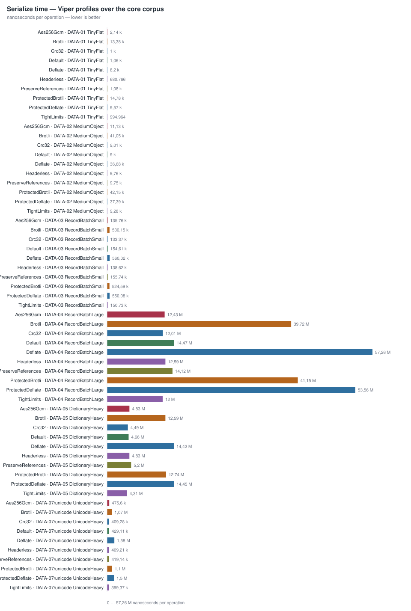

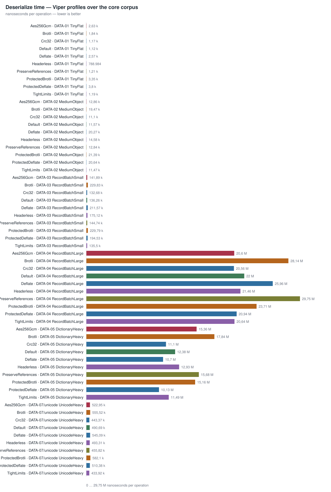

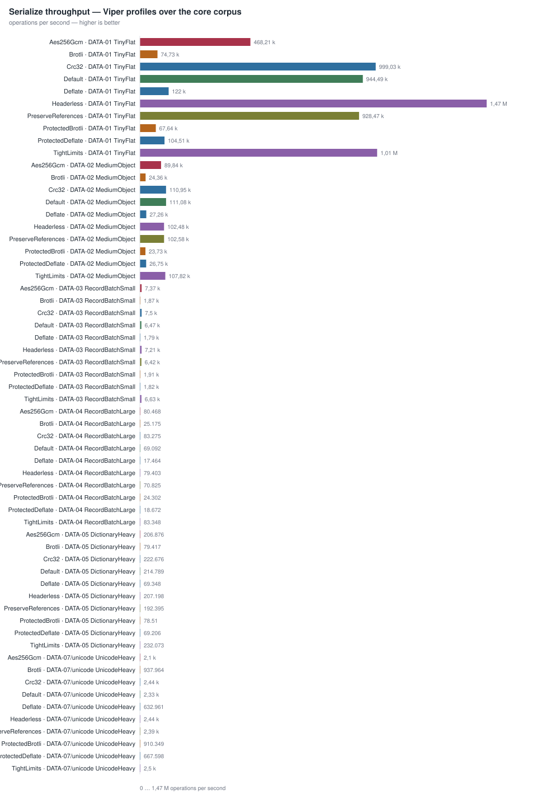

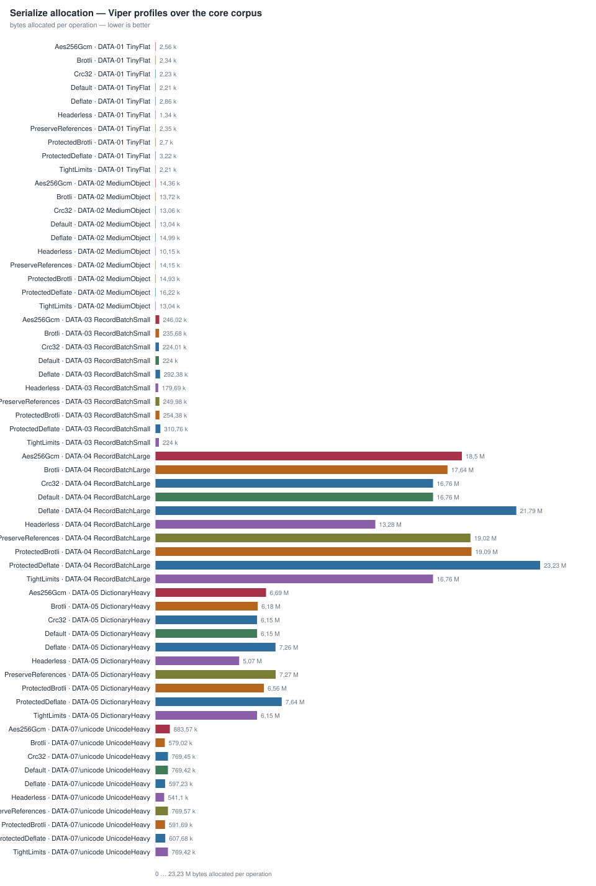

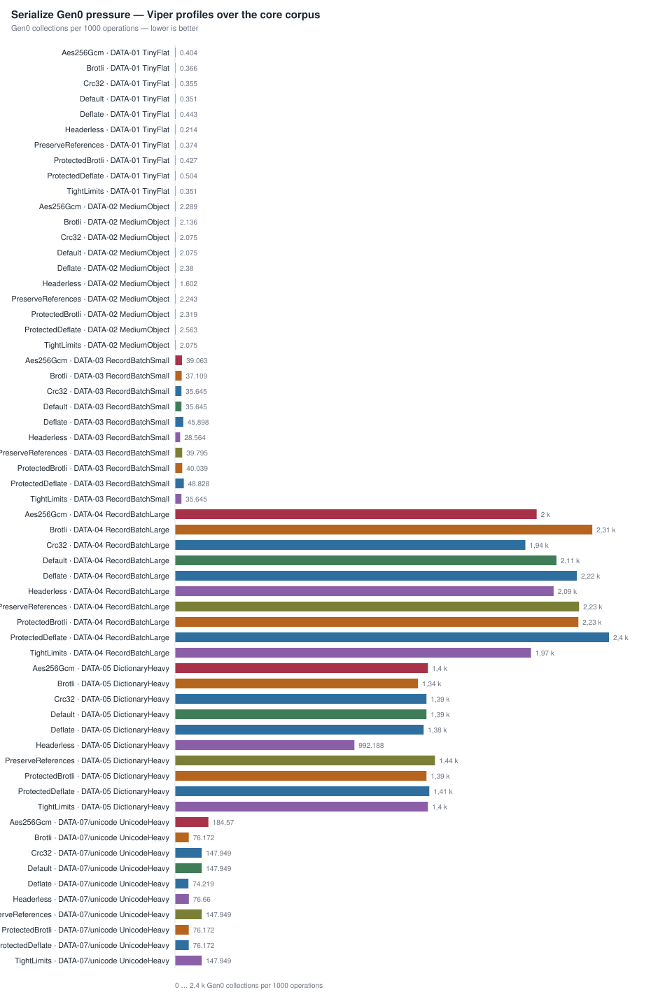

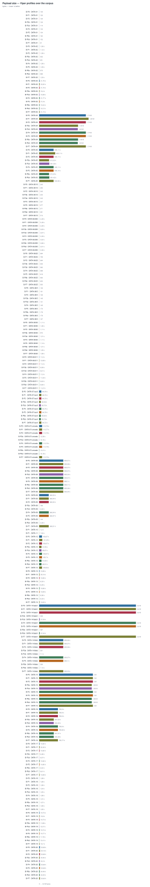

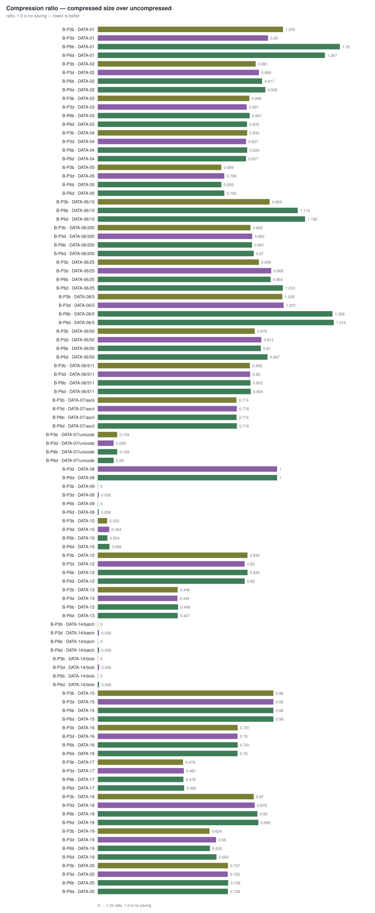

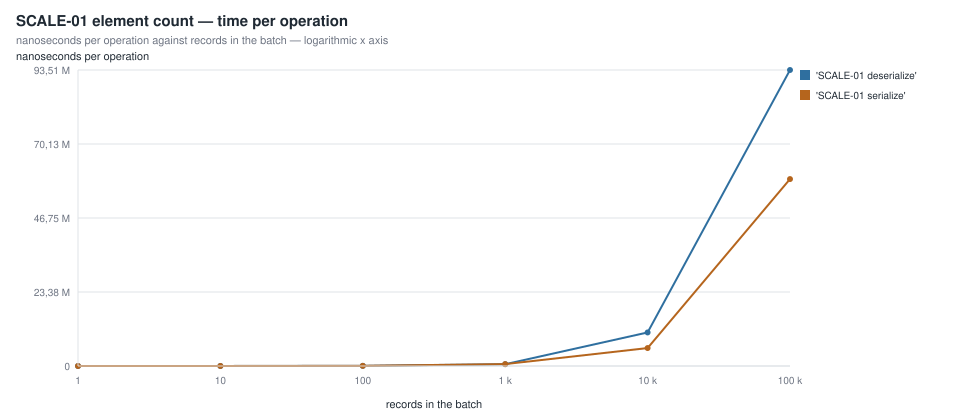

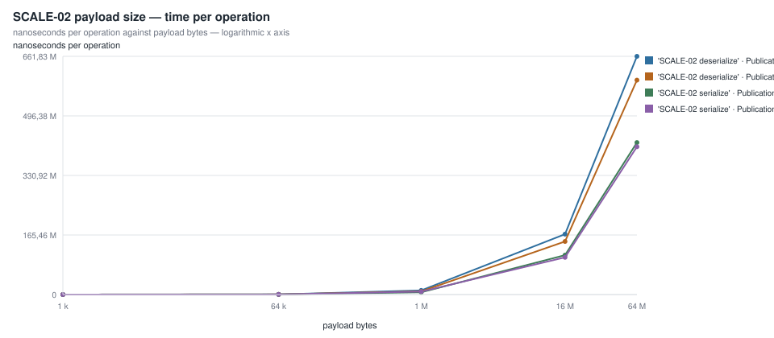

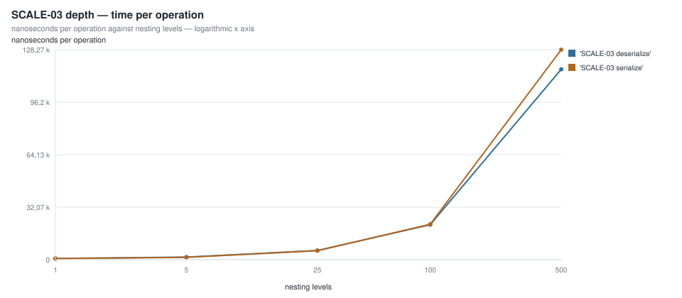

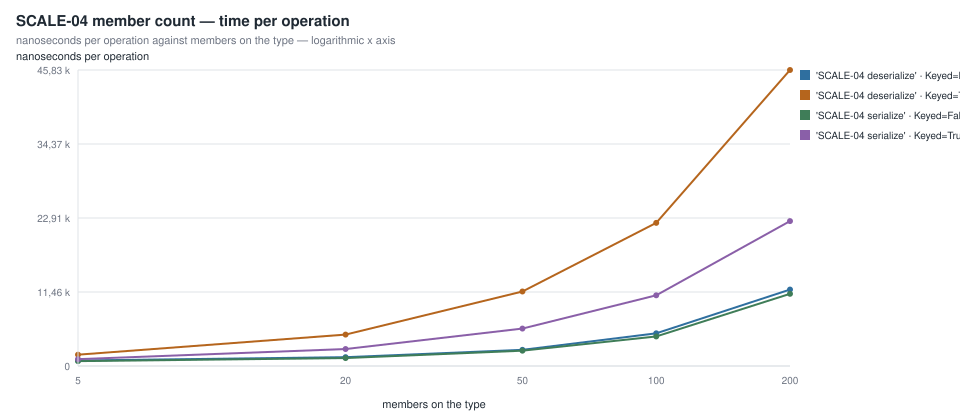

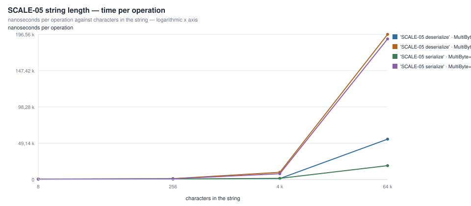

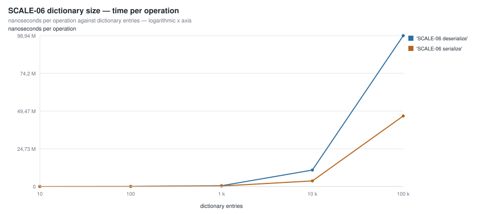

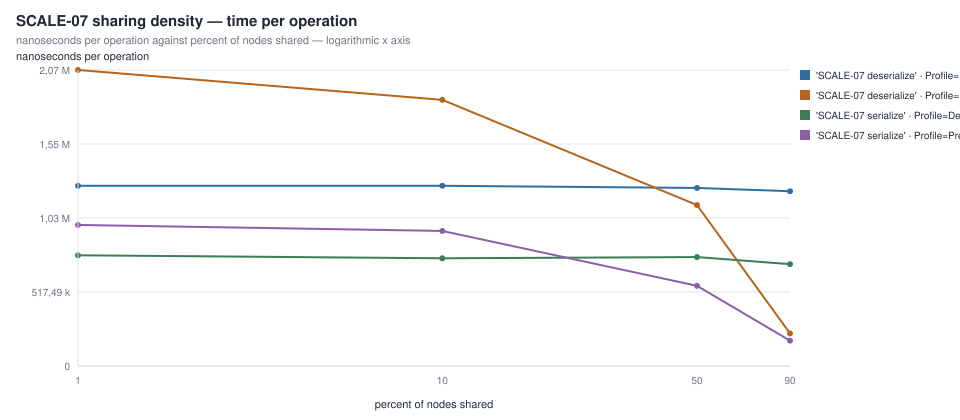

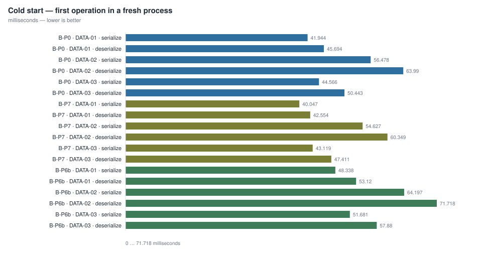

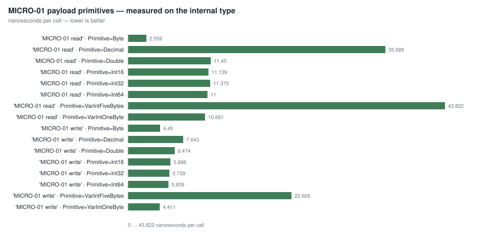

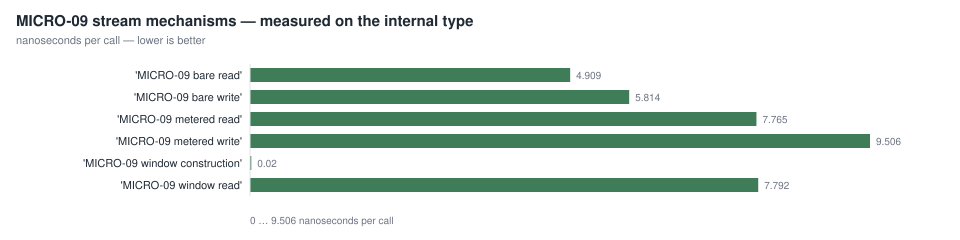


## Cells to read with caution


### Noisy

Published with the margin the run produced, and never re-run until the number looked prettier.

| Suite | Method | Parameters | Mean | Margin |
|---|---|---|---|---|
| ProfileMatrixBenchmarks | 'WL-06 round trip' | Profile=Default; Data=DATA-02 MediumObject | 31.19 µs | ±7.1% |
| ProfileMatrixBenchmarks | 'WL-04 deserialize ← byte[]' | Profile=Brotli; Data=DATA-05 DictionaryHeavy | 17.84 ms | ±5.4% |
| ValueTextBenchmarks | 'MICRO-01 write string' | Bytes=65536; MultiByte=True | 31.60 µs | ±3.3% |
| AlgorithmBenchmarks | 'phase write' | Profile=Default; Data=DATA-09 HighlyCompressible | 562.12 µs | ±2.6% |
| ProfileMatrixBenchmarks | 'WL-01 serialize → byte[]' | Profile=Default; Data=DATA-03 RecordBatchSmall | 154.61 µs | ±2.3% |
| AlgorithmBenchmarks | 'phase read' | Profile=ProtectedBrotli; Data=DATA-09 HighlyCompressible | 988.44 µs | ±2.0% |

